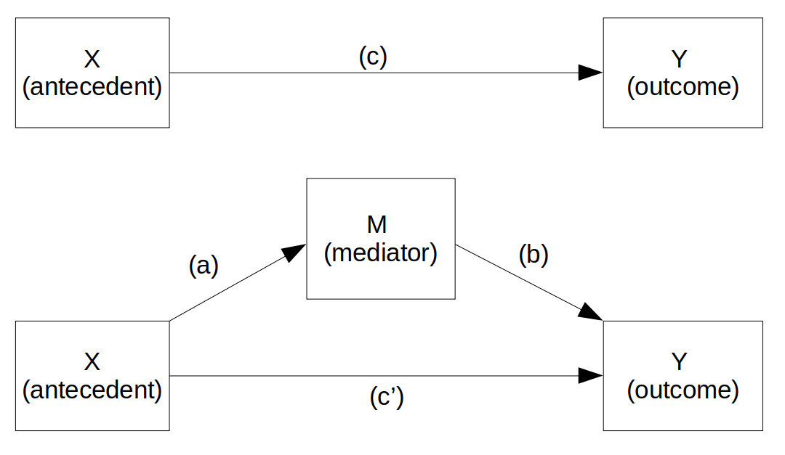
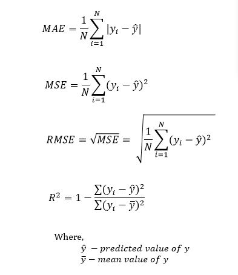
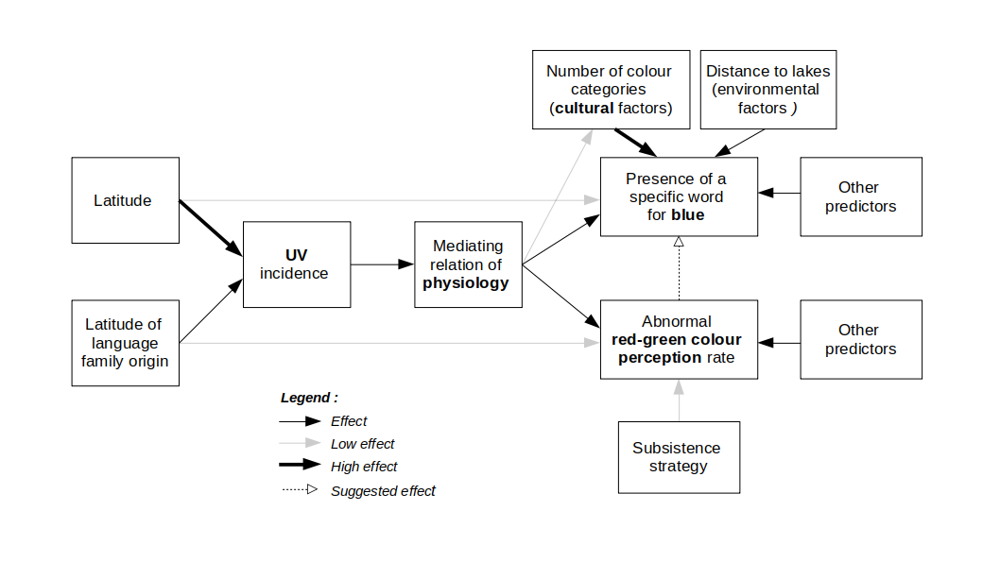

# TODO

- rename variables/keep only the variables we need/recode variables: **DONE**
- check the `stage` variable (I guess `999` means `NA` so should not be considered as an actual value)
- add `climate_PC3` and `humidity`: **DONE**
- add UB incidence: **DONE**
- add elevation (altitude): **DONE**
- keep only the libraries we actually use: **DONE**
- integrate FST_methods.Rmd: **DONE**
- redo/expand the Bayesian regressions and model comparison
- decide what to keep to streamline the analysis
- keep only the needed input files

**What I also did:**

- removed `gen.dist.na` and keep only the imputed genetic distances
- removed climate and dist2... variables because I re-compute them from scratch
- fixed some language names and one glottocode (Nepali)
- reduced the precision of most numeric variables
- computed co-variates for the families as well
- I removed the old "altitude" variable because now I recompute everything (including for families) from the Mapzen data


```{r setup, echo=F, message=F, warning=FALSE}
## Knitting options:
knitr::opts_chunk$set(echo=TRUE, warning=FALSE, message=FALSE,                    # default code chunk options
                      fig.width=11, fig.height=6, fig.align="center", comment=NA, # default figure dimensions
                      fig.path="./figures/",                                      # save images to ./figures/
                      dpi=72, dev="jpeg",                                         # please set dpi=300 and comment out dev="jpeg" for high resolution but very big images
                      cache=TRUE, autodep=TRUE);                                  # cache chunks


## Load needed packages:

# Rmarkdown:
library(knitr);
library(pander);

# System/parallel processing:
library(parallel);
library(future);

# Data processing:
library(plyr);
library(dplyr);

# Plotting:
library(ggplot2);
library(ggrepel);
library(gridExtra);

# Spatial stats and maps:
library(maptools); # as.im.RasterLayer()
library(spatstat); # ppp()
library(scanstatistics); # dist_to_knn()
library(ape); # Moran.I()
library(spdep); # tri2nb()
library(deldir); # deldir()
library(igraph); # graph()
library(Imap); # gdist()

# Regression and mediation analysis:
library(lmerTest); # ML mixed-effects models
library(brms); # Bayesian mixed-effects models with Stan
library(bayestestR); # Bayesian model comparison
library(sjstats); # mediation

# Decison trees, random forests, and SVMs:
library(partykit); # ctree()
#library(tree);
#library(rpart);
#library(rpart.plot);
#library(randomForest);
#library(e1071);


# Apparently not needed:
#library(gdata);
#library(maps);
#library(sna);
#library(fields);
#library(tidyr);
#library(geostatsp);
#library(MuMIn);
#library(maps);
#library(data.table);
#library(magrittr);
#library(sfsmisc);
#library(MASS);
#library(rsq);
#library(mediation);
#library(car);
#library(ROCR);
#library(ISLR)
#library(rsample);
#library(FactoMineR);


## Set seed for reproducibility:
set.seed(42);

## For Bayesian regressions with brms (some might be different for particular models to avoid too few or too many iterations):
brms_ncores  <- max(detectCores(all.tests=TRUE, logical=FALSE), 4, na.rm=TRUE); # ry to use multiple cores, if present
brms_iter    <- 5000; brms_warmup <- 2000; brms_thin <- 2; # burn-in and iterations 
brms_control <- list(adapt_delta=0.999, max_treedepth=15); # control params to pass to Stan: avoid the "divergent transitions after warmup" and "max_treedepth" warnings
brms_ci      <- 0.89; brms_rope <- c(-0.01, 0.01); # 89% HDI and a tight ROPE around 0.0 [-0.01, 0.01]
#plan(multiprocess); # parallel kfold using futures

## Various folders:
if( !dir.exists("./figures") ) dir.create("./figures", showWarnings=FALSE); # figures are saved here
if( !dir.exists("./cached_results") ) dir.create("./cached_results", showWarnings=FALSE); # cache expensive results here
if( !dir.exists("./input_files/") ) stop("The input files folder 'input_files' does not seem to exist!\n");


## Auxiliary functions:

# Figure and Table caption adapted from https://stackoverflow.com/questions/37116632/rmarkdown-html-number-figures: 
outputFormat = opts_knit$get("rmarkdown.pandoc.to"); # determine the output format of the document
if( is.null(outputFormat) ) outputFormat = ""; # probably not run within knittr
capTabNo = 1; capFigNo = 1; # figure and table caption numbering, for HTML do it manually
#Function to add the Table Number
capTab = function(x){
  if(outputFormat == 'html'){
    x = paste0("***Table ",capTabNo,".*** _",x,"_")
    capTabNo <<- capTabNo + 1
  }; x
}
#Function to add the Figure Number
capFig = function(x){
  if(outputFormat == 'html'){
    x = paste0("***Figure ",capFigNo,".*** _",x,"_")
    capFigNo <<- capFigNo + 1
  }; x
}

# Verbal interpretation of Bayes factors (BF):
BF_interpretation <- function(BF, model1_name="m1", model2_name="m2")
{
  if( BF > 100 )   return (paste0("extreme evidence for ",model1_name," against ",model2_name));
  if( BF > 30 )    return (paste0("very strong evidence for ",model1_name," against ",model2_name));
  if( BF > 10 )    return (paste0("strong evidence for ",model1_name," against ",model2_name));
  if( BF > 3 )     return (paste0("moderate evidence for ",model1_name," against ",model2_name));
  if( BF > 1 )     return (paste0("anecdotal evidence for ",model1_name," against ",model2_name));
  if( BF == 1 )    return (paste0("no evidence for ",model1_name," nor ",model2_name));
  if( BF > 0.33 )  return (paste0("anecdotal evidence for ",model2_name," against ",model1_name));
  if( BF > 0.10 )  return (paste0("moderate evidence for ",model2_name," against ",model1_name));
  if( BF > 0.033 ) return (paste0("strong evidence for ",model2_name," against ",model1_name));
  if( BF > 0.010 ) return (paste0("very strong evidence for ",model2_name," against ",model1_name));
  return (paste0("extreme evidence for ",model2_name," against ",model1_name));
}

# Standard error of the mean:
std <- function(x) sd(x)/sqrt(length(x))

# Root Mean Square Error (RMSE) between observed (y) and predicted (yrep) values:
rmse <- function(y, yrep)
{
  yrep_mean <- colMeans(yrep)
  sqrt(mean((yrep_mean - y)^2))
}

# Panel function for the pairwise plots:
panel.cor <- function(x, y){
  usr <- par("usr"); on.exit(par(usr))
  par(usr = c(0, 1, 0, 1))
  r <- cor.test(x, y, method="pearson");
  rho <- cor.test(x, y, method="spearman");
  txt <- sprintf("r=%.2f\n(p=%.4g)\nrho=%.2f\n(p=%.4g)", 
                 r$estimate, r$p.value, rho$estimate, rho$p.value)
  cex.cor <- 0.8/strwidth(txt)
  text(0.5, 0.5, txt, cex=1.2)
}
upper.panel<-function(x, y){
  points(x,y, pch = 21, bg="lightgray", col="gray30")
  abline(lm(y ~ x), col="blue", lwd=2);
}
panel.hist <- function(x, ...)
{
  usr <- par("usr"); on.exit(par(usr))
  par(usr = c(usr[1:2], 0, 1.5) )
  h <- hist(x, plot = FALSE)
  breaks <- h$breaks; nB <- length(breaks)
  y <- h$counts; y <- y/max(y)
  rect(breaks[-nB], 0, breaks[-1], y, col = "lightgray", ...)
}
```

<style>
caption, .caption {
color: #555555;
font-weight: bold;
font-size: 105%;
text-align: left}

a[hreflang]:before{}
</style>


```{r load and prepare data, echo=FALSE, message=FALSE, warning=FALSE}
# Load the world map and change it for Pacific-centered plotting:
mapWorld <- map_data("world", wrap=c(-20,340), ylim=c(-70,100));

# If the environmental variables are not already computed, compute them now:
if( !all(file.exists("./input_files/data_climate.tsv", 
                     "./input_files/data_humidity.tsv", 
                     "./input_files/data_dist2water.tsv", 
                     "./input_files/data_UV_incidence.tsv",
                     "./input_files/data_elevation.tsv")) )
{
  # Get the primary data and compute them:
  source("./00_preprocess_data.R", echo=FALSE);
}


# Load the colors data:
d_colors <- read.table("./input_files/data_colors.csv", header=TRUE, sep=",", quote='"', stringsAsFactors=FALSE); # comma-separated double-quoted CVS file

# Add the various info, both for the languages and for the families.
# For humidity, keep only the mean annual median and IQR as all the other measures are very highly correlated with these
# For UV, do not use the individual freqyency bands, but the wide categories "A" and "B" (and overall):
d_climate    <- read.table("./input_files/data_climate.tsv",      header=TRUE, sep="\t", quote="");
d_humidity   <- read.table("./input_files/data_humidity.tsv",     header=TRUE, sep="\t", quote="");
d_dist2water <- read.table("./input_files/data_dist2water.tsv",   header=TRUE, sep="\t", quote="");
d_uv         <- read.table("./input_files/data_UV_incidence.tsv", header=TRUE, sep="\t", quote="");
d_elevation  <- read.table("./input_files/data_elevation.tsv",    header=TRUE, sep="\t", quote="");
d_genetics   <- read.table("./input_files/data_genetics.tsv",     header=TRUE, sep="\t", quote="");

# for languages ...
d_colors <- merge(d_colors, d_climate[,c("glottocode", "clim_PC1", "clim_PC2", "clim_PC3")], by="glottocode", all.x=TRUE, all.y=FALSE);
d_colors <- merge(d_colors, d_humidity[,c("glottocode", "humidity_mean_annual_median", "humidity_mean_annual_IQR")], by="glottocode", all.x=TRUE, all.y=FALSE);
names(d_colors)[ncol(d_colors)-c(1,0)] <- c("hum_median", "hum_IQR");
d_colors <- merge(d_colors, d_dist2water[,c("glottocode", "dist2ocean", "dist2lakes", "dist2rivers", "dist2water")], by="glottocode", all.x=TRUE, all.y=FALSE);
d_colors <- merge(d_colors, d_uv[,c("glottocode", "UV_A_mean", "UV_A_sd", "UV_B_mean", "UV_B_sd", "UV_mean", "UV_sd")], by="glottocode", all.x=TRUE, all.y=FALSE);
d_colors <- merge(d_colors, d_elevation[,c("glottocode", "elevation")], by="glottocode", all.x=TRUE, all.y=FALSE);
d_colors <- merge(d_colors, d_genetics, by="glottocode", all.x=TRUE, all.y=FALSE);

# ... and for families
d_colors <- merge(d_colors, d_climate[,c("glottocode", "clim_PC1", "clim_PC2", "clim_PC3")], by.x="glottocode_family", by.y="glottocode", suffixes=c("","_family"), all.x=TRUE, all.y=FALSE);
d_colors <- merge(d_colors, d_humidity[,c("glottocode", "humidity_mean_annual_median", "humidity_mean_annual_IQR")], by.x="glottocode_family", by.y="glottocode", suffixes=c("","_family"), all.x=TRUE, all.y=FALSE);
names(d_colors)[ncol(d_colors)-c(1,0)] <- c("hum_median_family", "hum_IQR_family");
d_colors <- merge(d_colors, d_dist2water[,c("glottocode", "dist2ocean", "dist2lakes", "dist2rivers", "dist2water")], by.x="glottocode_family", by.y="glottocode", suffixes=c("","_family"), all.x=TRUE, all.y=FALSE);
d_colors <- merge(d_colors, d_uv[,c("glottocode", "UV_A_mean", "UV_A_sd", "UV_B_mean", "UV_B_sd", "UV_mean", "UV_sd")], by.x="glottocode_family", by.y="glottocode", suffixes=c("","_family"), all.x=TRUE, all.y=FALSE);
d_colors <- merge(d_colors, d_elevation[,c("glottocode", "elevation")], by.x="glottocode_family", by.y="glottocode", suffixes=c("","_family"), all.x=TRUE, all.y=FALSE);

# Rescale variables (we use the suffix _r for them):
# - elevation: log(+1) because there are some elevations set to 0 meters, so increase everything by 1m to avoid -Inf:
d_colors$elevation_r          <- log2(d_colors$elevation + 1);
d_colors$elevation_family_r   <- log2(d_colors$elevation_family + 1);
# - distance to water bodies: log() as distances to water are never 0.0, so no need to guard against -Inf here:
d_colors$dist2water_r         <- log2(d_colors$dist2water);
d_colors$dist2rivers_r        <- log2(d_colors$dist2rivers);
d_colors$dist2ocean_r         <- log2(d_colors$dist2ocean);
d_colors$dist2lakes_r         <- log2(d_colors$dist2lakes);
d_colors$dist2water_family_r  <- log2(d_colors$dist2water_family);
d_colors$dist2rivers_family_r <- log2(d_colors$dist2rivers_family);
d_colors$dist2ocean_family_r  <- log2(d_colors$dist2ocean_family);
d_colors$dist2lakes_family_r  <- log2(d_colors$dist2lakes_family);
# - longitude and latitude: cosine (degrees -> radians):
d_colors$latitude_r           <- cos(d_colors$latitude*(pi/180));
d_colors$longitude_r          <- cos(d_colors$longitude*(pi/180));
d_colors$latitude_family_r    <- cos(d_colors$latitude_family*(pi/180));
d_colors$longitude_family_r   <- cos(d_colors$longitude_family*(pi/180));
# - UV incidence: z-score:
d_colors$UV_A_mean_r          <- scale(d_colors$UV_A_mean);
d_colors$UV_A_sd_r            <- scale(d_colors$UV_A_sd);
d_colors$UV_B_mean_r          <- scale(d_colors$UV_B_mean);
d_colors$UV_B_sd_r            <- scale(d_colors$UV_B_sd);
d_colors$UV_mean_r            <- scale(d_colors$UV_mean);
d_colors$UV_sd_r              <- scale(d_colors$UV_sd);
d_colors$UV_A_mean_family_r   <- scale(d_colors$UV_A_mean_family);
d_colors$UV_A_sd_family_r     <- scale(d_colors$UV_A_sd_family);
d_colors$UV_B_mean_family_r   <- scale(d_colors$UV_B_mean_family);
d_colors$UV_B_sd_family_r     <- scale(d_colors$UV_B_sd_family);
d_colors$UV_mean_family_r     <- scale(d_colors$UV_mean_family);
d_colors$UV_sd_family_r       <- scale(d_colors$UV_sd_family);
# - climate: z-score:
d_colors$clim_PC1_r           <- scale(d_colors$clim_PC1);
d_colors$clim_PC2_r           <- scale(d_colors$clim_PC2);
d_colors$clim_PC3_r           <- scale(d_colors$clim_PC3);
d_colors$clim_PC1_family_r    <- scale(d_colors$clim_PC1_family);
d_colors$clim_PC2_family_r    <- scale(d_colors$clim_PC2_family);
d_colors$clim_PC3_family_r    <- scale(d_colors$clim_PC3_family);
# - daltonism:
d_colors$daltonism_r          <- max(d_colors$daltonism/100, 0.0001); # prepare for Beta regression: transform it from % into proportions, and replace 0 by a very small proportion (0.01%)
# - number of color categories: standardize to 0..1:
d_colors$n_colors_r           <- (d_colors$n_colors - min(d_colors$n_colors,na.rm=TRUE)) / (max(d_colors$n_colors,na.rm=TRUE) - min(d_colors$n_colors,na.rm=TRUE));
# - genetics: z-score:
s <- grep("gen_D",names(d_colors),fixed=TRUE); for( i in s ){ d_colors <- cbind(d_colors, scale(d_colors[,i])); names(d_colors)[ncol(d_colors)] <- paste0(names(d_colors)[i],"_r"); }

# Alternative view of the globe: all longitudes > 180 are "flipped" to negative values:
d_colors$longitude_180        <- ifelse(d_colors$longitude <= 180,        d_colors$longitude,        d_colors$longitude - 360);
d_colors$longitude_family_180 <- ifelse(d_colors$longitude_family <= 180, d_colors$longitude_family, d_colors$longitude_family - 360);

# Ensure factors have the right levels and contrasts:
d_colors$exists_blue <- factor(d_colors$exists_blue, levels=c("no", "yes"));
d_colors$subsistence <- factor(d_colors$subsistence, levels=c("HG", "AGR"));

# Collapse the families with few languages into the "Other"category (for plotting purposes):
d_colors$glottocode_family_other <- ifelse(d_colors$glottocode_family %in% c("abkh1242", "ainu1252", "araw1281", "ayma1253", 
                                                                             "basq1248", "chib1249", "hadz1240", "japo1237", 
                                                                             "jiva1245", "kore1284", "otom1299", "pama1250", 
                                                                             "pano1259", "taik1256", "ticu1244", "tupi1275", 
                                                                             "utoa1244", "yano1268"),
                                           "Other", 
                                           as.character(d_colors$glottocode_family));

# Just the language families data:
d_colors_families <- unique(d_colors[, grep("_family", names(d_colors), fixed=TRUE) ]);

```


# Data

This dataset is built starting from the data accompanying @brown_color_2004, to which Emma Meeussen added several new populations (and checked the pre-existing coding) using a variety of primary and secondary sources (see @meeussen_colour_2015 for details), supplemented with several environmental variables by Mathilde Josserand (see @josserand_speaking_2020).


## Populations and languages

In our dataset, there are `r length(unique(d_colors$glottocode))` populations, each uniquely identified by the [Glottolog](https://glottolog.org/) code (the *glottocode*) of the primary language they speak (the matching was done manually).


## Geographic location

The geographic coordinates of the populations were retrieved from the [Glottolog](https://glottolog.org/) based on their *glottocode*s.
As per @brown_color_2004, we computed the cosine of these *latitude*s and the *longitude*s to be used in the statistical models; `cos(latitude)` captures the closeness to the equator, ranging between 0.0 (one of the poles) and 1.0 (the equator), and `cos(longitude)`range between -1.0 and 1.0 (corresponding to -180 and 180 degrees, respectively); 
please note that longitude can be coded (and plotted) either as ranging between 0° and 360°, or between -180° and +180°, or, when we need to avoid the International Date Line (IDL) producing an artefactual boundary, we center the work on the Pacific.

```{r populations map, echo=FALSE, message=FALSE, warning=FALSE, fig.cap=capFig("Map of the populations in our sample (with language names).")}
ggplot() + theme_bw() +
  geom_polygon(data=mapWorld, aes(x=long, y=lat, group=group), fill="grey") + xlab("Longitude (°)") + ylab("Latitude (°)") + # landmasses
  geom_point(data=d_colors, aes(x=longitude, y=latitude), color="black") +
  geom_label_repel(data=d_colors, aes(x=longitude, y=latitude, label=L1), color="blue", fill="lightyellow", alpha=0.75, size=2.75, label.padding=0.10, label.r=0.05) + 
  theme(legend.position = c(0.75, 0.5), 
      legend.justification = c(1, 1), 
      legend.title = element_text(size = 9), 
      legend.text = element_text(size = 10)) +
  NULL;
```


## Elevation

We obtained elevation (altitude, in meters) using [Mapzen](https://en.wikipedia.org/wiki/Mapzen) data, which is still available (July 2020) on the [Terrain Tiles on Amazon Web Services](https://aws.amazon.com/public-datasets/terrain/) and accessible through the [`elevatr` package](https://cran.r-project.org/web/packages/elevatr/vignettes/introduction_to_elevatr.html#get_raster_elevation_data); please note that for the analyses, we use `log(elevation + 1)` (we added 1m to avoid errors for the locations recorded at sea level, 0m).

```{r summary elevation, echo=FALSE, message=FALSE, warning=FALSE}
pander(summary(d_colors$elevation));
```

```{r distribution of elevation, echo=FALSE, message=FALSE, warning=FALSE, fig.cap=capFig("Distribution of elevation.")}
ggplot(d_colors, aes(x=elevation)) +
  theme_bw() +
  geom_histogram(color="tomato", fill="tomato", alpha=0.5)+
  ggtitle("Distribution of elevation") +
  theme(plot.title = element_text(size = 10, face = "bold")); 
```

```{r map elevation, echo=FALSE, message=FALSE, warning=FALSE, fig.cap=capFig("Map of elevation (color scale).")}
ggplot() + theme_bw() +
  geom_polygon(data=mapWorld, aes(x=long, y=lat, group=group), fill="grey") + xlab("Longitude (°)") + ylab("Latitude (°)") + # landmasses
  geom_label_repel(data=d_colors, aes(x=longitude, y=latitude, label=elevation), color="black", fill="lightyellow", alpha=0.75, size=2.75, label.padding=0.10, label.r=0.05) + 
  geom_point(data=d_colors, shape=21, aes(x=longitude, y=latitude, fill=elevation), color="black") +
  theme(legend.position = c(0.75, 0.5), 
      legend.justification = c(1, 1), 
      legend.title = element_text(size = 9), 
      legend.text = element_text(size = 10)) +
  labs(fill = "Elevation (m)") +
  scale_fill_gradient(low = "lightskyblue1", high = "navyblue") + 
  NULL;
```


## Climate and ecology 

We reused the code from @bentz_evolution_2018 to extract historical data on global weather and climate from [WorldClim](https://www.worldclim.org/) for the period 1960-1990, encoded in 19 variables covering various measures (such as temperature, seasonality or precipitation). 
As in @bentz_evolution_2018, we conduced a A Principal Component Analysis (PCA) for our data only, and we found similar results, namely that the first two principal components (PCs) explain most of the data and have meaningful interpretations: the PC1 explains 49.7% of the variance and reflects low seasonality, wet and hot climate, whereas PC2 explains 24.7% of the variance and reflects high seasonality, hot and dry climate; PC3 explains only 8.6% and its interpretation is less straightforward; see @bentz_evolution_2018 for details (please note that the sign of the PCs is arbitrary). 
For the analyses, these variables were z-scored.


### Climate PC1

```{r summary PC1, echo=FALSE, message=FALSE, warning=FALSE}
# Climate PC1
pander(summary(d_colors$clim_PC1))
```

```{r distribution of PC1, echo=FALSE, message=FALSE, warning=FALSE, fig.cap=capFig("Distribution of climate PC1.")}
ggplot(d_colors, aes(x=clim_PC1)) + 
  theme_bw() +
  geom_density(color="tomato", fill="tomato", alpha=0.5)+
  ggtitle("Distribution of climate PC1") +
  theme(plot.title = element_text(size = 10, face = "bold")); 
```

```{r map PC1, echo=FALSE, message=FALSE, warning=FALSE, fig.cap=capFig("Map of climate PC1 (color scale).")}
ggplot() + theme_bw() +
  geom_polygon(data=mapWorld, aes(x=long, y=lat, group=group), fill="grey") + xlab("Longitude (°)") + ylab("Latitude (°)") + # landmasses
  geom_point(data=d_colors, shape=21, aes(x=longitude, y=latitude, fill=clim_PC1), color="black") +
  theme(legend.position = c(0.75, 0.5), 
      legend.justification = c(1, 1), 
      legend.title = element_text(size = 9), 
      legend.text = element_text(size = 10)) +
  labs(fill = "Climate PC1") +
  scale_fill_gradient(low = "lightskyblue1", high = "navyblue") + 
  NULL;
```

### Climate PC2

```{r summary PC2, echo=FALSE, message=FALSE, warning=FALSE}
# Climate PC2
pander(summary(d_colors$clim_PC2))
```

```{r distribution of PC2, echo=FALSE, message=FALSE, warning=FALSE, fig.cap=capFig("Distribution of climate PC2.")}
ggplot(d_colors, aes(x=clim_PC2)) + 
  theme_bw() +
  geom_density(color="tomato", fill="tomato", alpha=0.5)+
  ggtitle("Distribution of climate PC2") +
  theme(plot.title = element_text(size = 10, face = "bold")); 
```

```{r map PC2, echo=FALSE, message=FALSE, warning=FALSE, fig.cap=capFig("Map of climate PC2 (color scale).")}
ggplot() + theme_bw() +
  geom_polygon(data=mapWorld, aes(x=long, y=lat, group=group), fill="grey") + xlab("Longitude (°)") + ylab("Latitude (°)") + # landmasses
  geom_point(data=d_colors, shape=21, aes(x=longitude, y=latitude, fill=clim_PC2), color="black") +
  theme(legend.position = c(0.75, 0.5), 
      legend.justification = c(1, 1), 
      legend.title = element_text(size = 9), 
      legend.text = element_text(size = 10)) +
  labs(fill = "Climate PC2") +
  scale_fill_gradient(low = "lightskyblue1", high = "navyblue") + 
  NULL;
```

### Climate PC3

```{r summary PC3, echo=FALSE, message=FALSE, warning=FALSE}
# Climate PC3
pander(summary(d_colors$clim_PC3))
```

```{r distribution of PC3, echo=FALSE, message=FALSE, warning=FALSE, fig.cap=capFig("Distribution of climate PC3.")}
ggplot(d_colors, aes(x=clim_PC3)) + 
  theme_bw() +
  geom_density(color="tomato", fill="tomato", alpha=0.5)+
  ggtitle("Distribution of climate PC3") +
  theme(plot.title = element_text(size = 10, face = "bold")); 
```

```{r map PC3, echo=FALSE, message=FALSE, warning=FALSE, fig.cap=capFig("Map of climate PC3 (color scale).")}
ggplot() + theme_bw() +
  geom_polygon(data=mapWorld, aes(x=long, y=lat, group=group), fill="grey") + xlab("Longitude (°)") + ylab("Latitude (°)") + # landmasses
  geom_point(data=d_colors, shape=21, aes(x=longitude, y=latitude, fill=clim_PC3), color="black") +
  theme(legend.position = c(0.75, 0.5), 
      legend.justification = c(1, 1), 
      legend.title = element_text(size = 9), 
      legend.text = element_text(size = 10)) +
  labs(fill = "Climate PC3") +
  scale_fill_gradient(low = "lightskyblue1", high = "navyblue") + 
  NULL;
```


## Humidity 

We obtained specific humidity ("the mass of water vapour in a unit mass of moist air, usually expressed as grams of vapour per kilogram of air"; [Encyclopaedia Britannica](https://www.britannica.com/science/specific-humidity)) data from the [NOAA](http://iridl.ldeo.columbia.edu/SOURCES/.NOAA/.NCEP-NCAR/.CDAS-1/.MONTHLY/.Diagnostic/.above_ground/.qa/datafiles.html), given as monthly extractions between 1 January 1949 and the download date, and we computed the overall mean, median, standard deviation and IQR across all measurements, as well as the mean across the yearly means, medians, standard deviations and IQRs.
However, all these measures are highly correlated by type (see plots below), such that we only retain here the mean of the yearly medians and IQRs.
We did not transform these variables for the analyses.

```{r echo=FALSE, message=FALSE, fig.cap=capFig("Pairwise correlations between measures of central tendency for humidity."), fig.width=8, fig.height=8}
pairs(d_humidity[,c("humidity_overall_mean", "humidity_overall_median", "humidity_mean_annual_mean", "humidity_mean_annual_median")], 
      lower.panel=panel.cor, diag.panel=panel.hist, upper.panel=upper.panel); 
```

```{r echo=FALSE, message=FALSE, fig.cap=capFig("Pairwise correlations between measures of dispersion for humidity."), fig.width=8, fig.height=8}
pairs(d_humidity[,c("humidity_overall_sd", "humidity_overall_IQR", "humidity_mean_annual_sd", "humidity_mean_annual_IQR")], 
      lower.panel=panel.cor, diag.panel=panel.hist, upper.panel=upper.panel); 
```

### Median (mean of yearly medians)

```{r summary median humidity, echo=FALSE, message=FALSE, warning=FALSE}
pander(summary(d_colors$hum_median))
```

```{r distribution of median humidity, echo=FALSE, message=FALSE, warning=FALSE, fig.cap=capFig("Distribution of median humidity.")}
ggplot(d_colors, aes(x=hum_median)) + 
  theme_bw() +
  geom_density(color="tomato", fill="tomato", alpha=0.5)+
  ggtitle("Distribution of median humidity") +
  theme(plot.title = element_text(size = 10, face = "bold")); 
```

```{r map median humidity, echo=FALSE, message=FALSE, warning=FALSE, fig.cap=capFig("Map of median humidity (color scale).")}
ggplot() + theme_bw() +
  geom_polygon(data=mapWorld, aes(x=long, y=lat, group=group), fill="grey") + xlab("Longitude (°)") + ylab("Latitude (°)") + # landmasses
  geom_point(data=d_colors, shape=21, aes(x=longitude, y=latitude, fill=hum_median), color="black") +
  theme(legend.position = c(0.75, 0.5), 
      legend.justification = c(1, 1), 
      legend.title = element_text(size = 9), 
      legend.text = element_text(size = 10)) +
  labs(fill = "Median humidity") +
  scale_fill_gradient(low = "lightskyblue1", high = "navyblue") + 
  NULL;
```

### Variation (mean of yearly IQRs)

```{r summary IQR humidity, echo=FALSE, message=FALSE, warning=FALSE}
pander(summary(d_colors$hum_IQR))
```

```{r distribution of IQR humidity, echo=FALSE, message=FALSE, warning=FALSE, fig.cap=capFig("Distribution of variation in humidity (IQR).")}
ggplot(d_colors, aes(x=hum_IQR)) + 
  theme_bw() +
  geom_density(color="tomato", fill="tomato", alpha=0.5)+
  ggtitle("Distribution of variation in humidity (IQR)") +
  theme(plot.title = element_text(size = 10, face = "bold")); 
```

```{r map IQR humidity, echo=FALSE, message=FALSE, warning=FALSE, fig.cap=capFig("Map of variation in humidity (IQR) (color scale).")}
ggplot() + theme_bw() +
  geom_polygon(data=mapWorld, aes(x=long, y=lat, group=group), fill="grey") + xlab("Longitude (°)") + ylab("Latitude (°)") + # landmasses
  geom_point(data=d_colors, shape=21, aes(x=longitude, y=latitude, fill=hum_IQR), color="black") +
  theme(legend.position = c(0.75, 0.5), 
      legend.justification = c(1, 1), 
      legend.title = element_text(size = 9), 
      legend.text = element_text(size = 10)) +
  labs(fill = "IQR humidity") +
  scale_fill_gradient(low = "lightskyblue1", high = "navyblue") + 
  NULL;
```


## Distance to bodies of water

We reused the code from @bentz_evolution_2018 to compute the distances from each of our populations to the nearest lake, ocean, river, and water in general, using [OpenStreetMap](http://openstreetmapdata.com/) raster files[^openstreetmaps]. 
For the analyses, we use the `log` of these distances.


### Distance to lakes

```{r summary dist lakes, echo=FALSE, message=FALSE, warning=FALSE}
# Distance to lakes
pander(summary(d_colors$dist2lakes));
```

```{r distribution dist lakes, echo=FALSE, message=FALSE, warning=FALSE, fig.cap=capFig("Distribution of distances to lakes.")}
ggplot(d_colors, aes(x=dist2lakes)) +
  theme_bw() +
  geom_density(color="tomato", fill="tomato", alpha=0.5)+
  #ggtitle("Distribution of distances to lakes") +
  xlab("Dist. to lakes (km)") + 
  theme(plot.title = element_text(size = 10, face = "bold")); 
```

```{r map dist lakes, echo=FALSE, message=FALSE, warning=FALSE, fig.cap=capFig("Map of distances to lakes (color scale).")}
ggplot() + 
  theme_bw() +
  geom_polygon(data=mapWorld, aes(x=long, y=lat, group=group), fill="grey") + xlab("Longitude (°)") + ylab("Latitude (°)") + # landmasses
  geom_label_repel(data=d_colors, aes(x=longitude, y=latitude, label=round(dist2lakes,0)), color="black", fill="lightyellow", alpha=0.75, size=2.75, label.padding=0.10, label.r=0.05) + 
  geom_point(data=d_colors, shape=21, aes(x=longitude, y=latitude, fill=dist2lakes), color="black") +
  theme(legend.position = c(0.75, 0.5), 
      legend.justification = c(1, 1), 
      legend.title = element_text(size = 9), 
      legend.text = element_text(size = 10)) +
  labs(fill = "Dist. to lakes (km)") +
  scale_fill_gradient(low = "lightskyblue1", high = "navyblue") + 
  NULL;
```

### Distance to rivers

```{r summary dist rivers, echo=FALSE, message=FALSE, warning=FALSE}
# Distance to lakes
pander(summary(d_colors$dist2rivers));
```

```{r distribution dist rivers, echo=FALSE, message=FALSE, warning=FALSE, fig.cap=capFig("Distribution of distances to rivers.")}
ggplot(d_colors, aes(x=dist2rivers)) + 
  theme_bw() +
  geom_density(color="tomato", fill="tomato", alpha=0.5)+
  #ggtitle("Distribution of log distance to rivers") +
  xlab("Dist. to rivers (km)") + 
  theme(plot.title = element_text(size = 10, face = "bold")); 
```

```{r map dist rivers, echo=FALSE, message=FALSE, warning=FALSE, fig.cap=capFig("Map of distances to rivers (color scale).")}
ggplot() + 
  theme_bw() +
  geom_polygon(data=mapWorld, aes(x=long, y=lat, group=group), fill="grey") + xlab("Longitude (°)") + ylab("Latitude (°)") + # landmasses
  geom_label_repel(data=d_colors, aes(x=longitude, y=latitude, label=round(dist2rivers,0)), color="black", fill="lightyellow", alpha=0.75, size=2.75, label.padding=0.10, label.r=0.05) + 
  geom_point(data=d_colors, shape=21, aes(x=longitude, y=latitude, fill=dist2rivers), color="black") +
  theme(legend.position = c(0.75, 0.5), 
      legend.justification = c(1, 1), 
      legend.title = element_text(size = 9), 
      legend.text = element_text(size = 10)) +
  labs(fill = "Dist. to rivers (km)") +
  scale_fill_gradient(low = "lightskyblue1", high = "navyblue") + 
  NULL;
```


### Distance to oceans

```{r summary dist oceans, echo=FALSE, message=FALSE, warning=FALSE}
# Distance to oceans
pander(summary(d_colors$dist2ocean));
```

```{r distribution dist oceans, echo=FALSE, message=FALSE, warning=FALSE, fig.cap=capFig("Distribution of distances to oceans.")}
ggplot(d_colors, aes(x=dist2ocean)) + 
  theme_bw() +
  geom_density(color="tomato", fill="tomato", alpha=0.5)+
  #ggtitle("Distribution of log distance to oceans") +
  xlab("Dist. to oceans (km)") + 
  theme(plot.title = element_text(size = 10, face = "bold")); 
```

```{r map dist oceans, echo=FALSE, message=FALSE, warning=FALSE, fig.cap=capFig("Map of distances to oceans (color scale).")}
ggplot() + 
  theme_bw() +
  geom_polygon(data=mapWorld, aes(x=long, y=lat, group=group), fill="grey") + xlab("Longitude (°)") + ylab("Latitude (°)") + # landmasses
  geom_label_repel(data=d_colors, aes(x=longitude, y=latitude, label=round(dist2ocean,0)), color="black", fill="lightyellow", alpha=0.75, size=2.75, label.padding=0.10, label.r=0.05) + 
  geom_point(data=d_colors, shape=21, aes(x=longitude, y=latitude, fill=dist2ocean), color="black") +
  theme(legend.position = c(0.75, 0.5), 
      legend.justification = c(1, 1), 
      legend.title = element_text(size = 9), 
      legend.text = element_text(size = 10)) +
  labs(fill = "Dist. to oceans (km)") +
  scale_fill_gradient(low = "lightskyblue1", high = "navyblue") + 
  NULL;
```

### Distance to water

```{r summary dist water, echo=FALSE, message=FALSE, warning=FALSE}
# Distance to water
pander(summary(d_colors$dist2water));
```

```{r distribution dist water, echo=FALSE, message=FALSE, warning=FALSE, fig.cap=capFig("Distribution of distances to water.")}
ggplot(d_colors, aes(x=dist2water)) + 
  theme_bw() +
  geom_density(color="tomato", fill="tomato", alpha=0.5)+
  #ggtitle("Distribution of log distance to v") +
  xlab("log dist water (km)") + 
  theme(plot.title = element_text(size = 10, face = "bold")); 
```

```{r map dist water, echo=FALSE, message=FALSE, warning=FALSE, fig.cap=capFig("Map of distances to water (color scale).")}
ggplot() + 
  theme_bw() +
  geom_polygon(data=mapWorld, aes(x=long, y=lat, group=group), fill="grey") + xlab("Longitude (°)") + ylab("Latitude (°)") + # landmasses
  geom_label_repel(data=d_colors, aes(x=longitude, y=latitude, label=round(dist2water,0)), color="black", fill="lightyellow", alpha=0.75, size=2.75, label.padding=0.10, label.r=0.05) + 
  geom_point(data=d_colors, shape=21, aes(x=longitude, y=latitude, fill=dist2water), color="black") +
  theme(legend.position = c(0.75, 0.5), 
      legend.justification = c(1, 1), 
      legend.title = element_text(size = 9), 
      legend.text = element_text(size = 10)) +
  labs(fill = "Dist. to water (km)") +
  scale_fill_gradient(low = "lightskyblue1", high = "navyblue") + 
  NULL;
```


## UV incidence

The incidence of ultra-violet light (UV) was calculated from the data available from the [NASA Total Ozone Mapping Spectrometer (TOMS)](http://toms.gsfc.nasa.gov/ery_uv/new_uv/)[^uv] for the year 1998, in order to replicate the procedure in @brown_color_2004. 
These data contain daily measures of UV radiation received by the human body at four wavelengths (305 nm, 310 nm, 320 nm, and 380 nm) in Joules per square meter (J/m^2^), taking into account the thickness of the ozone layer in the stratosphere, the amount of cloud cover, the elevation, and how high the sun is in the sky. 
Here, we computed the mean and standard deviation for the whole year for UV-A (315 nm to 400 nm), for UV-B (280 nm to 315 nm) and for the full spectrum; these were further z-scored for the statistical analyses.

### UV-A

Summaries for mean and standard deviation:
```{r summary UV-A, echo=FALSE, message=FALSE, warning=FALSE}
pander(summary(d_colors$UV_A_mean))
pander(summary(d_colors$UV_A_sd))
```

```{r distribution UV-A, echo=FALSE, message=FALSE, warning=FALSE, fig.cap=capFig("UV-A (mean and standard deviation).")}
grid.arrange(ggplot(d_colors, aes(x=UV_A_mean)) + 
               theme_bw() +
               geom_density(color="tomato", fill="tomato", alpha=0.5)+
               ggtitle("Distribution of mean UV-A") +
               theme(plot.title = element_text(size = 10, face = "bold")),
             ggplot(d_colors, aes(x=UV_A_sd)) + 
               theme_bw() +
               geom_density(color="tomato", fill="tomato", alpha=0.5)+
               ggtitle("Distribution of sd UV-A") +
               theme(plot.title = element_text(size = 10, face = "bold")),
             ncol=2);
```

```{r map UV-A, echo=FALSE, message=FALSE, warning=FALSE, fig.cap=capFig("Map of UV-A (mean and standard deviation)."), fig.height=12}
grid.arrange(ggplot() + theme_bw() +
               geom_polygon(data=mapWorld, aes(x=long, y=lat, group=group), fill="grey") + xlab("Longitude (°)") + ylab("Latitude (°)") + # landmasses
               geom_point(data=d_colors, shape=21, aes(x=longitude, y=latitude, fill=UV_A_mean), color="black") +
               theme(legend.position = c(0.75, 0.5), 
                     legend.justification = c(1, 1), 
                     legend.title = element_text(size = 9), 
                     legend.text = element_text(size = 10)) +
               labs(fill = "Mean UV-A") +
               scale_fill_gradient(low = "lightskyblue1", high = "navyblue") + 
               NULL,
             ggplot() + theme_bw() +
               geom_polygon(data=mapWorld, aes(x=long, y=lat, group=group), fill="grey") + xlab("Longitude (°)") + ylab("Latitude (°)") + # landmasses
               geom_point(data=d_colors, shape=21, aes(x=longitude, y=latitude, fill=UV_A_sd), color="black") +
               theme(legend.position = c(0.75, 0.5), 
                     legend.justification = c(1, 1), 
                     legend.title = element_text(size = 9), 
                     legend.text = element_text(size = 10)) +
               labs(fill = "SD UV-A") +
               scale_fill_gradient(low = "lightskyblue1", high = "navyblue") + 
               NULL,
             ncol=1);
```

### UV-B

Summaries for mean and standard deviation:
```{r summary UV-B, echo=FALSE, message=FALSE, warning=FALSE}
pander(summary(d_colors$UV_B_mean))
pander(summary(d_colors$UV_B_sd))
```

```{r distribution UV-B, echo=FALSE, message=FALSE, warning=FALSE, fig.cap=capFig("UV-B (mean and standard deviation).")}
grid.arrange(ggplot(d_colors, aes(x=UV_B_mean)) + 
               theme_bw() +
               geom_density(color="tomato", fill="tomato", alpha=0.5)+
               ggtitle("Distribution of mean UV-B") +
               theme(plot.title = element_text(size = 10, face = "bold")),
             ggplot(d_colors, aes(x=UV_B_sd)) + 
               theme_bw() +
               geom_density(color="tomato", fill="tomato", alpha=0.5)+
               ggtitle("Distribution of sd UV-B") +
               theme(plot.title = element_text(size = 10, face = "bold")),
             ncol=2);
```

```{r map UV-B, echo=FALSE, message=FALSE, warning=FALSE, fig.cap=capFig("Map of UV-B (mean and standard deviation)."), fig.height=12}
grid.arrange(ggplot() + theme_bw() +
               geom_polygon(data=mapWorld, aes(x=long, y=lat, group=group), fill="grey") + xlab("Longitude (°)") + ylab("Latitude (°)") + # landmasses
               geom_point(data=d_colors, shape=21, aes(x=longitude, y=latitude, fill=UV_B_mean), color="black") +
               theme(legend.position = c(0.75, 0.5), 
                     legend.justification = c(1, 1), 
                     legend.title = element_text(size = 9), 
                     legend.text = element_text(size = 10)) +
               labs(fill = "Mean UV-B") +
               scale_fill_gradient(low = "lightskyblue1", high = "navyblue") + 
               NULL,
             ggplot() + theme_bw() +
               geom_polygon(data=mapWorld, aes(x=long, y=lat, group=group), fill="grey") + xlab("Longitude (°)") + ylab("Latitude (°)") + # landmasses
               geom_point(data=d_colors, shape=21, aes(x=longitude, y=latitude, fill=UV_B_sd), color="black") +
               theme(legend.position = c(0.75, 0.5), 
                     legend.justification = c(1, 1), 
                     legend.title = element_text(size = 9), 
                     legend.text = element_text(size = 10)) +
               labs(fill = "SD UV-B") +
               scale_fill_gradient(low = "lightskyblue1", high = "navyblue") + 
               NULL,
             ncol=1);
```

### UV (overall)

Summaries for mean and standard deviation:
```{r summary UV, echo=FALSE, message=FALSE, warning=FALSE}
pander(summary(d_colors$UV_mean))
pander(summary(d_colors$UV_sd))
```

```{r distribution UV, echo=FALSE, message=FALSE, warning=FALSE, fig.cap=capFig("UV (mean and standard deviation).")}
grid.arrange(ggplot(d_colors, aes(x=UV_mean)) + 
               theme_bw() +
               geom_density(color="tomato", fill="tomato", alpha=0.5)+
               ggtitle("Distribution of mean UV-B") +
               theme(plot.title = element_text(size = 10, face = "bold")),
             ggplot(d_colors, aes(x=UV_sd)) + 
               theme_bw() +
               geom_density(color="tomato", fill="tomato", alpha=0.5)+
               ggtitle("Distribution of sd UV-B") +
               theme(plot.title = element_text(size = 10, face = "bold")),
             ncol=2);
```

```{r map UV, echo=FALSE, message=FALSE, warning=FALSE, fig.cap=capFig("Map of UV (mean and standard deviation)."), fig.height=12}
grid.arrange(ggplot() + theme_bw() +
               geom_polygon(data=mapWorld, aes(x=long, y=lat, group=group), fill="grey") + xlab("Longitude (°)") + ylab("Latitude (°)") + # landmasses
               geom_point(data=d_colors, shape=21, aes(x=longitude, y=latitude, fill=UV_mean), color="black") +
               theme(legend.position = c(0.75, 0.5), 
                     legend.justification = c(1, 1), 
                     legend.title = element_text(size = 9), 
                     legend.text = element_text(size = 10)) +
               labs(fill = "Mean UV") +
               scale_fill_gradient(low = "lightskyblue1", high = "navyblue") + 
               NULL,
             ggplot() + theme_bw() +
               geom_polygon(data=mapWorld, aes(x=long, y=lat, group=group), fill="grey") + xlab("Longitude (°)") + ylab("Latitude (°)") + # landmasses
               geom_point(data=d_colors, shape=21, aes(x=longitude, y=latitude, fill=UV_sd), color="black") +
               theme(legend.position = c(0.75, 0.5), 
                     legend.justification = c(1, 1), 
                     legend.title = element_text(size = 9), 
                     legend.text = element_text(size = 10)) +
               labs(fill = "SD UV") +
               scale_fill_gradient(low = "lightskyblue1", high = "navyblue") + 
               NULL,
             ncol=1);
```


## Log of population size

The log of population size was obtained from @bentz_evolution_2018.

```{r summary popsize, echo=FALSE, message=FALSE, warning=FALSE}
# population size
pander(summary(d_colors$log_popSize))
```

```{r distribution popsize, echo=FALSE, message=FALSE, warning=FALSE, fig.cap=capFig("Log population size.")}
ggplot(d_colors, aes(x=log_popSize)) + 
  theme_bw() +
  geom_density(color="tomato", fill="tomato", alpha=0.5)+
  #ggtitle("Distribution of population size (log)") +
  theme(plot.title = element_text(size = 10, face = "bold")); 
```

```{r map popsize, echo=FALSE, message=FALSE, warning=FALSE, fig.cap=capFig("Map of log population size.")}
ggplot() + theme_bw() +
  geom_polygon(data=mapWorld, aes(x=long, y=lat, group=group), fill="grey") + xlab("Longitude (°)") + ylab("Latitude (°)") + # landmasses
  geom_label_repel(data=d_colors, aes(x=longitude, y=latitude, label=round(log_popSize,1)), color="black", fill="lightyellow", alpha=0.75, size=2.75, label.padding=0.10, label.r=0.05) + 
  geom_point(data=d_colors, shape=21, aes(x=longitude, y=latitude, fill=log_popSize), color="black") +
  theme(legend.position = c(0.75, 0.5), 
      legend.justification = c(1, 1), 
      legend.title = element_text(size = 9), 
      legend.text = element_text(size = 10)) +
  labs(fill = "Log(pop. size)") +
  scale_fill_gradient(low = "lightskyblue1", high = "navyblue") + 
  NULL;
```


## Subsistence strategy

Subsistence strategy was obtained mainly from [AUTOTYP](http://www.autotyp.uzh.ch/) [@bickel_autotyp_2017] as coded in [@blasi_human_2019], supplemented with information from other databases such as [D-Place](https://d-place.org/) [@kirby_dplace_2016] and [Seshat](http://seshatdatabank.info/) [@turchin_seshat_2015]. 
This is represented by the binary variable *subsistence* with values "HG" for populations whose subsistence mode is based on hunting, fishing, gathering and/or foraging, and "AGR" for populations with subsistence modes centered around food production. 

```{r summary subsistence, echo=FALSE, message=FALSE, warning=FALSE}
pander(summary(d_colors$subsistence))
```

```{r distribution subsistence, echo=FALSE, message=FALSE, warning=FALSE, fig.cap=capFig("Subsistence strategy.")}
ggplot(data =d_colors)+
  theme_bw() +
  geom_bar(aes(x=as.factor(subsistence), fill=as.factor(subsistence)), alpha=0.75) + 
  labs(x="Hunting-gathering subsistence strategy?", fill="")+
  guides(fill=FALSE) +
  scale_fill_viridis_d()
```

```{r map subsistence, echo=FALSE, message=FALSE, warning=FALSE, fig.cap=capFig("Map of subsistence strategy.")}
ggplot() + theme_bw() +
  geom_polygon(data=mapWorld, aes(x=long, y=lat, group=group), fill="grey") + xlab("Longitude (°)") + ylab("Latitude (°)") + # landmasses
  geom_point(data= d_colors, shape=21, aes(x = longitude, y = latitude, fill=subsistence), color="red") +
  theme(legend.position = c(0.75, 0.5), 
      legend.justification = c(1, 1), 
      legend.title = element_text(size = 9), 
      legend.text = element_text(size = 10)) +
  labs(fill = "subsistence?") +
  scale_fill_viridis_d()
```


## Color vocabulary

@brown_color_2004 and @meeussen_colour_2015 have collected information about the color vocabularies according to the Basic Color Categories of @berlin_basic_1991. 
Here, we used only two variables: the *size of the color lexicon* (the variable *n_colors*, varying in our data between `r min(d_colors$n_colors, na.rm=TRUE)` and `r max(d_colors$n_colors, na.rm=TRUE)`), and the *presence of a specific term for blue* (variable *exists_blue* with values "yes" or "no").

### Number of color categories

```{r summary no color categories, echo=FALSE, message=FALSE, warning=FALSE}
# Visualize data
pander(summary(d_colors$n_colors))
```

```{r distribution no color categories, echo=FALSE, message=FALSE, warning=FALSE, fig.cap=capFig("Number of color categories.")}
# DISTRIBUTION color vocab
ggplot(data =d_colors)+
  theme_bw() +
  geom_bar(aes(x=as.factor(n_colors), fill=as.factor(n_colors)), alpha=0.75) + 
  labs(x="# color categories", fill="")+
  guides(fill=FALSE)
```

```{r map no color categories, echo=FALSE, message=FALSE, warning=FALSE, fig.cap=capFig("Map of color categories (color scale).")}
# plot Colar vocab on map
ggplot() + theme_bw() + 
  geom_polygon(data=mapWorld, aes(x=long, y=lat, group=group), fill="grey") + xlab("Longitude (°)") + ylab("Latitude (°)") + # landmasses
  geom_label_repel(data=d_colors, aes(x=longitude, y=latitude, label=n_colors), color="black", fill="lightyellow", alpha=0.75, size=2.75, label.padding=0.10, label.r=0.05) + 
  geom_point(data= d_colors, aes(x = longitude, y = latitude, fill=n_colors), shape = 21, color="black") +
  theme(legend.position = c(0.75, 0.5), 
      legend.justification = c(1, 1), 
      legend.title = element_text(size = 9), 
      legend.text = element_text(size = 10)) +
  scale_fill_gradient(low = "lightskyblue1", high = "navyblue") + 
  labs(fill = "# color categories") 
```

### Specific term for "blue"

```{r summary word for blue, echo=FALSE, message=FALSE, warning=FALSE}
# Visualize data
pander(summary(d_colors$exists_blue))
```

```{r distribution word for blue, echo=FALSE, message=FALSE, warning=FALSE, fig.cap=capFig('Is there a specific term for "blue"?')}
# DISTRIBUTION color vocab
ggplot(data =d_colors)+
  theme_bw() +
  geom_bar(aes(x=as.factor(exists_blue), fill=as.factor(exists_blue)), alpha=0.75) + 
  labs(x='Is there a specific term for "blue"?', fill="")+
  guides(fill=FALSE) +
  scale_fill_viridis_d()
```

```{r map word for blue, echo=FALSE, message=FALSE, warning=FALSE, fig.cap=capFig("Map of specific terms for blue.")}
# plot exists_blue on map
ggplot() + theme_bw() + 
  geom_polygon(data=mapWorld, aes(x=long, y=lat, group=group), fill="grey") + xlab("Longitude (°)") + ylab("Latitude (°)") + # landmasses
  geom_point(data= d_colors, shape=21, aes(x = longitude, y = latitude, fill=exists_blue), color="red") +
  theme(legend.position = c(0.75, 0.5), 
      legend.justification = c(1, 1), 
      legend.title = element_text(size = 9), 
      legend.text = element_text(size = 10)) +
  labs(fill = 'Term for "blue"?') +
  scale_fill_viridis_d() + 
  NULL

```


## Abnormal red/green color perception

Data on the incidence of abnormal red/green color perception for males was collected from 85 references, using the Ishihara test [@ishihara_tests_1917], the anomaloscope [@knoll_anomaloscope_1968], the [Holmgren-Thomson wool test](https://www.psych.utoronto.ca/sites/www.psych.utoronto.ca/files/Professor%20Holmgren%E2%80%99s%20Test%20For%20Colour%20Blindness.pdf) [@thomson_instrument_1880], or the [Hardy-Rand-Rittler pseudoisochromatic plate test](https://www.good-lite.com/Details.cfm?ProdID=107) [@hardy_hrr_1954]; see @meeussen_colour_2015 and @josserand_speaking_2020 for details. 
These data represent the percent of red/green "color blind" males in the population, and, for our data, varies between 0% and 11%. 
Overall "color blindness" rates were used, unless specific information was available; we include only *deuteranopia*, *deuteranomaly*, *protanopia* and *protanomaly*, and we specifically did not include data on *tritanopia* (as this concerns abnormal color perception in the yellow/blue range). 
We excluded from the analyses samples which did not distinguish between male and female, or which had data for less than 50 individuals.
We named here this variable *daltonism*, but, while this is a very short and evocative variable name, as discussed above, we emphatically also considere milder forms of red/green abnormal color perception.

```{r summary daltonism, echo=FALSE, message=FALSE, warning=FALSE}
pander(summary(d_colors$daltonism))
```

```{r distribution of daltonism, echo=FALSE, message=FALSE, warning=FALSE, fig.cap=capFig("Incidence of red/green abnormal color perception.")}
# Plot
ggplot(d_colors, aes(x=daltonism)) + 
  theme_bw() +
  geom_histogram(color="tomato", fill="tomato", alpha=0.5)+
  xlab("Incidence of red/green abnormal color perception (%)") +
  #ggtitle("Distribution of daltonism") +
  theme(plot.title = element_text(size = 10, face = "bold")); 
```

```{r map word for daltonism, echo=FALSE, message=FALSE, warning=FALSE, fig.cap=capFig("Map of incidence of red/green abnormal color perception (color scale).")}
ggplot() + theme_bw() + 
  geom_polygon(data=mapWorld, aes(x=long, y=lat, group=group), fill="grey") + xlab("Longitude (°)") + ylab("Latitude (°)") + # landmasses
  geom_label_repel(data=d_colors, aes(x=longitude, y=latitude, label=paste0(round(daltonism,1),"%")), 
                   color="black", fill="lightyellow", alpha=0.75, size=2.75, label.padding=0.10, label.r=0.05) + 
  geom_point(data= d_colors, aes(x = longitude, y = latitude, fill=daltonism), shape = 21, color="black") +
  theme(legend.position = c(0.75, 0.5), 
      legend.justification = c(1, 1), 
      legend.title = element_text(size = 9), 
      legend.text = element_text(size = 10)) +
  labs(fill = "% red/green abn. perc.") +
  scale_fill_gradient(low = "lightskyblue1", high = "navyblue") + 
  NULL;

```


## Language family

For each language, we obtained its family affiliation from the [Glottolog](https://glottolog.org/) [@hammarstrom_glottolog_2018]; there are `r length(unique(d_colors$glottocode_family))` unique language families, most languages belonging to the Indo-European (indo1319), Atlantic-Congo (atla1278) and Afro-Asiatic (afro1255). 

```{r summary families, echo=FALSE, message=FALSE, warning=FALSE}
# language family
pander(table(d_colors$glottocode_family))
```

```{r distribution families, echo=FALSE, message=FALSE, warning=FALSE, fig.cap=capFig("The distribution of languages across families. Only the 15 most represented families are explicitely shown, the others being gathered in the umbrella category 'Other'.")}
# Make sure "Other" is the last one:
d_colors$glottocode_family_other <- factor(d_colors$glottocode_family_other, levels=c(sort(setdiff(unique(d_colors$glottocode_family_other), "Other")), "Other"));
ggplot(data =d_colors)+
  theme_bw() +
  geom_bar(aes(x=as.factor(glottocode_family_other), fill=as.factor(glottocode_family_other)), alpha=0.5) + 
  labs(x="Language families", fill="") +
  theme(axis.text.x = element_text(angle = 90, hjust = 1)) + 
  scale_fill_viridis_d() + 
  guides(fill=FALSE)
```

```{r map family, echo=FALSE, message=FALSE, warning=FALSE, fig.cap=capFig("Map of the main language families. Only the 15 most represented language families have individual colors.")}
# Use an other variable to plot: only 15 main language families, other families are gathered under "Other"
ggplot() + theme_bw() +
  geom_polygon(data=mapWorld, aes(x=long, y=lat, group=group), fill="grey") + xlab("Longitude (°)") + ylab("Latitude (°)") + # landmasses
  geom_label_repel(data=d_colors, aes(x=longitude, y=latitude, label=glottocode_family, fill=glottocode_family_other), 
                   color="black", alpha=0.75, size=2.75, label.padding=0.10, label.r=0.05) + 
  geom_point(data=d_colors, shape=21, aes(x=longitude, y=latitude, fill=glottocode_family_other), color="black") +
  theme(legend.position = "none") +
  scale_fill_viridis_d() + 
  NULL
```

### Putative origins of (macro-)families

The putative geographic origins of the language (macro-)families (latitude and longitude) were obtained from [@wichmann_homelands_2010], supplemented with information from the [Glottolog](https://glottolog.org/) [@hammarstrom_glottolog_2018].

```{r map family origins, echo=FALSE, message=FALSE, warning=FALSE, fig.cap=capFig("Origins of the putative origins of language (macro-)families.")}
ggplot() + theme_bw() +
  geom_polygon(data=mapWorld, aes(x=long, y=lat, group=group), fill="grey") + xlab("Longitude (°)") + ylab("Latitude (°)") + # landmasses
  geom_label_repel(data=d_colors_families, aes(x=longitude_family, y=latitude_family, label=macro_family), 
                   color="black", fill="lightyellow", alpha=0.75, size=2.75, label.padding=0.10, label.r=0.05) + 
  geom_point(data=d_colors_families, shape=21, aes(x=longitude_family, y=latitude_family, fill=macro_family), color="black", alpha=0.75) +
  theme(legend.position = "none") +
  scale_fill_viridis_d() + 
  NULL
```

We also collected data corresponding to these locations for elevation, climate and ecology, humidity, distance to bodies of water and UV incidence; please note that (a) these locations are highly speculative, and (b) the information associated does not necessarily reflect the state of the world at the time when the proto-languages were spoken.


## Macroarea

We collected the macroareas as given by the [Glottolog](https://glottolog.org/) [@hammarstrom_glottolog_2018].

```{r map macroareas, echo=FALSE, message=FALSE, warning=FALSE, fig.cap=capFig("Map of populations in our sample highlighting their macroarea.")}
# macroarea
pander(table(d_colors$macroarea));

ggplot() + theme_bw() +
  geom_polygon(data=mapWorld, aes(x=long, y=lat, group=group), fill="grey") + xlab("Longitude (°)") + ylab("Latitude (°)") + # landmasses
  geom_point(data=d_colors, aes(x=longitude, y=latitude, color=macroarea, shape=macroarea)) +
  theme(legend.position = c(0.75, 0.5), 
      legend.justification = c(1, 1), 
      legend.title = element_text(size = 9), 
      legend.text = element_text(size = 10)) +
  labs(color="Macroarea", shape="Macroarea") +
  scale_color_viridis_d() + 
  NULL
```


## Genetic distances between populations

Unfortunately, we could not obtain information about the *opsin* genes ([*OPN1MW*](https://www.omim.org/entry/300821) and [*OPN1LW*](https://www.omim.org/entry/300822)) for the populations in our sample. 
However, using a set of microhaplotypes and SNPs from the [ALFRED database](https://alfred.med.yale.edu/) [@rajeevan_alfred_2003], and the [Arlequin](http://cmpg.unibe.ch/software/arlequin35/) [@excoffier_arlequin_2010] software package, we computed the overall genetic distances between the populations.
We imputed the missing values in the obtained distances matrix with the ultrametric methd [@lapointe_estimating_1995,@de_soete_ultrametric_1984].
Please see [Appendix I. Distance matrices] for more details.

Finally, we applied classic multi-dimensional scaling (`cmdscale`) to this imputed distance matrix, and we decided to retain the first 10 dimensions (resulting in a goodness-of-fit of 10.5%).
These dimensions should represent an overall genetic similarity between our populations.


## Input files and variables

These data can be found in the following input files (collected in the `./input_files` folder); "pre-processed" means produced by the associated `R` script `00_preprocess_data.R` (automatically, if needed); when transformed, the variable names usually takes the suffix "_r"; when applied to families, the variable takes the suffix "_family":

| Data                        | Input file              | Pre-processed?       | Variable name(s) | Transformed? | Also for families? |
|-----------------------------|-------------------------|----------------------|------------------|--------------|--------------------|
| Populations and languages   | `data_colors.csv`       | No | *glottocode*, *L1* | No | No |
| Language family             | `data_colors.csv`       | No | *glottocode_family*, *macro_family* | No | Yes |
| Geographic locations        | `data_colors.csv`       | No | *latitude*, *longitude* | `cos()` | Yes |
| Elevation                   | `data_elevation.tsv`    | From [Mapzen](https://en.wikipedia.org/wiki/Mapzen) | *elevation* | `log(1+)` | Yes |
| Climate and ecology         | `data_climate.tsv`      | From [WorldClim](https://www.worldclim.org/)        | *clim_PC1*, *clim_PC2*, *clim_PC3* | z-scored | Yes |
| Humidity                    | `data_chumidity.tsv`    | From [NOAA](http://iridl.ldeo.columbia.edu/SOURCES/.NOAA/.NCEP-NCAR/.CDAS-1/.MONTHLY/.Diagnostic/.above_ground/.qa/datafiles.html) | *hum_median*, *hum_IQR* | No | Yes |
| Distance to bodies of water | `data_dist2water.tsv`   | From [OpenStreetMap](http://openstreetmapdata.com/) | *dist2ocean*, *dist2lakes*, *dist2rivers*, *dist2water* | `log()` | Yes |
| UV incidence                | `data_UV_incidence.tsv` | From [NASA TOMS](http://toms.gsfc.nasa.gov/ery_uv/new_uv/) | *UV_A_mean*, *UV_A_sd*, *UV_B_mean*, *UV_B_sd*, *UV_mean*, *UV_sd* | z-scored | Yes |
| Log of population size      | `data_colors.csv`       | No | *log_popSize* | No (already `log`'d) | No |
| Subsistence strategy        | `data_colors.csv`       | No | *subsistence* | No | No |
| Number of color categories  | `data_colors.csv`       | No | *n_colors* | standardized [0..1] | No |
| Specific term for “blue”    | `data_colors.csv`       | No | *exists_blue* | No | No |
| Abnormal red/green color perception  | `data_colors.csv` | No | *exists_blue* | % &rarr; proportion (division by 100); 0% &rarr; 0.01% | No |
| Putative origins of (macro-)families | `data_colors.csv` | No | *latitude_family*, *longitude_family* | `cos()` | Yes |
| Macroarea                   | `data_colors.csv`       | No | *macroarea* | No | Yes |
| Genetic distances           | `data_cgenetics.tsv`    | From [ALFRED](https://alfred.med.yale.edu/) | *gen_D1* .. *gen_D10* | z-scored | No |


```{r cache=FALSE}
knitr::knit_exit();
```


# Point Pattern Analysis

We performed a *Point Pattern Analysis* (PPA) of our datapoints. 
PPA is a set of methods used for the detection of patterns and spatial arrangements and structures in a set of map locations [@spielman_point_2017]. 
Our dataset can be considered as a relatively random sample of populations, as it was driven by data availability for the color vocabulary and daltonism rate.

Our datapoints represent populations and their locations are defined by longitude and latitude on the Earth’s surface. 
Those points have *marks* attached to them, and we focus here on two such marks: a categorical mark (exists_blue) and a continous mark (daltonism). 
Covariates, such as elevation or climate, are a type of data treated as explanatory rather than as part of the *a priori* hypotheses, and they have been used in previous studies of linguistic diversity [e.g., @bentz_evolution_2018; @everett_evidence_2013].
Here, we used statistical methods traditionnally used in PPA, such as comparaison with a Poisson process, modelling and spatial autocorrelation. 

We also explored neighbouring coefficients and various distance matrices. 
The *neighbouring coefficient* describes the degree of similarity that populations share with their neighbours for different attributes, estimated with  correlograms using Pearson correlations between the focus populations and their neighbours. 
Here, the neighbours were defined using various distance matrices, and we averaged the correlation coefficients across these distance matrices.
 
Here we list various resources that we used for these analyses:

 -  https://mgimond.github.io/Spatial/point-pattern-analysis.html
 -  https://eburchfield.github.io/files/Point_pattern_LAB.html
 -  https://training.fws.gov/courses/references/tutorials/geospatial/CSP7304/documents/PointPatterTutorial.pdf
 -  https://rspatial.org/raster/analysis/3-spauto.html


## Data

### Point patterns

```{r PPA data, echo=FALSE, message=FALSE, warning=FALSE}
# copy previous variable to other name, which will be used during this analysis
dbdalto <- d_colors

# change system of coordinates for South America (longitude europe centered)
dbdalto2 <- dbdalto

# store x and y coords in two vectors
lon <- dbdalto$longitude
lon2 <- dbdalto$longitude_180 # with other longitude system
lat <- dbdalto$latitude

# create two vectors xrange and yrange with dimensions of triangle that contain all points
xrange <- range(lon, na.rm=T)
xrange2 <- range(lon2, na.rm=T) # with other longitude system
yrange <- range(lat, na.rm=T)

# create ppp without marks
mydatappp <- ppp(lon, lat, xrange, yrange)
mydatappp2 <- ppp(lon2, lat, xrange2, yrange) # with other longitude system

# create a ppp object with daltonism as marked data
pppdalto <- ppp(lon, lat, xrange, yrange, marks= dbdalto$daltonism) 

# create a ppp object with exists_blue as marked data
pppgrue <- ppp(lon, lat, xrange, yrange, marks=  dbdalto$exists_blue) 
pppgrue_num <- ppp(lon, lat, xrange, yrange, marks= as.numeric(dbdalto$exists_blue))


# convert ppp format to sp format
longlat <- data.frame(lon= dbdalto$longitude_180, lat=dbdalto$latitude)
WGScoor <-  longlat
coordinates(WGScoor)=~lon+lat
proj4string(WGScoor)<- CRS("+proj=longlat +datum=WGS84")

# add values value
WGScoor$dalto <- dbdalto$daltonism
WGScoor$exists_blue <- dbdalto$exists_blue
```

We used two different data formats: class `ppp` and class `sp`:

- three variables of class `ppp`: one without marks, one with exists_blue as a mark, one with daltonism as a mark,
- and various objects of class `ppp` representing point pattern datasets in the two-dimensional plane.

#### `sp` with marks

```{r PPA SP marks, echo=FALSE, message=FALSE, warning=FALSE}
WGScoor
```

#### `ppp` with no marks

```{r PPA PPP no marks, echo=FALSE, message=FALSE, warning=FALSE}
mydatappp
```

#### `ppp` with exists_blue as mark

```{r PPA PPP exists_blue marks, echo=FALSE, message=FALSE, warning=FALSE}
pppgrue
```

#### `ppp` with daltonism as mark

```{r PPA PPP daltonism marks, echo=FALSE, message=FALSE, warning=FALSE}
pppdalto
```

#### Densities

```{r PPA densities without exists_blue, echo=FALSE, message=FALSE, warning=FALSE, fig.cap=capFig("Density surfaces for languages without a specific term for exists_blue.")}
spp <- split(pppgrue)
plot(density(spp[1]))
```

```{r PPA densities with exists_blue, echo=FALSE, message=FALSE, warning=FALSE, fig.cap=capFig("Density surfaces for languages with a specific term for exists_blue.")}
plot(density(spp[2]))
```

We can see in the plots above that the densities of exists_blue="no" and exists_blue="yes" are different: population having a specific term for exists_blue are mostly clustured in Europe, whereas population lacking a word for exists_blue are mostly found in Africa, South America, the Middle East and South Asia.

```{r PPA pairs, echo=FALSE, message=FALSE, warning=FALSE, fig.cap=capFig("Pairwise densitiy surfaces for exists_blue 'yes' and 'no'.")}
pairs(density(split(pppgrue)[c(1,2)]))
```

This graph includes two density surfaces interacting with each other: the density surface for "yes" condition, and the density surface for the "no" condition. 
In other terms, it computed the smoothed kernel intensity estimate for each condition (yes and no) and displayed scatterplots of the each condition pair. 


### Distance matrices

We used 5 different distance matrices and 1 neighbouring matrix, constructed using differents packages:

 -  *GeoDistanceInMetresMatrix*, that gives pairwise distances between populations in kilometers (km), as the crow flies. It accounts for the natural curvature of the earth. (code found on [EurekaStatistic] (https://eurekastatistics.com/calculating-a-distance-matrix-for-geographic-points-using-r/)
 -  *Delaunay distance* with natural borders: **neighbouring matrix**
 -  *Phylogenetic distance*, computed using family classifications from Glottolog
 -  *Genetic distance* computed using allele frequency data from ALFRED, using 3 different data imputation methods:
      - additive data imputation
      - ultrametric data imputation
      - no data imputation

#### GeoDistanceInMetresMatrix

```{r compute GeoDistanceInMetresMatrix, echo=FALSE, message=FALSE, warning=FALSE}
ReplaceLowerOrUpperTriangle <- function(m, triangle.to.replace){
  # If triangle.to.replace="lower", replaces the lower triangle of a square matrix with its upper triangle.
  # If triangle.to.replace="upper", replaces the upper triangle of a square matrix with its lower triangle.
  
  if (nrow(m) != ncol(m)) stop("Supplied matrix must be square.")
  if      (tolower(triangle.to.replace) == "lower") tri <- lower.tri(m)
  else if (tolower(triangle.to.replace) == "upper") tri <- upper.tri(m)
  else stop("triangle.to.replace must be set to 'lower' or 'upper'.")
  m[tri] <- t(m)[tri]
  return(m)
}

GeoDistanceInMetresMatrix <- function(df.geopoints){
  # Returns a matrix (M) of distances between geographic points.
  # M[i,j] = M[j,i] = Distance between (df.geopoints$lat[i], df.geopoints$lon[i]) and
  # (df.geopoints$lat[j], df.geopoints$lon[j]).
  # The row and column names are given by df.geopoints$name.
  
  GeoDistanceInMetres <- function(g1, g2){
    # Returns a vector of distances. (But if g1$index > g2$index, returns zero.)
    # The 1st value in the returned vector is the distance between g1[[1]] and g2[[1]].
    # The 2nd value in the returned vector is the distance between g1[[2]] and g2[[2]]. Etc.
    # Each g1[[x]] or g2[[x]] must be a list with named elements "index", "lat" and "lon".
    # E.g. g1 <- list(list("index"=1, "lat"=12.1, "lon"=10.1), list("index"=3, "lat"=12.1, "lon"=13.2))
    DistM <- function(g1, g2){
      return(ifelse(g1$index > g2$index, 0, gdist(lat.1=g1$lat, lon.1=g1$lon, lat.2=g2$lat, lon.2=g2$lon, units="m")))
    }
    return(mapply(DistM, g1, g2))
  }
  
  n.geopoints <- nrow(df.geopoints)
  
  # The index column is used to ensure we only do calculations for the upper triangle of points
  df.geopoints$index <- 1:n.geopoints
  
  # Create a list of lists
  list.geopoints <- by(df.geopoints[,c("index", "lat", "lon")], 1:n.geopoints, function(x){return(list(x))})
  
  # Get a matrix of distances (in metres)
  mat.distances <- ReplaceLowerOrUpperTriangle(outer(list.geopoints, list.geopoints, GeoDistanceInMetres), "lower")
  
  # Set the row and column names
  rownames(mat.distances) <- df.geopoints$name
  colnames(mat.distances) <- df.geopoints$name
  
  return(mat.distances)
}

# new format only with name, latitude and longitude:
subfile <- data.frame(ID=dbdalto$glottocode, lon=dbdalto$longitude, lat=dbdalto$latitude)

data.dists.km.m2 <- round(GeoDistanceInMetresMatrix(subfile) / 1000) #  as the crow flies distance

# rows and columns names
colnames(data.dists.km.m2) <- as.character(dbdalto$glottocode)
rownames(data.dists.km.m2) <- as.character(dbdalto$glottocode)
```

Visualize only first 6 rows and columns:
```{r look at PPA data, echo=FALSE, message=FALSE, warning=FALSE}
pander(head(data.dists.km.m2[,1:6]))
```

#### Delaunay distance

This is based on a method developed in @cysouw_comment_2012 and adapted by Marc Tang: it computes neighbouring datapoints by taking into account the natural barriers to population movement represented by seas and oceans (see figures below).
 
```{r compute Delaunay, echo=FALSE, message=FALSE, warning=FALSE}
# Delaunay distances:
# This is based on code from Cysouw, M., Dediu, D., & Moran, S. (2012). Comment on “Phonemic Diversity Supports a Serial Founder Effect Model of Language Expansion from Africa.” Science, 335(6069), 657. https://doi.org/10.1126/science.1208841, 
# updated to run on R 3.6 by Marc Tang, and massively changed to accommodate more dense data by Dan Dediu:

# read table
datamat <- data.frame(glottocode=dbdalto$glottocode, long = dbdalto$longitude, lat= dbdalto$latitude)
long<-datamat$long
names(long)<-datamat$glottocode
lat<-datamat$lat
names(lat)<-datamat$glottocode


# The barriers that nearest-neighbour cannot cross:
.generate_barrier <- function(p, n_points=100) # p is a vector of (x,y) coordinates, i.e p=c(x1,y1, x2,y2, ... xn,yn)
{
  if( length(p) < 2 || length(p) %%2 != 0 ) stop("p must be of the form c(x1,y1, x2,y2, ... xn,yn).");
  t <- seq(0, 1, length.out=n_points);
  i <- 1; x <- y <- c();
  while( i <= length(p)-2 )
  {
    x <- c(x, t*p[i] + (1-t)*p[i+2]);
    y <- c(y, t*p[i+1] + (1-t)*p[i+3]);
    i <- i+2;
  }
  return (data.frame("longitude"=x, "latitude"=y));
}
geo_barriers <- rbind(.generate_barrier(c(-20,35.92, -5.65,35.92, -5.20,36.03, -1.32,36.29, 5.62,37.94, 11.32,37.72, 15.45,34.91, 32.82,32.68, 35.14, 35.53)), # Meditterean
                      .generate_barrier(c(34.30,43.47, 41.25,41.61)), # Black sea
                      .generate_barrier(c(52.90,46.27, 49.06,44.80, 51.47,40.20, 51.57,36.87)), # Caspian sea
                      .generate_barrier(c(59.00,17.59, 59.00,-50.00)), # Indian ocean (Africa)
                      .generate_barrier(c(89.34,21.04, 89.34,-20.00)), # Indian ocean (India)
                      .generate_barrier(c(89.34,-20.00, 126.42,-12.44, 131.42,-9.79, 140.00,-10.18)),  # Australia (Sunda)
                      .generate_barrier(c(157.93,-26.00, 157.93,-50.00)),               # Australia (Pacific)
                      .generate_barrier(c(124.55,29.58, 127.87,23.27, 134.33,30.00, 143.50,33.00)), # Pacific rim (1)
                      .generate_barrier(c(-145.00,30.00, -83.00,-22.00, -82.00,-50.00)), # Pacific rim (2)
                      .generate_barrier(c(-96.60,25.69, -80.59,24.17, -74.43,21.58, -68.72,20.29, -19.99,20.29)), # Caribbean
                      .generate_barrier(c(-168.99,68.03, -168.99,80.00)), # Chukchi sea
                      .generate_barrier(c(55.89,69.30, 46.80,71.78, 46.80,80.00)), # Arctic
                      .generate_barrier(c(3.50,70.00, 3.50,80.00)), # North Atlantic
                      .generate_barrier(c(10.70,-5.58, -15.00,-19.00)), # Africa (Gulf of Guinea)
                      .generate_barrier(c(-65.22,-45.25, -35.00,-45.25)), # Tierra del Fuego
                      NULL
);
geo_barriers$longitude <- ifelse( !is.na(geo_barriers$longitude) & geo_barriers$longitude < -20, 360 + geo_barriers$longitude, geo_barriers$longitude ); # Pacific-centered

world.graph.1 <- deldir(datamat$long, datamat$lat, # languages
                             dpl=list(x=geo_barriers$longitude, y=geo_barriers$latitude)); # "boundaries" as dummy points


# Remove the connections to the dummy points (the "boundaries"):
world.graph <- world.graph.1$delsgs;
world.graph <- world.graph[ world.graph$ind1 <= world.graph.1$n.data &
                              world.graph$ind2 <= world.graph.1$n.data, ]; # keep only the actual glottolog points (but deal with duplication)

# load the world map and change it to Pacific-centered
mapWorld <- map_data('world', wrap=c(-20,340), ylim=c(-70,100))
                                                                    
# Plot this Delaunay network:
ggplot() + theme_bw() +
  geom_polygon(data=mapWorld, aes(x=long, y=lat, group=group), fill="grey") + # landmasses as polygons
  geom_curve(data=world.graph, aes(x=x1, y=y1, xend=x2, yend=y2), color="black", curvature=0, alpha=0.5) +
  geom_point(data=datamat, aes(x=long, y=lat), shape=21, alpha=0.5, color="blue", fill="yellow", size=2) + # languages
  geom_point(data=geo_barriers, aes(x=longitude, y=latitude), col="red", shape=20, size=1) + # "barriers"
  theme(legend.position = "none",
        axis.title.x=element_blank(),
        axis.title.y=element_blank(),
        legend.title = element_blank(),
        legend.text=element_blank()) +
  NULL;

# these lines extract the network data
world.edges<-rbind(world.graph[,c(5,6)],world.graph[,c(6,5)])
world.edges<-cbind(world.edges,rep(1,times=dim(world.edges)[1]))
attr(world.edges,"n")<-length(long)
attr(world.edges,"vnames")<-datamat$glottocode


# Set the margin on all sides to 0
par(mar = rep(0,4))

# add ids in language data 'l' for easier merge later
datamat$id <- 1:nrow(datamat)

# create the list of vertices for the network
vertices <- as.list(data.frame(t(world.graph[,c("ind1","ind2")]),stringsAsFactors = F)) %>% unlist() %>% unname()
g1 <- igraph::graph(edges= vertices, 
                    n = nrow(datamat),
                    directed=F) 

# generate the meta data
meta <- cbind(1:nrow(datamat), long, lat) %>% as.data.frame()

# set the layout with the meta data
lo <- igraph::layout.norm(as.matrix(meta[,2:3]))
par(mar=c(0,0,0,0))


# extract all the neighbors with the function ego
igraph::ego(g1) -> neighbor.list 

# extract the neighbors as a table
plyr::ldply(neighbor.list, rbind) -> neighbor.list
colnames(neighbor.list) <- c("id", 1:(ncol(neighbor.list)-1))

# merge the data with our data
merged.data <- merge(datamat, neighbor.list, by="id")

```

Let's visualize the neighbouring matrix for the 6 first rows:
```{r echo=FALSE, message=FALSE, warning=FALSE}
pander(head(merged.data))
```

#### Genetic distance from Alfred (FST)

Genetic distances were estimated using FST on data from the ALFRED database (see method in [Appendix I. Distance matrices]).
Because this genetic distance matrix has many missing values, two imputation methods were used (in addition to using the distance matrix as it is): additive and ultrametic.

```{r compute FST, echo=FALSE, message=FALSE, warning=FALSE}
# read file final
gen.dist.add <-  read.table("./input_files/distmat_gen_add.csv", header=T, row.names=1, sep=",", quote='"', fill=TRUE) 
gen.dist.ult <-  read.table("./input_files/distmat_gen_ult.csv", header=T,  row.names=1, sep=",", quote='"', fill=TRUE)
```

Let's visualize the *additive* matrix, for the 6 first rows and columns:

```{r look at add matrix, echo=FALSE, message=FALSE, warning=FALSE}
pander(head(gen.dist.add[,1:6]))
```


Let's visualize the *ultrametric* matrix, for the 6 first rows and columns:

```{r look at ult matrix, echo=FALSE, message=FALSE, warning=FALSE}
pander(head(gen.dist.ult[,1:6]))
```

#### Phylogenetic distance from Glottolog

The table `qlc_data_dist.csv` was computed using functions `QlcData` and `cophenetic`. 

```{r compute phylogeentic distances, echo=FALSE, message=FALSE, warning=FALSE}
# Change row and column name in phylogenetic distance database
qlcdist <- read.table("./input_files/qlc_data_dist.csv", header=T, sep=",", quote='"', row.names=1, fill=TRUE) 
qlcdist$rownam <- rownames(qlcdist)

qlcglotto <- read.table("./input_files/qlc2glottocode.csv", header=F, sep=",", quote='"', fill=TRUE) 

qlcdist$rownam2 <- qlcglotto$V1[match(qlcdist$rownam , qlcglotto$V2)]
qlcdist$rownam2[which(startsWith(as.character(qlcdist$rownam), "Xav"))] <- "xava1240"

rownames(qlcdist) <- qlcdist$rownam2
colnames(qlcdist) <- qlcdist$rownam2

qlcdist <- qlcdist[, -(c(ncol(qlcdist)-1, ncol(qlcdist)))]

# delete rows not in dbdalto
qlcdist = qlcdist[which(rownames(qlcdist) %in% as.character(dbdalto$glottocode)), which(colnames(qlcdist) %in% as.character(dbdalto$glottocode))]
```

Let's visualize the *phylogenetic* matrix, for the 6 first rows and columns:

```{r look at phylo mat, echo=FALSE, message=FALSE, warning=FALSE}
pander(head(qlcdist[,1:6]))
```


# Notes on methods

For `brms`, to select the best model, we used Bayes factors, WAIC, LOO and KFOLD.
Please note that, form `brms`, there might be differences between Bayes factors, on the one hand, and WAIC/LOO/KFOLD, on the other, due to the default use of improper priors (see, for example, https://stats.stackexchange.com/questions/407964/bayes-factors-and-predictive-accuracy-in-model-comparison-in-rstan-brms); therefore, we will both methods for model selection.


# Results

## Point Pattern Analysis

### Spatial randomness

#### Is our data randomly distributed in space?*

Under the assumption of *CSR* (complete spatial randomness), points are independent of each other and have the same likelihood of being found at any location. 
These assumptions are almost never met: instead, the location of points is driven by point attributes (marks), other covariates, and random noise.

*Poisson* is a discrete probability distribution; let's visualize it:

```{r plot CSR Poisson, echo=FALSE, message=FALSE, warning=FALSE}
# plot random poisson distribution for 145 datapoints, just to check
plot(rpoispp(145), main = "CSR 1")
plot(rpoispp(145), main = "CSR 2")
```

We can think of our null hypothesis for the spatial distribution of our points as one of complete spatial randomness (CSR). 
By comparing our data to this null of randomness, we can determine whether our point process is significantly departing from spatial randomness by being either clustered or regularly spaced. 

##### *χ*^2^ test on quadrat counts

The "classic methods" is to compare our data to a CSR process using a *χ*^2^ test based on quadrat counts, or a Monte-Carlo test.

```{r chi-sq CSR tests,echo=FALSE, message=FALSE, warning=FALSE}
# chi test
pander(quadrat.test(mydatappp, method = "Chisq", nx=5, ny=15))

# Montecarlo test
pander(quadrat.test(mydatappp, method="MonteCarlo", nx=5, ny=15), caption="Conditional Monte Carlo test of CSR using quadrat counts unsing Pearson X2 statistic")
```

We can see that both produce very low *p*-values, so we can reject the null hypothesis of CSR.

##### Kolmogorov-Smirnov test

The *Kolmogorov-Smirnov test* compares our empirical (sampled) data to a theoretical (in our case, CSR) ideal and see if the two are significantly different. 
With point data, we specify a real function $T(x,y)$ defined at all locations $x,y$ in our sampling window, and we evaluate it at each of the data points and compare the empirical values of $T$ with the predicted distribution of $T$ under the CSR assumptions.

```{r kolmogorov-smironov, echo=FALSE, message=FALSE, warning=FALSE, fig.cap=capFig("Kolmogorov-Smirnov versus the CSR using only the 'x' coordinate.")}
# KS test for x coordinates
ks <- cdf.test(mydatappp, "x")
plot(ks) # plot test results
```

We can also input a *density function* as a covariate, to estimate overall spatial randomness:

```{r kolmogorov-smironov 2, echo=FALSE, message=FALSE, warning=FALSE, fig.cap=capFig("Kolmogorov-Smirnov versus the CSR using on two dimensions.")}
# KS test for density
ds <- density(mydatappp)
k <- cdf.test(mydatappp, ds)
plot(k) # plot test results
```

We can see that the observed and expected (if our data were CSR) cumulative distributions are pretty *different*.

##### Conclusions

Thus, our tests of spatial randomness were performed in order to compare the distribution of our datapoints to the distribution of a Poisson Process, where points have the same likelihood of being found at any location. 
Both the *χ*^2^ test and Monte-Carlo test suggest that the distribution of our datapoints is significantly different from a Poisson Process, which is also supported the Kolmogorov-Smirnov test.
In a way, these results confirm the obvious point that our data distribution is not randomly distributed over the whole surface of the Earth!


#### How is our data distributed not randomly?

Our point process is not random, but how? 
Is it because of datapoints are regularly space or clustered?

We will compare the distances between datapoints; these distances can be of several kinds:

 -  Nearest neighbor distances: **G function** 
 -  Empty space distances: **F function**
 -  Pairwise distance: **K function**

##### G function

```{r G function, echo=FALSE, message=FALSE, warning=FALSE, fig.cap=capFig("The G function.")}
gtest <- Gest(mydatappp)
gtest
plot(gtest)
```

For all values of *r* (the distances between points) our empirical function is greater than the theoretical one, suggesting that nearest neighbor distances among our data points are shorter than for a Poisson process, suggesting a *clustered pattern*. 

##### F function

```{r F function, echo=FALSE, message=FALSE, warning=FALSE, fig.cap=capFig("The F function.")}
ftest <- Fest(mydatappp)
ftest
plot(ftest)
```

Empirical values above the theoretical values (blue) indicate that empty space distances in our empirical point pattern are shorter than for a Poisson process, suggesting again a *clustered pattern*. 

##### K function

```{r K function, echo=FALSE, message=FALSE, warning=FALSE, fig.cap=capFig("The K function.")}
ktest <- Kest(mydatappp)
ktest
plot(ktest)
```

This test confirms the previous results: our data seems to be *clustered*.

##### Conclusions

Thus, the G function (nearest neighbour distance), F function (empty space distance) and K function (pairwise distance) plots all show a *clustered pattern*. 


#### Elevation as a covariate

We test here if *elevation* is driving the location of our datapoints; we create two fitting function for our point process: one model with a Poisson Process and one model with a Poisson Process + elevation as a covariate. 

```{r elevation covariate, echo=FALSE, message=FALSE, warning=FALSE, fig.cap=capFig("Elevation as a covariate.")}
# get elevation value: needs one minute to run
if( !file.exists("./input_files/elevation.Rdata") )
{
  library(elevatr);
  elevation <- get_elev_raster(WGScoor, z = 1, src = "aws")
  save(elevation, file="./input_files/elevation.Rdata", compress="xz", compression_level=9)
} else
{
  load("./input_files/elevation.Rdata")
}

# plot it
plot(elevation)
plot(WGScoor, add = TRUE)
```

We use the function `ppm` (point process model) to fit a model (this is analogous to the model fitting functions in `R` such as `lm` and `glm`).
The statistic $S(u)$ is specified by an `R` language formula, like the formulas used to specify the systematic relationship in a linear model orgeneralised linear model.


```{r elevation ppm, echo=FALSE, message=FALSE, warning=FALSE}
# Now let's convert that raster to an im object for use in spatstat:
ele <- as.im.RasterLayer(elevation)

side <- function(z) factor(ifelse(z < 500, "left", "right"))
ppm(bei, ~side(x))

# Model fitting
ppm1 <- ppm(mydatappp2 ~ 1 ) # normal poisson model
ppm2 <- ppm(mydatappp2, ~cov1, covariates = list(cov1 =ele)) # poisson model with elevation as a covariate
ppm3 <- ppm(mydatappp2, ~offset(log(cov1)), covariates = list(cov1 =ele)) # fit the inhomogeneous Poisson model with intensity that is proportional to elevation
```

We plot the predictions of the fitting functions:

 1) Poisson model with elevation as a covariate
 2) Poisson model fitted with intensity that is proportional to elevation
 
```{r elevation ppm2, echo=FALSE, message=FALSE, warning=FALSE, fig.cap=capFig("Poisson model with elevation as a covariate.")}               
# check prediction for model 3
plot(predict(ppm2))
```

```{r elevation ppm3, echo=FALSE, message=FALSE, warning=FALSE, fig.cap=capFig("Poisson model fitted with intensity that is proportional to elevation.")}               
plot(predict(ppm3))
#plot(mydatappp2, add = TRUE, pch = "+") 
```

The summary of the fitting function with elevation as a covariate:

```{r elevation ppm2 summary, echo=FALSE, message=FALSE, warning=FALSE}
# Summary model2
summary(ppm2)
```

We compared the models using the likelihood ratio test of the null hypothesis of a homogeneous Poisson process (CSR) against the alternative of an inhomogeneous Poisson process with intensity that is a function of the elevation covariate. 

```{r model comparison ppm1-ppm2, echo=FALSE, message=FALSE, warning=FALSE}
# Model comparaison
pander(anova(ppm1, ppm2, test="Chi"))
```

The *p*-value is very small, rejecting CSR in favour of the alternative model. 

 
### Spatial autocorrelation

Spatial autocorrelation describes the degree to which variables are similar to each other at different spatial locations. 
We computed *Moran’s index* [@moran_notes_1950], which is a measure of global spatial autocorrelation, at different distance matrices.

We will use 3 different methods to compute spatial autocorrelation with Moran's index:

 -  inverse distance matrix
 -  bins of distance (above or below a given lag)
 -  nearest neighbour

#### Inverse distance matrix

```{r inverse dist mat, echo=FALSE, message=FALSE, warning=FALSE}
# create inverse distance matrix
data.dists.inv.m2 <- 1/data.dists.km.m2
diag(data.dists.inv.m2) <- 0 # fill diagonal with 0
```

*Moran's I for daltonism:*

```{r moran dalto, echo=FALSE, message=FALSE, warning=FALSE}

# compute Moran's I...

# ... for daltonism
Moran.I(dbdalto$daltonism, data.dists.inv.m2) # with second distance method
```

*Moran's I for exists_blue:*

```{r moran blue, echo=FALSE, message=FALSE, warning=FALSE}
# ... for presence of blue term
Moran.I(as.numeric(dbdalto$exists_blue), data.dists.inv.m2) # with second distance method
```

Thus, there is a *significative positive spatial autocorrelation* for both exists_blue and daltonism.

#### Inverse distance matrix with bins of distance

Instead of using the whole distance matrix, we will use bins of distance.
For example, populations living close enough (between a certain distance range, such as between 0 and 1000 km away) will be considered as being close, others will be considered as being far.
The information conveyed in the distance matrix will be converted to into binary information.

We will use 2 differents ranges : 

 -  between 0 and 1000 km, and
 -  between 0 and 2000 km.

Then, the average number of neighbours per population will increase when the range is large.

```{r inverse dist mat with bins, echo=FALSE, message=FALSE, warning=FALSE}
# same method but with bins of distance
data.dists.bin.2000 <- (data.dists.km.m2 > 0 & data.dists.km.m2 <= 2000) # same with 2000 km as a separator
data.dists.bin.1000 <- (data.dists.km.m2 > 0 & data.dists.km.m2 <= 1000) # same with 1000 km as a separator
```

*Moran's I for daltonism, bins=2000 and bins=1000:*

```{r moran dalto bin, echo=FALSE, message=FALSE, warning=FALSE}

# compute Moran's I

# ... for daltonism
Moran.I(dbdalto$daltonism, data.dists.bin.2000)
Moran.I(dbdalto$daltonism, data.dists.bin.1000)
```

*Moran's I for exists_blue, bins=2000 and bins=1000:*

```{r moran blue bin, echo=FALSE, message=FALSE, warning=FALSE}
# ... for exists_blue
Moran.I(as.numeric(dbdalto$exists_blue), data.dists.bin.2000)
Moran.I(as.numeric(dbdalto$exists_blue), data.dists.bin.1000)

```

We can see that the results with the 3 different bins are very similar, showing a *positive significative autocorrelation*, and very similar to the results from the inverse distance matrix.

#### Nearest Neighbour with Delaunay distance

For each language, we compute its nearest neighbours:

```{r look at nearest neighbour, echo=FALSE, message=FALSE, warning=FALSE}
knitr::kable(head(merged.data))
```

```{r compute table for moran test, echo=FALSE, message=FALSE, warning=FALSE}
# compute a 'nb' class object from WGScoor...
#... it won't be used, it is just that I didn't manage to create a nb object from Delaunay neighbouring df :(
g <- tri2nb(WGScoor)
g2 <- g

# delete useless column in merged.data
merged.data$group= NULL

# one datapoint does not have any link: create a link to himself (otherwise the function will not work)
merged.data[which(is.na(merged.data["1"])==TRUE), which(colnames(merged.data)=="1")] <- which(is.na(merged.data["1"])==TRUE)

#  change the format of merged.data from dataframe to nb structure, using the g2 variable I created previously (there probably exist any easier way to do it...)
for (el in 1:nrow(merged.data)){
  vec1 <- as.integer(merged.data[el,grep("1", colnames(merged.data))[1]:ncol(merged.data)])
  vec1 <- vec1[!is.na(vec1)]
  g2[[el]] <- vec1
}

# convert variable in shapefile
gg2 <-  nb2listw(g2, style='B') # change format
```

*Moran's I for daltonism*:

```{r moran dalto delaunay, echo=FALSE, message=FALSE, warning=FALSE}
# test for significance of Moran's I
moran.test(dbdalto$daltonism, gg2, randomisation=FALSE)
```

*Moran's I for exists_blue*:

```{r moran blue delaunay, echo=FALSE, message=FALSE, warning=FALSE}
moran.test(as.numeric(dbdalto$exists_blue), gg2, randomisation=FALSE)
```

*Montecarlo test for daltonism*:

```{r moran dalto delaunay montecarlo, echo=FALSE, message=FALSE, warning=FALSE}
# same but with MonteCarlo test
moran.mc(dbdalto$daltonism, gg2, nsim=99)
```

*Montecarlo test for exists_blue*:

```{r moran blue delaunay montecarlo, echo=FALSE, message=FALSE, warning=FALSE}
moran.mc(as.numeric(dbdalto$exists_blue), gg2, nsim=99)
```


##### UVR and Number of color categories

UVB and Number of color categories are two variables of interest in our dataset; let's have a look to their spatial autocorrelation:

*Moran's I for UVR*:

```{r moran UVR, echo=FALSE, message=FALSE, warning=FALSE}
# Moran's I for UVR
Moran.I(dbdalto$UVB, data.dists.inv.m2) 
```

*Moran's I for number of color categories*:

```{r moran Nb color cat, echo=FALSE, message=FALSE, warning=FALSE}
# Moran's I for number of color categories
Moran.I(dbdalto$n_colors, data.dists.inv.m2) 

```

There is also a *high positive spatial autocorrelation*, especially UVR. 

##### Conclusions

Multiple methods (inverse distance matrix, bins of distances, and Delaunay neighbours) emphasize the high degree of spatial autocorrelation for exists_blue and daltonism.


### Correlograms: neighbouring coefficient

Here, we use the distance matrices explained above to compute the autocorrelations of the variables *exists_blue* and *daltonism*, as we aim to find which distance matrix results in the highest autocorrelations.

The number of neighbours is manually fixed at 10:

```{r choose nb KNN, echo=FALSE}
### CHOOSE NUMBER OF NEAREST NEIGHBOUR 
clust=10
```

Steps used to compute the correlation coefficient (*method 1*):

 -  for each distance matrix, create a table with the *K* nearest neighbours (*K* = 1:`r clust`)
 -  for each distance matrix, create a table where each row represents a population: the first column contains the values for daltonism (or exists_blue) for that particular population, while the other columns contain the values of daltonism (or exists_blue) for the neighbours of this population
 -  compute Pearson's correlation between the focus column and each neighbour columns
 
Thus, the value for KNN=*i* represents the correlation between the focus population and *only* the values of the neighbours *i* steps away. 

We also computed (*method 2*) the correlation between the focus populations and *all* its neighbours closer than KNN=i. 
For example, for KNN=5, the correlation is computed between the focus population and the mean of all its neighbours that are included in the 5 steps radius (KNN=1,2,3,4 and 5). 
This method is probably more appropriate for our analysis here, as we want to study neighbours in general. 


#### For daltonism

```{r autocorrelogram daltonism, echo=FALSE, message=FALSE, warning=FALSE}
# ------------------

# COMPUTE neighbouring files for all matrices

#-------------------

dist_neighbour <- data.frame(dist_to_knn(as.matrix(data.dists.km.m2), k= min(clust,nrow(data.dists.km.m2))))
phylo_neighbour <- data.frame(dist_to_knn(as.matrix(qlcdist), k=clust)) # compute neighbouring list
gen_neighbour <- data.frame(dist_to_knn(as.matrix(gen.dist.ult), k=clust)) # compute neighbouring list
gen_neighbour2 <- data.frame(dist_to_knn(as.matrix(gen.dist.add), k=clust)) # compute neighbouring list


# add ID and glottocode
gen_neighbour$glottocode <- rownames(gen_neighbour)
gen_neighbour$ID <- as.numeric(1:nrow(gen_neighbour))
phylo_neighbour$glottocode <- rownames(phylo_neighbour)
phylo_neighbour$ID <- as.numeric(1:nrow(phylo_neighbour))
dist_neighbour$glottocode <- rownames(dist_neighbour)
dist_neighbour$ID <- as.numeric(1:nrow(dist_neighbour))
gen_neighbour2$glottocode <- rownames(gen_neighbour2)
gen_neighbour2$ID <- as.numeric(1:nrow(gen_neighbour2))

# add exists_blue and daltonism
dbdalto$Blue2 <- as.numeric(dbdalto$exists_blue)
dbdalto$Blue2[dbdalto$Blue2==2] <-0
gen_neighbour$exists_blue<- dbdalto$Blue2[match(gen_neighbour$glottocode, dbdalto$glottocode)]
gen_neighbour$daltonism<- dbdalto$daltonism[match(gen_neighbour$glottocode, dbdalto$glottocode)]
phylo_neighbour$exists_blue<- dbdalto$Blue2[match(phylo_neighbour$glottocode, dbdalto$glottocode)]
phylo_neighbour$daltonism<- dbdalto$daltonism[match(phylo_neighbour$glottocode, dbdalto$glottocode)]
dist_neighbour$exists_blue<- dbdalto$Blue2[match(dist_neighbour$glottocode, dbdalto$glottocode)]
dist_neighbour$daltonism<- dbdalto$daltonism[match(dist_neighbour$glottocode, dbdalto$glottocode)]
gen_neighbour2$exists_blue<- dbdalto$Blue2[match(gen_neighbour2$glottocode, dbdalto$glottocode)]
gen_neighbour2$daltonism<- dbdalto$daltonism[match(gen_neighbour2$glottocode, dbdalto$glottocode)]

# rename rows
rownames(gen_neighbour) <- gen_neighbour$ID
gen_neighbour$ID <- NULL
rownames(phylo_neighbour) <- phylo_neighbour$ID
phylo_neighbour$ID <- NULL
rownames(dist_neighbour) <- dist_neighbour$ID
dist_neighbour$ID <- NULL
rownames(gen_neighbour2) <- gen_neighbour2$ID
gen_neighbour2$ID <- NULL

# ------------------

# gather daltonism data of neighbours for each focus population

#-------------------

total_dist <- matrix(NA,nrow=nrow(gen_neighbour), ncol=clust)
total_phylo <- matrix(NA,nrow=nrow(gen_neighbour), ncol=clust)
total_ult <- matrix(NA,nrow=nrow(gen_neighbour), ncol=clust)
total_add <- matrix(NA,nrow=nrow(gen_neighbour), ncol=clust)
total_na <- matrix(NA,nrow=nrow(gen_neighbour), ncol=clust)


for (el in 1:nrow(gen_neighbour)){
  neighb <- as.numeric(gen_neighbour[el, 2:clust])
  total_ult[el,1] <-  gen_neighbour$daltonism[el]
  total_ult[el,2:ncol(total_ult)] <- gen_neighbour$daltonism[neighb]
}

for (el in 1:nrow(gen_neighbour2)){
  neighb <- as.numeric(gen_neighbour2[el, 2:clust])
  total_add[el,1] <-  gen_neighbour2$daltonism[el]
  total_add[el,2:ncol(total_add)] <- gen_neighbour2$daltonism[neighb]
}

for (el in 1:nrow(phylo_neighbour)){
  neighb <- as.numeric(phylo_neighbour[el, 2:clust])
  total_phylo[el,1] <-  phylo_neighbour$daltonism[el]
  total_phylo[el,2:ncol(total_phylo)] <- phylo_neighbour$daltonism[neighb]
}

for (el in 1:nrow(dist_neighbour)){
  neighb <- as.numeric(dist_neighbour[el, 2:clust])
  total_dist[el,1] <-  dist_neighbour$daltonism[el]
  total_dist[el,2:ncol(total_dist)] <- dist_neighbour$daltonism[neighb]
}

# ------------------

# gather daltonism data of neighbours for each focus population, with a MEAN number of neighbours

#-------------------

# for example, for KNN=6, I compute the correlation between the vector of focus populations and the mean of vector for KNN=1, KNN=2, KNN=3, KNN=4 and KNN=5

total_ult_mean <- total_ult
total_add_mean <- total_add
total_dist_mean <- total_dist
total_phylo_mean <- total_phylo
total_na_mean <- total_na


for (col in 3:ncol(total_ult)){
  mini_df_ult <- as.matrix(total_ult[,2])
  mini_df_add <- as.matrix(total_add[,2])
  mini_df_dist <- as.matrix(total_dist[,2])
  mini_df_phylo <- as.matrix(total_phylo[,2])
  mini_df_na <- as.matrix(total_na[,2])

  for (el in 1:(col-2)){
    mini_df_ult <- cbind(mini_df_ult, total_ult[,(2+el)])
    mini_df_add <- cbind(mini_df_add, total_add[,(2+el)])
    mini_df_dist <- cbind(mini_df_dist, total_dist[,(2+el)])
    mini_df_phylo <- cbind(mini_df_phylo, total_phylo[,(2+el)])
    mini_df_na <- cbind(mini_df_na, total_na[,(2+el)])

  }
  total_ult_mean[,col] <- rowMeans(mini_df_ult)
  total_add_mean[,col] <- rowMeans(mini_df_add)
  total_phylo_mean[,col] <- rowMeans(mini_df_phylo)
  total_dist_mean[,col] <- rowMeans(mini_df_dist)
  total_na_mean[,col] <- rowMeans(mini_df_na)

}

# ------------------

# Compute correlation for each nearest neighbour

#-------------------

vec_cor_ult <- c()
vec_cor_add <- c()
vec_cor_dist <- c()
vec_cor_phylo <- c()
vec_cor_na <- c()

# with pearson correlation
for (col in 2:ncol(total_ult)){
  vec_cor_ult <- c(vec_cor_ult, cor(total_ult[,1], total_ult[,col]))
  vec_cor_add <- c(vec_cor_add, cor(total_add[,1], total_add[,col]))
  vec_cor_dist <- c(vec_cor_dist, cor(total_dist[,1], total_dist[,col]))
  vec_cor_phylo <- c(vec_cor_phylo, cor(total_phylo[,1], total_phylo[,col]))
  vec_cor_na <- c(vec_cor_na, cor(total_na[,1], total_na[,col]))

}


# ------------------

# Compute correlation for the mean nearest neighbour

#-------------------

vec_cor_ult_mean <- c()
vec_cor_add_mean <- c()
vec_cor_dist_mean <- c()
vec_cor_phylo_mean <- c()
vec_cor_na_mean <- c()

# with pearson correlation
for (col in 2:ncol(total_ult)){
  vec_cor_ult_mean <- c(vec_cor_ult_mean, cor(total_ult_mean[,1], total_ult_mean[,col]))
  vec_cor_add_mean <- c(vec_cor_add_mean, cor(total_add_mean[,1], total_add_mean[,col]))
  vec_cor_dist_mean <- c(vec_cor_dist_mean, cor(total_phylo_mean[,1], total_phylo_mean[,col]))
  vec_cor_phylo_mean <- c(vec_cor_phylo_mean, cor(total_dist_mean[,1], total_dist_mean[,col]))
  vec_cor_na_mean <- c(vec_cor_na_mean, cor(total_na_mean[,1], total_na_mean[,col]))

}

# ------------------

# Gather all data in a dataframe, for the two methods

#-------------------


df.all.mean <- data.frame(corr=NA, condition=NA, KNN=NA)
all.corr <-  c(vec_cor_ult_mean, vec_cor_add_mean, vec_cor_dist_mean, vec_cor_phylo_mean, vec_cor_na_mean)
all.condition <- c(rep("Genetic_ult", length(vec_cor_ult)), rep("Genetic_add", length(vec_cor_add)), rep("Geographic", length(vec_cor_dist)), rep("Phylogenetic", length(vec_cor_phylo)),  rep("Genetic_na", length(vec_cor_add)))
all.knn <- c(1:(clust-1), 1:(clust-1), 1:(clust-1), 1:(clust-1), 1:(clust-1))

df.all.mean <- data.frame(corr=all.corr, condition=all.condition, knn=all.knn)


# gather all data in dataframe 
df.all <- data.frame(corr=NA, condition=NA, KNN=NA)
all.corr <-  c(vec_cor_ult, vec_cor_add, vec_cor_dist, vec_cor_phylo, vec_cor_na)
df.all <- data.frame(corr=all.corr, condition=all.condition, knn=all.knn)

# ------------------

# Plot them

#-------------------
```


```{r plot neighbouring autocorr dalto method 1, echo=FALSE, message=FALSE, warning=FALSE, fig.cap=capFig("Method 1, for daltonism.")}
# First plot with df.all
ggplot(df.all, aes(x=knn, y=corr, color=condition)) +
  theme_bw() +
  geom_point()+
  geom_line()+
  labs( x ="KNN (Nearest Neighbour number)", y = "Pearson Correlation") +
  theme(axis.text.x = element_text(size =13, face = "bold"), 
             axis.text.y = element_text(hjust = 1, size =13, face = "bold"),
             axis.title=element_text(size=13),
             legend.title=element_text(size =13),
             legend.text=element_text(size =13)) +
  scale_x_continuous(breaks=1:9)

```

```{r plot neighbouring autocorr dalto method 2, echo=FALSE, message=FALSE, warning=FALSE, fig.cap=capFig("Method 2, for daltonism.")}
# Second plot with df.all.mean
ggplot(df.all.mean, aes(x=knn, y=corr, color=condition)) +
  theme_bw() +
  geom_point()+
  geom_smooth()+
  theme(axis.text.x = element_text(size =13, face = "bold"), 
             axis.text.y = element_text(hjust = 1, size =13, face = "bold"),
             axis.title=element_text(size=13),
             legend.title=element_text(size =13),
             legend.text=element_text(size =13)) +
  labs( x ="KNN (Nearest Neighbour number)", y = "Pearson Correlation") +
  scale_x_continuous(breaks=1:9)


```

We used *t*-test to compare the means of the two autocorrelations:

```{r stat dalto neigh autocorr, echo=FALSE, message=FALSE, warning=FALSE}
# only when number of cluster is below 8...
pander(t.test(df.all.mean$corr[df.all.mean$condition=="Genetic_ult"], 
              df.all.mean$corr[df.all.mean$condition=="Geographic"]))

```

#### For exists_blue

We apply the same steps with exists_blue variable (converted from yes/no into a numerical binary variable 0/1).

```{r autocorrelogram blue, echo=FALSE, message=FALSE, warning=FALSE}

# ------------------

# gather exists_blue data of neighbours for each focus population

#-------------------

total_dist <- matrix(NA,nrow=nrow(gen_neighbour), ncol=clust)
total_phylo <- matrix(NA,nrow=nrow(gen_neighbour), ncol=clust)
total_ult <- matrix(NA,nrow=nrow(gen_neighbour), ncol=clust)
total_add <- matrix(NA,nrow=nrow(gen_neighbour), ncol=clust)
total_na <- matrix(NA,nrow=nrow(gen_neighbour), ncol=clust)


for (el in 1:nrow(gen_neighbour)){
  neighb <- as.numeric(gen_neighbour[el, 2:clust])
  total_ult[el,1] <-  gen_neighbour$exists_blue[el]
  total_ult[el,2:ncol(total_ult)] <- gen_neighbour$exists_blue[neighb]
}

for (el in 1:nrow(gen_neighbour2)){
  neighb <- as.numeric(gen_neighbour2[el, 2:clust])
  total_add[el,1] <-  gen_neighbour2$exists_blue[el]
  total_add[el,2:ncol(total_add)] <- gen_neighbour2$exists_blue[neighb]
}

for (el in 1:nrow(phylo_neighbour)){
  neighb <- as.numeric(phylo_neighbour[el, 2:clust])
  total_phylo[el,1] <-  phylo_neighbour$exists_blue[el]
  total_phylo[el,2:ncol(total_phylo)] <- phylo_neighbour$exists_blue[neighb]
}

for (el in 1:nrow(dist_neighbour)){
  neighb <- as.numeric(dist_neighbour[el, 2:clust])
  total_dist[el,1] <-  dist_neighbour$exists_blue[el]
  total_dist[el,2:ncol(total_dist)] <- dist_neighbour$exists_blue[neighb]
}

# ------------------

# gather exists_blue data of neighbours for each focus population, with a MEAN number of neighbours

#-------------------

# for example, for KNN=6, I compute the correlation between the vector of focus populations and the mean of vector for KNN=1, KNN=2, KNN=3, KNN=4 and KNN=5

total_ult_mean <- total_ult
total_add_mean <- total_add
total_dist_mean <- total_dist
total_phylo_mean <- total_phylo
total_na_mean <- total_na


for (col in 3:ncol(total_ult)){
  mini_df_ult <- as.matrix(total_ult[,2])
  mini_df_add <- as.matrix(total_add[,2])
  mini_df_dist <- as.matrix(total_dist[,2])
  mini_df_phylo <- as.matrix(total_phylo[,2])
  mini_df_na <- as.matrix(total_na[,2])

  for (el in 1:(col-2)){
    mini_df_ult <- cbind(mini_df_ult, total_ult[,(2+el)])
    mini_df_add <- cbind(mini_df_add, total_add[,(2+el)])
    mini_df_dist <- cbind(mini_df_dist, total_dist[,(2+el)])
    mini_df_phylo <- cbind(mini_df_phylo, total_phylo[,(2+el)])
    mini_df_na <- cbind(mini_df_na, total_na[,(2+el)])

  }
  total_ult_mean[,col] <- rowMeans(mini_df_ult)
  total_add_mean[,col] <- rowMeans(mini_df_add)
  total_phylo_mean[,col] <- rowMeans(mini_df_phylo)
  total_dist_mean[,col] <- rowMeans(mini_df_dist)
  total_na_mean[,col] <- rowMeans(mini_df_na)

}

# ------------------

# Compute correlation for each nearest neighbour

#-------------------

vec_cor_ult <- c()
vec_cor_add <- c()
vec_cor_dist <- c()
vec_cor_phylo <- c()
vec_cor_na <- c()

# with pearson correlation
for (col in 2:ncol(total_ult)){
  vec_cor_ult <- c(vec_cor_ult, cor(total_ult[,1], total_ult[,col]))
  vec_cor_add <- c(vec_cor_add, cor(total_add[,1], total_add[,col]))
  vec_cor_dist <- c(vec_cor_dist, cor(total_dist[,1], total_dist[,col]))
  vec_cor_phylo <- c(vec_cor_phylo, cor(total_phylo[,1], total_phylo[,col]))
  vec_cor_na <- c(vec_cor_na, cor(total_na[,1], total_na[,col]))

}


# ------------------

# Compute correlation for the mean nearest neighbour

#-------------------

vec_cor_ult_mean <- c()
vec_cor_add_mean <- c()
vec_cor_dist_mean <- c()
vec_cor_phylo_mean <- c()
vec_cor_na_mean <- c()

# with pearson correlation
for (col in 2:ncol(total_ult)){
  vec_cor_ult_mean <- c(vec_cor_ult_mean, cor(total_ult_mean[,1], total_ult_mean[,col]))
  vec_cor_add_mean <- c(vec_cor_add_mean, cor(total_add_mean[,1], total_add_mean[,col]))
  vec_cor_dist_mean <- c(vec_cor_dist_mean, cor(total_phylo_mean[,1], total_phylo_mean[,col]))
  vec_cor_phylo_mean <- c(vec_cor_phylo_mean, cor(total_dist_mean[,1], total_dist_mean[,col]))
  vec_cor_na_mean <- c(vec_cor_na_mean, cor(total_na_mean[,1], total_na_mean[,col]))

}

# ------------------

# Gather all data in a dataframe, for the two methods

#-------------------


df.all.mean <- data.frame(corr=NA, condition=NA, KNN=NA)
all.corr <-  c(vec_cor_ult_mean, vec_cor_add_mean, vec_cor_dist_mean, vec_cor_phylo_mean, vec_cor_na_mean)
all.condition <- c(rep("Genetic_ult", length(vec_cor_ult)), rep("Genetic_add", length(vec_cor_add)), rep("Geographic", length(vec_cor_dist)), rep("Phylogenetic", length(vec_cor_phylo)),  rep("Genetic_na", length(vec_cor_add)))
all.knn <- c(1:(clust-1), 1:(clust-1), 1:(clust-1), 1:(clust-1), 1:(clust-1))

df.all.mean <- data.frame(corr=all.corr, condition=all.condition, knn=all.knn)


# gather all data in dataframe 
df.all <- data.frame(corr=NA, condition=NA, KNN=NA)
all.corr <-  c(vec_cor_ult, vec_cor_add, vec_cor_dist, vec_cor_phylo, vec_cor_na)
df.all <- data.frame(corr=all.corr, condition=all.condition, knn=all.knn)

# ------------------

# Plot them

#-------------------
```

```{r plot neighbouring autocorr blue method 1, echo=FALSE, message=FALSE, warning=FALSE, fig.cap=capFig("Method 1, for blue")}
# Changer le type de points en fonction des niveaux de cyl
ggplot(df.all, aes(x=knn, y=corr, color=condition)) +
  theme_bw() +
  geom_point()+
  geom_line() +
  labs( x ="KNN (Nearest Neighbour number)", y = "Pearson Correlation") +
  theme(axis.text.x = element_text(size =13, face = "bold"), 
             axis.text.y = element_text(hjust = 1, size =13, face = "bold"),
             axis.title=element_text(size=13),
             legend.title=element_text(size =13),
             legend.text=element_text(size =13)) +
  scale_x_continuous(breaks=1:9)

```

```{r plot neighbouring autocorr blue method 2, echo=FALSE, message=FALSE, warning=FALSE, fig.cap=capFig("Method 2, for blue")}
# Changer le type de points en fonction des niveaux de cyl
ggplot(df.all.mean, aes(x=knn, y=corr, color=condition)) +
  theme_bw() +
  geom_point()+
  geom_smooth()+
  theme(axis.text.x = element_text(size =13, face = "bold"), 
             axis.text.y = element_text(hjust = 1, size =13, face = "bold"),
             axis.title=element_text(size=13),
             legend.title=element_text(size =13),
             legend.text=element_text(size =13)) +
  labs( x ="KNN (Nearest Neighbour number)", y = "Pearson Correlation") +
  scale_x_continuous(breaks=1:9)

```

```{r stats blue neighb autocorr, echo=FALSE, message=FALSE, warning=FALSE}
pander(t.test(df.all.mean$corr[df.all.mean$condition=="Genetic_ult"], df.all.mean$corr[df.all.mean$condition=="Geographic"]))
```

#### Conclusions

Thus, we found a high neighbouring coefficient for exists_blue (r=0.62 with KNN=3 with genetic distance matrix) and daltonism (r=0.57 with KNN=3 with genetic distance matrix) variables, supporting the finding of a high spatial autocorrelation found for these variables.

Moreover, geographic and genetic distance matrices were compared in terms of which generates the highest neighbouring coefficient.
Interestingly, the variants of genetic distance (no data imputation method, additive data imputation, ultrametric data imputation) and the phylogenetic distance (from Glottolog) resultd in very different results. 
When the number of nearest neighbours is < 8, the genetic distance with ultrametric imputation explained best the patterning of our data points, for both exists_blue and daltonism. 
In particular, it resulted in a significantly higher similarity between neighbouring coefficients than geographical distance. 
When the number of nearest neighbours is >= 9, all distance matrices tend to produce equivalent rates of similarity.


## Hypothesis 1: does the number of color categories predict the presence of a word for "blue"?

### Exploratory analysis

We first investigated if the number of color categories may predict variable exists_blue. 
Indeed, according to @berlin_basic_1991, color categories are acquired through successive steps. 
Thus, a language possessing 6 color words will possess a word for blue, whereas a language having only 5 color terms will not. 
If this theory is correct, then the number of color categories should entirely predict the presence or absence of a specific blue term. 
However, several authors have noticed that it does not account for all languages.

In our dataset, only `r round((1 - length(d_colors[d_colors$stage==0,])/length(d_colors$stage))*100,2) ` % of langage follow Berlin and Kay’s stages. 
The distributions of the number of color categories and the presence of a word for exists_blue overlaps:

```{r exploratory blue, echo=FALSE, message=FALSE, warning=FALSE, fig.cap=capFig("The distribution of the number of color categories for language with (blue) and without (red) a word for exists_blue.")}
# DISTRIBUTION n_colors
ggplot(d_colors, aes(x=n_colors, fill=exists_blue)) + 
  geom_density(alpha=0.5) +
  theme_bw() +
  labs(x="Number of colour categories") +
  theme(axis.text.x = element_text(size =14, face = "bold"), 
             axis.text.y = element_text(hjust = 1, size =14, face = "bold"),
             axis.title=element_text(size=14),
             legend.title=element_text(size =16),
             legend.text=element_text(size =16)) +
   geom_vline(xintercept = 6, color = "red") +
   scale_x_continuous(breaks=seq(2,12,1))

```

```{r exploratory blue 2, echo=FALSE, message=FALSE, warning=FALSE}
# getting a yes if n_colors >=6, and no if n_colors<6
yes_percent_6 <- summary(d_colors[d_colors$n_colors >= 6,]$exists_blue)["yes"] / sum(summary(d_colors[d_colors$n_colors>=6,]$exists_blue))
no_percent_6  <- summary(d_colors[d_colors$n_colors  < 6,]$exists_blue)["yes"] / sum(summary(d_colors[d_colors$n_colors<6,]$exists_blue))
```

In our data, `r round(no_percent_6*100, 1)`% of the languages with *less* than 6 color words *do* have a word for blue, while `r round((1-yes_percent_6)*100, 1) `% of languages with *more* than 6 color words do *not* have a word for blue.

Thus, for our data, while the number of color categories is indeed an important predictor of the presence of a word for blue (as predicted by Berlin and Kay’s stages theory), it does not, however, account for all the variation in our dataset.


### Mediation analysis

Second, we carried out a *mediation analysis* [using the `brm` function from `brms` package in `R`: @burkner_advanced_2018 and the `mediation` function from `spatstat`; @mediation_spatstat] to test whether the number of color categories is a mediating factor between UVR incidence and the presence of a dedicated word for blue, and whether the relation between the latter and latitude is mediated by UVR incidence. 

Due to current limitations in the `brm` function, we can not study study the effect of latitude quadratic, but only latitude linear.




Interpretation of the `mediation` output:

-  *Indirect effect* = this is the *indirect effect* of X on the Y that goes through the mediator M. They are computed using `(a*b)`.
-  *Direct effect* = it describes the *direct effect* of the X on the Y.  They are represented with the `(c')`.
-  *Total Effect* = *total effect* (direct + indirect) of the X on the Y. They are represented with `(c')`, which has been computed using `c = c' + ab`.
-  *Prop. Mediated* = *proportion* of the effect of the X on the Y that goes through M.


```{r blue mediation analysis, echo=FALSE, message=FALSE, warning=FALSE}

if( !file.exists("./cached_results/mediation_blue.RData") )
{
  ## WITH ALL DATA, with normal regression: UVR --> n_colors --> exists_blue
  model_mediator <- bf(n_colors ~ UVB_r + (1 | macroarea) + (1 | glottocode_family)) + gaussian()
  model_outcome <- bf(exists_blue ~ UVB_r + n_colors + (1 | macroarea) + (1 | glottocode_family)) + bernoulli(link = "logit")
  
  blue_UV_Nbcol <- brm(model_mediator + model_outcome + set_rescor(FALSE), data = d_colors,
            cores=brms_ncores, iter=brms_iter, warmup=brms_warmup, thin=brms_thin, save_all_pars=TRUE,
            control=brms_control)
  
  ## WITH ALL DATA, with normal regression: lat --> UVB_r --> exists_blue
  model_mediator <- bf(UVB_r ~ latitude_r + (1 | macroarea) + (1 | glottocode_family)) + gaussian()
  model_outcome <- bf(exists_blue ~ UVB_r + latitude_r + (1 | macroarea) + (1 | glottocode_family)) + bernoulli(link = "logit")
  blue_lat_UV <- brm(model_mediator + model_outcome + set_rescor(FALSE), data = d_colors,
            cores=brms_ncores, iter=brms_iter, warmup=brms_warmup, thin=brms_thin, save_all_pars=TRUE,
            control=brms_control)

  # ## WITH ALL DATA, with normal regression: lat² --> UVB_r --> exists_blue
  # model_mediator <- bf(UVB_r ~ I(latitude_r^2) + (1 | macroarea) + (1 | glottocode_family)) + gaussian()
  # model_outcome <- bf(exists_blue ~ UVB_r + I(latitude_r^2) + (1 | macroarea) + (1 | glottocode_family)) + bernoulli(link = "logit")
  # blue_lat2_UV <- brm(model_mediator + model_outcome + set_rescor(FALSE), data = d_colors,
  #           cores=brms_ncores, iter=brms_iter, warmup=brms_warmup, thin=brms_thin, save_all_pars=TRUE,
  #           control=brms_control)

  ## WITH ALL DATA, with normal regression: lat + lat² --> UVB_r --> exists_blue
  model_mediator <- bf(UVB_r ~ latitude_r + I(latitude_r^2)  + (1 | macroarea) + (1 | glottocode_family)) + gaussian()
  model_outcome <- bf(exists_blue ~ UVB_r  + latitude_r +  I(latitude_r^2) + (1 | macroarea) + (1 | glottocode_family)) + bernoulli(link = "logit")
  blue_latlat2_UV <- brm(model_mediator + model_outcome + set_rescor(FALSE), data = d_colors,
            cores=brms_ncores, iter=brms_iter, warmup=brms_warmup, thin=brms_thin, save_all_pars=TRUE,
            control=brms_control)

  ## WITH ALL DATA, with normal regression: latitude_family --> UVB_r --> exists_blue
  model_mediator <- bf(UVB_r ~ latitude_family_r + (1 | macroarea)) + gaussian()
  model_outcome <- bf(exists_blue ~ UVB_r + latitude_family_r + (1 | macroarea)) + bernoulli(link = "logit")
  blue_latfam_UV <- brm(model_mediator + model_outcome + set_rescor(FALSE), data = d_colors,
            cores=brms_ncores, iter=brms_iter, warmup=brms_warmup, thin=brms_thin, save_all_pars=TRUE,
            control=brms_control)

  # ## WITH ALL DATA, with normal regression: latitude_family² --> UVB_r --> exists_blue
  # model_mediator <- bf(UVB_r ~ I(latitude_family_r^2) + (1 | macroarea) + (1 | glottocode_family)) + gaussian()
  # model_outcome <- bf(exists_blue ~ UVB_r + I(latitude_family_r^2) + (1 | macroarea) + (1 | glottocode_family)) + bernoulli(link = "logit")
  # blue_latfam2_UV <- brm(model_mediator + model_outcome + set_rescor(FALSE), data = d_colors,
  #           cores=brms_ncores, iter=brms_iter, warmup=brms_warmup, thin=brms_thin, save_all_pars=TRUE,
  #           control=brms_control)

  ## WITH ALL DATA, with normal regression: latitude_family + latitude_family² --> UVB_r --> exists_blue
  model_mediator <- bf(UVB_r ~ latitude_family_r + I(latitude_family_r^2) + (1 | macroarea)) + gaussian()
  model_outcome <- bf(exists_blue ~ UVB_r  + latitude_family_r + I(latitude_family_r^2) + (1 | macroarea)) + bernoulli(link = "logit")
  blue_latfamlatfam2_UV <- brm(model_mediator + model_outcome + set_rescor(FALSE), data = d_colors,
            cores=brms_ncores, iter=brms_iter, warmup=brms_warmup, thin=brms_thin, save_all_pars=TRUE,
            control=brms_control)

  # cache these results:
  save(blue_UV_Nbcol, blue_lat_UV, blue_latlat2_UV, blue_latfam_UV, blue_latfamlatfam2_UV,
       file="./cached_results/mediation_blue.RData", compress="xz", compression_level=9)
} else
{
  load("./cached_results/mediation_blue.RData")
}

```
 

 
```{r function plot mediation result, echo=FALSE, message=FALSE, warning=FALSE}

# Homemade function to plot the result of mediation
plot_med <- function(x){
  h <- mediation(x)
  h <- h[h$effect=="indirect" | h$effect=="direct" | h$effect=="total",]
  h <- h[order(h$effect),]
  #scale_color <- c("#DCE319FF", "#73D055FF", "#29AF7FFF", "#287D8EFF", "#39568CFF")
  scale_color <- c( "#73D055FF", "#29AF7FFF",  "#39568CFF")
  p <- ggplot(data=h, aes(x = value, y= effect, color=effect)) +
    geom_point(data=h, aes(x = value, y= effect, color=effect, size=0.55)) +
    geom_point(data=h, aes(x = hdi.low, y= effect, color=effect)) +
    geom_point(data=h, aes(x = hdi.high, y= effect, color=effect)) +
    theme_bw()  +
    scale_colour_manual(values = scale_color) +
    geom_vline(xintercept = 0, linetype="dashed") +
    guides(color=FALSE, size=FALSE) +
    theme(axis.text.x = element_text(size =14, face = "bold"), 
             axis.text.y = element_text(hjust = 1, size =14, face = "bold"),
             axis.title=element_text(size=14),
             legend.title=element_text(size =16),
             legend.text=element_text(size =16)) 
  
  for (el in 1: length(h$effect)){
    p <- p + geom_segment(x = h$hdi.low[h$effect==h$effect[el]], y = el, xend = h$hdi.high[h$effect==h$effect[el]], yend = el, color=scale_color[el])
  }
  p
} 

# function 2
plot_answer_med <- function(x, outcome, mediator){
  if (outcome=="daltonismbeta" & mediator =="UVBz"){
    outcome1 <- "daltonism"
    mediator1 <- "UVR"
  } else if (outcome=="exists_blue" & mediator =="UVBz"){
    outcome1 <- "exists_blue"
    mediator1 <- "UVR"
  } else if (mediator=="Nbcolorcat" & outcome=="exists_blue"){
    mediator1 <- "Nb of colour categories"
    outcome1 <- "exists_blue"
  } else {
    outcome1 <- outcome
    mediator1 <- mediator
  }
  p1 <- pp_check(x, resp = outcome) + ggtitle(paste("Outcome (", outcome1, ")", sep=""))
  p2 <- pp_check(x, resp = mediator) + ggtitle(paste("Mediator (", mediator1, ")", sep=""))
  grid.arrange(p1, p2, ncol=2)
}

```
 

 
#### UVR --> Number of color categories --> exists_blue 


##### Bayes model result and diagnostic
```{r show mediation nbcolor blue 1, echo=FALSE, message=FALSE, warning=FALSE}
# Plot Bayes model
summary(blue_UV_Nbcol)
plot(blue_UV_Nbcol)
```

##### Mediation result

With prob = 0.9:
```{r show mediation nbcolor blue 2 , echo=FALSE, message=FALSE, warning=FALSE}
# Plot mediation
mediation(blue_UV_Nbcol)
plot_med(blue_UV_Nbcol)
```

With prob = 0.95:
```{r show mediation nbcolor blue 3, echo=FALSE, message=FALSE, warning=FALSE}
mediation(blue_UV_Nbcol, prob=0.95)

```

Please note that as exists_blue (outcome) is binary, direct and indirect effects may be on different scales.

##### Comparaison of predicted and observed values for the mediator and outcome

The faint lines (yrep) are posterior predictive draws, and y is the observed distribution.

```{r show mediation nbcolor blue 4, echo=FALSE, message=FALSE, warning=FALSE}
plot_answer_med(blue_UV_Nbcol, "Blue", "Nbcolorcat")

```

The faint lines (yrep) are posterior predictive draws. 

#### latitude --> UVR --> exists_blue 

##### Bayes model result and diagnostic
```{r show mediation lat blue 1, echo=FALSE, message=FALSE, warning=FALSE}
# Plot Bayes model
summary(blue_lat_UV)
plot(blue_lat_UV)
```

##### Mediation result

With prob = 0.9:
```{r show mediation lat blue 2 , echo=FALSE, message=FALSE, warning=FALSE}
# Plot mediation
mediation(blue_lat_UV)
plot_med(blue_lat_UV)
```

With prob = 0.95:
```{r show mediation lat blue 3, echo=FALSE, message=FALSE, warning=FALSE}
mediation(blue_lat_UV, prob=0.95)
```

Please note that as exists_blue (outcome) is binary, direct and indirect effects may be on different scales.

##### Comparaison of predicted and observed values for the mediator and outcome

The faint lines (yrep) are posterior predictive draws, and y is the observed distribution.

```{r show mediation lat blue 4, echo=FALSE, message=FALSE, warning=FALSE}
plot_answer_med(blue_lat_UV, "Blue", "UVBz")

```


```{r show mediation lat2 UV exists_blue, echo=FALSE, message=FALSE, warning=FALSE}
##### Latitude quadratic
# mediation(blue_lat2_UV)
# pp_check(blue_lat2_UV, resp = 'exists_blue') + ggtitle('Outcome (exists_blue)')
# pp_check(blue_lat2_UV, resp = 'UVBz') + ggtitle('Mediator (UVR)')
##### Both latitude linear and quadratic
# mediation(blue_latlat2_UV)
# bayes_R2(blue_latlat2_UV)
# 
# plot_answer_med(blue_latlat2_UV, "exists_blue", "UVBz")
# plot_med(blue_latlat2_UV)
# plot(blue_latlat2_UV)
``` 


#### Putative latitude of language family origin --> UVR --> exists_blue 

##### Bayes model result and diagnostic

```{r show mediation latfam blue 1, echo=FALSE, message=FALSE, warning=FALSE}
# Plot Bayes model
summary(blue_latfam_UV)
plot(blue_latfam_UV)
```

##### Mediation result

With prob = 0.9:

```{r show mediation latfam blue 2 , echo=FALSE, message=FALSE, warning=FALSE}
# Plot mediation
mediation(blue_latfam_UV)
plot_med(blue_latfam_UV)
```

With prob = 0.95:

```{r show mediation latfam blue 3, echo=FALSE, message=FALSE, warning=FALSE}
mediation(blue_latfam_UV, prob=0.95)

```

Please note that as exists_blue (outcome) is binary, direct and indirect effects may be on different scales.

##### Comparaison of predicted and observed values for the mediator and outcome

The faint lines (yrep) are posterior predictive draws, and y is the observed distribution.

```{r show mediation latfam blue 4, echo=FALSE, message=FALSE, warning=FALSE}
plot_answer_med(blue_latfam_UV, "Blue", "UVBz")

```


```{r show mediation latfam2 UV exists_blue, echo=FALSE, message=FALSE, warning=FALSE}
##### Latitude quadratic
# mediation(blue_latfam2_UV)
# pp_check(blue_latfam2_UV, resp = 'exists_blue') + ggtitle('Outcome (exists_blue)')
# pp_check(blue_latfam2_UV, resp = 'UVBz') + ggtitle('Mediator (UVR)')

##### Both latitude linear and quadratic

# summary(blue_latfamlatfam2_UV)
# mediation(blue_latfamlatfam2_UV)
# bayes_R2(blue_latfamlatfam2_UV)
# 
# plot_answer_med(blue_latfamlatfam2_UV, "exists_blue", "UVBz")
# plot_med(blue_latfamlatfam2_UV)
# plot(blue_latfamlatfam2_UV)
``` 

#### Conclusions

The mediation analysis shows that UVR has both a direct and an indirect effect on exists_blue, the latter mediated by the number of color categories (when having macroarea and family as random effects).

On the other hand, latitude (and latitude^2^) does have an effect on exists_blue, but this is fully mediated by UVR incidence (when having macroarea and family as random effects).


### Regression models

#### UVR incidence only

We model here the effects of UVR incidence on exists_blue using Bayesian mixed-effects models (implemented in package `brms`; @brms_2018). 
Because the repartition of populations is uneven with respect to geographical location and language family, we used language family and macroarea as random effects in all our models.

```{r brm blue on uvb, echo=FALSE, message=FALSE, warning=FALSE}
if( !file.exists("./cached_results/blue_uvb.RData") )
{
  # fit model, with only UVB as a fixed effect
  model_uvb_rs <- brm(exists_blue ~ UVB_r + (1 + UVB_r | macroarea) + (1 + UVB_r | glottocode_family), 
                      data=d_colors, # very similar notation to lmer
                      family=bernoulli(link = "logit"),
                      cores=brms_ncores, iter=brms_iter, warmup=brms_warmup, thin=brms_thin, save_all_pars=TRUE, control=brms_control); 
  summary(model_uvb_rs);
  loo_uvb_rs <- loo(model_uvb_rs); waic_uvb_rs <- waic(model_uvb_rs); kfold_uvb_rs <- kfold(model_uvb_rs, chains=1);
  
  # Check if the random slopes are needed or not:
  model_uvb_nors <- update(model_uvb_rs, . ~ . - (1 + UVB_r | macroarea) - (1 + UVB_r | glottocode_family) + (1 | macroarea) + (1 | glottocode_family), cores=brms_ncores);
  summary(model_uvb_nors);
  loo_uvb_nors <- loo(model_uvb_nors); waic_uvb_nors <- waic(model_uvb_nors); kfold_uvb_nors <- kfold(model_uvb_nors, chains=1);
  (bf_rs_nors <- bayes_factor(model_uvb_rs, model_uvb_nors)); BF_interpretation(bf_rs_nors$bf, "with random slopes", "random intercepts only") 
  loo_compare(loo_uvb_rs, loo_uvb_nors);
  loo_compare(waic_uvb_rs, waic_uvb_nors);
  loo_compare(kfold_uvb_rs, kfold_uvb_nors);
  model_weights(model_uvb_rs, model_uvb_nors, weights = "waic");
  
  model_uvb <- model_uvb_nors; # random slopes are not needed
  loo_uvb <- loo_uvb_nors; waic_uvb <- waic_uvb_nors; kfold_uvb <- kfold_uvb_nors;
  
  # compute Rsquared
  Rsquared <- bayes_R2(model_uvb)

  # Check if UVB_r matters:
  model_uvb_0 <- update(model_uvb, . ~ . - UVB_r, cores=brms_ncores);
  summary(model_uvb_nors);
  loo_uvb_0 <- loo(model_uvb_0); waic_uvb_0 <- waic(model_uvb_0); kfold_uvb_0 <- kfold(model_uvb_0, chains=1);
  (bf_uvb_0 <- bayes_factor(model_uvb, model_uvb_0)); BF_interpretation(bf_uvb_0$bf, "with UVR incidence", "without UVR incidence") 
  loo_compare(loo_uvb, loo_uvb_0);
  loo_compare(waic_uvb, waic_uvb_0);
  loo_compare(kfold_uvb, kfold_uvb_0);
  model_weights(model_uvb, model_uvb_0, weights = "waic");
  # Clearly UVB_r is needed!
  
  # initialize variables
  acc_all <- NULL ; prec_all <- NULL ; rec_all <- NULL; # initialize variables
  
  # fit algorithm for N iteration
  for (k in 1:30){
    
    # split data in training and testing set
    data_split <- initial_split(d_colors, prop=0.80, strata = "daltonism")
    data_train <- training(data_split)
    data_test <- testing(data_split)
  
    # fit model on training dataset
    fit_train <-  brm(exists_blue ~  UVB_r + (1 | macroarea) + (1 | glottocode_family),
                      data=data_train,
                      family=bernoulli(link = "logit"),
                      cores=brms_ncores, iter=brms_iter, warmup=brms_warmup, thin=brms_thin, save_all_pars=TRUE, control=brms_control);
  
    # create confusion matrix
    Pred <- predict(fit_train, type = "response", newdata= data_test, allow_new_levels=TRUE)
    Pred <- if_else(Pred[,1] > 0.5, 1, 0)
    ConfusionMatrix <- table(Pred, pull(data_test, exists_blue)) #`pull` results in a vector

    # compute classification rate, precision, recall andsave those data in table
    acc_all[k] <- sum(diag(ConfusionMatrix)) / sum(ConfusionMatrix)
    prec_all[k] <- ConfusionMatrix[2,2]/(ConfusionMatrix[2,2]+ConfusionMatrix[1,2])
    rec_all[k] <- ConfusionMatrix[2,2]/(ConfusionMatrix[2,2]+ConfusionMatrix[2,1])
  }
  
  # mean those values
  accuracy_brms <- mean(acc_all)
  precision_brms <- mean(prec_all)
  recall_brms <- mean(rec_all)

  # cache these results:
  save(model_uvb, Rsquared, bf_rs_nors, bf_uvb_0,
       loo_uvb_rs, loo_uvb_nors, waic_uvb_rs, waic_uvb_nors, kfold_uvb_rs, kfold_uvb_nors, loo_uvb_0, waic_uvb_0 , kfold_uvb_0,
       accuracy_brms, recall_brms, precision_brms,
       file="./cached_results/blue_uvb.RData", compress="xz", compression_level=9)
} else
{
  load("./cached_results/blue_uvb.RData")
}

summary(model_uvb)
(m_hdi <- hdi(model_uvb, ci=brms_ci)); rope(model_uvb, range=brms_rope, ci=brms_ci); p_rope(model_uvb, range=brms_rope);
```

While we also included random slopes, they did not make any significant contribution, and we retained the random intercepts-only model (Bayes factor `r round(bf_rs_nors$bf,2)`, `r BF_interpretation(bf_rs_nors$bf, "with random slopes", "random intercepts only")`).

UVR has a *strong negative* effect on exists_blue (Bayes factor `r sprintf("%.2f",bf_uvb_0$bf)`, `r BF_interpretation(bf_uvb_0$bf, "model with UVR incidence", "null model")`; `r brms_ci*100`% HDI for *&beta;*~UVR~ = [`r round(m_hdi$CI_low[m_hdi$Parameter == "b_UVB_r"],2)`, `r round(m_hdi$CI_high[m_hdi$Parameter == "b_UVB_r"],2)`]), explaining R^2^ = `r round(Rsquared[1]*100,2)`% of the variance, and correctly classifying `r round(accuracy_brms*100, 2)`% of the populations (recall = `r round(recall_brms*100, 2)`%, precision = `r round(precision_brms*100,2)`%).


#### Adding covariates

##### Using Bayes factors

The best model is:

```{r brm blue on uvb best, echo=FALSE, message=FALSE, warning=FALSE}
if( !file.exists("./cached_results/blue_uvb_best.RData") )
{
  # adding number of color categories brought 25468 (bayes factor)
  # adding latitude_family quadratic brought 1729
  # adding latitude quadratic brought 1205
  # adding number of color cat quadratic brought 1131 (bayes factor)
  # adding latitude_family brought 181
  # adding distance to lakes brought 143 (bayes factor)
  # adding UVB  brought 93 (bayes factor)
  # adding longitude_family quadratic brought 93 (bayes factor)
  # adding latitude brought 79 (bayes factor)
  # adding subsistence brought 14 (bayes factors)
  # adding longitude brought 7.66 (bayes factor)
  # adding longitude_family brought 5.47 (bayes factor)
  
  bestmodel <- brm(exists_blue ~ UVB_r + n_colors + dist2lakes_r + subsistence + latitude_family_r + longitude_family_r + latitude_r + longitude_r + I(latitude_family_r^2) + I(longitude_family_r^2) +  I(latitude_r^2) + I(n_colors^2) + (1 | macroarea) + (1 | glottocode_family), 
                   data=d_colors, # very similar notation to lmer
                   family=bernoulli(link = "logit"),
                   cores=brms_ncores, iter=brms_iter, warmup=brms_warmup, thin=brms_thin, save_all_pars=TRUE, control=brms_control);
  
  
  # slightly better with popSize: 1.90 (Bayes factor)
  # slightly better with daltonism: 1.46 (Bayes factor)
  # slightly worst with clim_PC2: 0.71 (Bayes factor)
  # slightly worst with clim_PC1: 0.66 (Bayes factor)
  # really worst with altitude_rescaled: 0.36 (Bayes factor)
  # really worst with dist2rivers: 0.004 (Bayes factor)
  # really worst with dist2oceans: 0.01 (Bayes factor)
  # really worst with dist2water: 0.06 (Bayes factor)
  # really worst with longitude quadratic: 0.08
  
  # cache these results:
  save(bestmodel,
       file="./cached_results/blue_uvb_best.RData", compress="xz", compression_level=9)
} else
{
  load("./cached_results/blue_uvb_best.RData")
}

summary(bestmodel)
hdi(bestmodel, ci=brms_ci); rope(bestmodel, range=brms_rope, ci=brms_ci); p_rope(bestmodel, range=brms_rope);

plot(
  bestmodel,
  pars = NA,
  combo = c("dens", "trace")
)
```

###### Multicollinearity

We used the *variance inflation factor* (VIF) with a threshold of 5, to detect multicollinearity between the covariates in this model.

```{r blue on uvb best vif, echo=FALSE, message=FALSE, warning=FALSE}
# use glm because vif function does not support brms format
mc_best <- glm(exists_blue ~ UVB_r + n_colors + dist2lakes_r + subsistence + latitude_family_r + longitude_family_r + latitude_r + longitude_r, data=d_colors, family=binomial(link = "logit")); 

pander(vif(mc_best))
```

UVR and latitude have the highest VIF scores in our dataset, but, according to our mediation analysis, latitude has an effect on exists_blue only through UVR. 
We compared (using both Bayes factors and K-fold) the following four models:

 -  *model_nolat*: UVR as only predictor
 -  *model_nouvb_quadr*: latitude^2^ as only predictor
 -  *model_nouvb_lin*: latitude as only predictor
 -  *model_nouvb*: latitude and latitude^2^ as predictors

```{r brm blue on uvb best vif, echo=FALSE, message=FALSE, warning=FALSE}
if( !file.exists("./cached_results/blue_uvb_best_vif.RData") )
{
  # model with only UVB (no latitude normal and quadratic)
  model_nolat <- brm(exists_blue ~ UVB_r + (1 | macroarea) + (1 | glottocode_family), 
                     data=d_colors, # very similar notation to lmer
                     family=bernoulli(link = "logit"),
                     cores=brms_ncores, iter=brms_iter, warmup=brms_warmup, thin=brms_thin, save_all_pars=TRUE, control=brms_control);
  
  
  # model with only latitude quadratic (nouvb)
  model_nouvb_quadr <- brm(exists_blue ~ I(latitude_r^2) + (1 | macroarea) + (1 | glottocode_family), 
                           data=d_colors, # very similar notation to lmer
                           family=bernoulli(link = "logit"),
                           cores=brms_ncores, iter=brms_iter, warmup=brms_warmup, thin=brms_thin, save_all_pars=TRUE, control=brms_control);
  
  # model with only latitude linear (no uvb)
  model_nouvb_lin <- brm(exists_blue ~ latitude_r + (1 | macroarea) + (1 | glottocode_family), 
                         data=d_colors, # very similar notation to lmer
                         family=bernoulli(link = "logit"),
                         cores=brms_ncores, iter=brms_iter, warmup=brms_warmup, thin=brms_thin, save_all_pars=TRUE, control=brms_control);
  
  # model with both latitude quadratic linear (no uvb)
  model_nouvb <- brm(exists_blue ~ I(latitude_r^2) + latitude_r + (1 | macroarea) + (1 | glottocode_family), 
                     data=d_colors, # very similar notation to lmer
                     family=bernoulli(link = "logit"),
                     cores=brms_ncores, iter=brms_iter, warmup=brms_warmup, thin=brms_thin, save_all_pars=TRUE, control=brms_control);
  
  #bestmodel_nouvb <- add_ic(bestmodel_nouvb, ic = c("loo", "waic"), reloo=TRUE)
  kfold_nouvb       <- kfold(model_nouvb, chains = 1)
  kfold_nouvb_lin   <- kfold(model_nouvb_lin, chains = 1)
  kfold_nouvb_quadr <- kfold(model_nouvb_quadr, chains = 1)
  
  #bestmodel_nolat <- add_ic(bestmodel_nolat, ic = c("loo", "waic"), reloo=TRUE)
  kfold_nolat <- kfold(model_nolat, chains = 1)
  
  ### MODEL COMPARAISON
  
  # with bayes
  bf_model_nolat_nouvb       <- bayes_factor(model_nolat, model_nouvb);  # --> evidence for having both latitude linear and quadratic, against only uvb
  bf_model_nolat_nouvb_lin   <- bayes_factor(model_nolat, model_nouvb_lin);  # --> evidence for having UVB instead of latitude linear
  bf_model_nolat_nouvb_quadr <- bayes_factor(model_nolat, model_nouvb_quadr);  # --> evidence for having UVB instead of latitude quadratic
  
  # with KFOLD, WAIC and LOO
  waic_loo_model_nolat_nouvb       <- loo_compare(kfold_nolat, kfold_nouvb) 
  waic_loo_model_nolat_nouvb_lin   <- loo_compare(kfold_nolat, kfold_nouvb_lin) 
  waic_loo_model_nolat_nouvb_quadr <- loo_compare(kfold_nolat, kfold_nouvb_quadr) 
  
  # cache these results:
  save(model_nolat, model_nouvb_quadr, model_nouvb_lin, model_nouvb, 
       kfold_nouvb, kfold_nouvb_lin, kfold_nouvb_quadr, kfold_nolat,
       bf_model_nolat_nouvb, bf_model_nolat_nouvb_lin, bf_model_nolat_nouvb_quadr,
       waic_loo_model_nolat_nouvb, waic_loo_model_nolat_nouvb_lin, waic_loo_model_nolat_nouvb_quadr,
       file="./cached_results/blue_uvb_best_vif.RData", compress="xz", compression_level=9)
} else
{
  load("./cached_results/blue_uvb_best_vif.RData")
}

# Bayes factors:
cat(paste0("Bayes factor: model_nolat vs model_nouvb: ",round(bf_model_nolat_nouvb$bf,3),"; ",BF_interpretation(bf_model_nolat_nouvb$bf, "model_nolat", "model_nouvb"),".\n"));
cat(paste0("Bayes factor: model_nolat vs model_nouvb_lin: ",round(bf_model_nolat_nouvb_lin$bf,3),"; ",BF_interpretation(bf_model_nolat_nouvb_lin$bf, "model_nolat", "model_nouvb_lin"),".\n"));
cat(paste0("Bayes factor: model_nolat vs model_nouvb_quadr: ",round(bf_model_nolat_nouvb_quadr$bf,3),"; ",BF_interpretation(bf_model_nolat_nouvb_quadr$bf, "model_nolat", "model_nouvb_quadr"),".\n"));

# KFOLD, WAIC and LOO:
waic_loo_model_nolat_nouvb;
waic_loo_model_nolat_nouvb_lin; 
waic_loo_model_nolat_nouvb_quadr;
```

With Bayes factors: (latitude + latitude^2^) > **UVR** > [latitude^2^ & latitude]

With LOO/WAIC/KFOLD: all models seem comparable (the difference between models is smaller than the SE).

Let's remove UVR from our best complex model:

```{r brm blue best no uvb, echo=FALSE, message=FALSE, warning=FALSE}
if( !file.exists("./cached_results/blue_uvb_remove_uvb.RData") )
{
  # best model without UVB
  bestmodel_nouvb <- brm(exists_blue ~ n_colors + dist2lakes_r + subsistence + latitude_family_r + longitude_family_r + latitude_r + longitude_r + 
                           I(latitude_family_r^2) + I(longitude_family_r^2) +  I(latitude_r^2) + I(n_colors^2) + (1 | macroarea) + (1 | glottocode_family), 
                         data=d_colors, # very similar notation to lmer
                         family=bernoulli(link = "logit"),
                         cores=brms_ncores, iter=brms_iter, warmup=brms_warmup, thin=brms_thin, save_all_pars=TRUE, control=brms_control);
  
  # Bayes factor
  bf_best_nouvb <- bayes_factor(bestmodel, bestmodel_nouvb); 
  
  # cache these results:
  save(bestmodel_nouvb, bf_best_nouvb,
       file="./cached_results/blue_uvb_remove_uvb.RData", compress="xz", compression_level=9)
} else
{
  load("./cached_results/blue_uvb_remove_uvb.RData")
}

# BF:
cat(paste0("Bayes factor: model_nolat vs model_nouvb: ",round(bf_best_nouvb$bf,3),"; ",BF_interpretation(bf_best_nouvb$bf, "best model", "best model without UVB"),".\n"));
```

... and let's remove latitude from our best model (quadratic and linear):

```{r  brm blue best no lat, echo=FALSE, message=FALSE, warning=FALSE}
if( !file.exists("./cached_results/blue_uvb_remove_lat.RData") )
{
  # best model without latitude
  bestmodel_nolat <- brm(exists_blue ~ n_colors + dist2lakes_r + subsistence + latitude_family_r + longitude_family_r  + longitude_r + 
                           I(latitude_family_r^2) + I(longitude_family_r^2) + I(n_colors^2) + (1 | macroarea) + (1 | glottocode_family), 
                         data=d_colors, # very similar notation to lmer
                         family=bernoulli(link = "logit"),
                         cores=brms_ncores, iter=brms_iter, warmup=brms_warmup, thin=brms_thin, save_all_pars=TRUE, control=brms_control);
  
  # Bayes factor
  bf_best_nolat <- bayes_factor(bestmodel, bestmodel_nolat);  
  
  # cache these results:
  save(bestmodel_nolat, bf_best_nolat,
       file="./cached_results/blue_uvb_remove_lat.RData", compress="xz", compression_level=9)
} else
{
  load("./cached_results/blue_uvb_remove_lat.RData")
}

# BF:
cat(paste0("Bayes factor: model_nolat vs model_nouvb: ",round(bf_best_nolat$bf,3),"; ",BF_interpretation(bf_best_nolat$bf, "best model", "best model without latitude and latitude^2"),".\n"));
```

Thus, we should keep, UVR and latitude (and latitude^2^) as predictors of exists_blue. 

This complex model includes many variables. In order to check which variables are the most important, we computed the best model according to LOO, WAIC and KFOLD methods. 


##### Using WAIC, LOO and KFOLD

With this the best model is:

```{r brm best light model, echo=FALSE, message=FALSE, warning=FALSE}
if( !file.exists("./cached_results/blue_bestlightmodel.RData") )
{
  bestlightmodel <- brm(exists_blue ~ n_colors + dist2lakes + I(n_colors^2) + (1 | macroarea) + (1 | glottocode_family), 
                        data=d_colors, # very similar notation to lmer
                        family=bernoulli(link = "logit"),
                        cores=brms_ncores, iter=brms_iter, warmup=brms_warmup, thin=brms_thin, save_all_pars=TRUE, control=brms_control); 
  
 
  # cache these results:
  save(bestlightmodel,
       file="./cached_results/blue_bestlightmodel.RData", compress="xz", compression_level=9)
} else
{
  load("./cached_results/blue_bestlightmodel.RData")
}

summary(bestlightmodel)
hdi(bestlightmodel, ci=brms_ci); rope(bestlightmodel, range=brms_rope, ci=brms_ci); p_rope(bestlightmodel, range=brms_rope);

plot(
  bestlightmodel,
  pars = NA,
  combo = c("dens", "trace")
)
```


#### Adding covariates except number of color categories

We use the same approach as before, but this time we remove the number of color categories from the set of potential predictors, as its inclusion is debatable.

##### Using Bayes factors

Whith these, the best fit (according to Bayes factors) is very similar to the best fit obtained before:

```{r uvb best model 2, echo=FALSE, message=FALSE, warning=FALSE}
# complex best model with Bayes factor for Model 2 (without number of color cat) 
if( !file.exists("./cached_results/blue_bestmodel2.RData") )
{
  bestmodel2 <- brm(exists_blue ~ UVB_r + log_popSize + dist2lakes_r + subsistence + latitude_family_r + longitude_family_r + latitude_r + longitude_r + 
                      I(latitude_family_r^2) + I(longitude_family_r^2) +  I(latitude_r^2)  + (1 | macroarea) + (1 | glottocode_family), 
                    data=d_colors, # very similar notation to lmer
                    family=bernoulli(link = "logit"),
                    cores=brms_ncores, iter=brms_iter, warmup=brms_warmup, thin=brms_thin, save_all_pars=TRUE, control=brms_control); 
  
  # cache these results:
  save(bestmodel2,
       file="./cached_results/blue_bestmodel2.RData", compress="xz", compression_level=9)
} else
{
  load("./cached_results/blue_bestmodel2.RData")
}

summary(bestmodel2)
hdi(bestmodel2, ci=brms_ci); rope(bestmodel2, range=brms_rope, ci=brms_ci); p_rope(bestmodel2, range=brms_rope);

plot(
  bestmodel2,
  pars = NA,
  combo = c("dens", "trace")
)
```

Cheking the importance of UVR:

```{r uvb best model 2 no uvb, echo=FALSE, message=FALSE, warning=FALSE}
if( !file.exists("./cached_results/blue_bestmodel2_nouvb.RData") )
{
  bestmodel2_nouvb <- brm(exists_blue ~ log_popSize + dist2lakes_r + subsistence + latitude_family_r + longitude_family_r + latitude_r + longitude_r + 
                            I(latitude_family_r^2) + I(longitude_family_r^2) +  I(latitude_r^2)  + (1 | macroarea) + (1 | glottocode_family), 
                          data=d_colors, # very similar notation to lmer
                          family=bernoulli(link = "logit"),
                          cores=brms_ncores, iter=brms_iter, warmup=brms_warmup, thin=brms_thin, save_all_pars=TRUE, control=brms_control); 
  
  #... compare with Bayes factor:
  bf_bestmodel2_nouvb <- bayes_factor(bestmodel2, bestmodel2_nouvb);  
  
  # cache these results:
  save(bestmodel2_nouvb, bf_bestmodel2_nouvb,
       file="./cached_results/blue_bestmodel2_nouvb.RData", compress="xz", compression_level=9)
} else
{
  load("./cached_results/blue_bestmodel2_nouvb.RData")
}

# BF:
cat(paste0("Bayes factor: bestmodel2 vs bf_bestmodel2_nouvb: ",round(bf_bestmodel2_nouvb$bf,3),"; ",BF_interpretation(bf_bestmodel2_nouvb$bf, "keeping UVR", "dropping UVR"),".\n"));
```

##### Using WAIC, LOO and KFOLD

With this the best model is:

```{r uvb best model 2 kfold, echo=FALSE, message=FALSE, warning=FALSE}
if( !file.exists("./cached_results/blue_bestmodel2_kfold.RData") )
{
  bestmodel2_kfold <- brm(exists_blue ~ UVB_r + log_popSize + dist2lakes_r + (1 | macroarea) + (1 | glottocode_family), 
                          data=d_colors, # very similar notation to lmer
                          family=bernoulli(link = "logit"),
                          cores=brms_ncores, iter=brms_iter, warmup=brms_warmup, thin=brms_thin, save_all_pars=TRUE, control=brms_control); 
  
  # cache these results:
  save(bestmodel2_kfold,
       file="./cached_results/blue_bestmodel2_kfold.RData", compress="xz", compression_level=9)
} else
{
  load("./cached_results/blue_bestmodel2_kfold.RData")
}

summary(bestmodel2_kfold)
hdi(bestmodel2_kfold, ci=brms_ci); rope(bestmodel2_kfold, range=brms_rope, ci=brms_ci); p_rope(bestmodel2_kfold, range=brms_rope);

plot(
  bestmodel2_kfold,
  pars = NA,
  combo = c("dens", "trace")
)

```

Cheking the importance of UVR:

```{r uvb best model 2 kfold no uvb, echo=FALSE, message=FALSE, warning=FALSE}
if( !file.exists("./cached_results/blue_bestmodel2_kfold_nouvb.RData") )
{
  bestmodel2_kfold_nouvb <- brm(exists_blue ~ log_popSize + dist2lakes_r  + (1 | macroarea) + (1 | glottocode_family), 
                                data=d_colors, # very similar notation to lmer
                                family=bernoulli(link = "logit"),
                                cores=brms_ncores, iter=brms_iter, warmup=brms_warmup, thin=brms_thin, save_all_pars=TRUE, control=brms_control); 
  
  #... compare with Bayes factor:
  bf_bestmodel2_kfold_nouvb <- bayes_factor(bestmodel2_kfold, bestmodel2_kfold_nouvb);  
  # ... and compare with Kfold:
  kfold_nouvb <- kfold(bestmodel2_kfold_nouvb, chains = 1)
  kfold <- kfold(bestmodel2_kfold, chains = 1)
  
  # cache these results:
  save(bestmodel2_kfold_nouvb,
       bf_bestmodel2_kfold_nouvb, kfold_nouvb, kfold,
       file="./cached_results/blue_bestmodel2_kfold_nouvb.RData", compress="xz", compression_level=9)
} else
{
  load("./cached_results/blue_bestmodel2_kfold_nouvb.RData")
}

# BF
cat(paste0("Bayes factor: bestmodel2_kfold vs bestmodel2_kfold_nouvb: ",round(bf_bestmodel2_kfold_nouvb$bf,3),"; ",BF_interpretation(bf_bestmodel2_kfold_nouvb$bf, "keeping UVR", "dropping UVR"),".\n"));

# LOO
loo_compare(kfold_nouvb, kfold)
```


### Plotting the predictors

**Number of color categories.** As predicted, this has a strong positive effect on exists_blue; thus, the more color categories in a language, the more likely it is to have a word for blue.

**Population Size.** This becomes predictive only if we do not consider the number of color categories (in fact, those two variables are highly positively correlated); thus, the larger the population, the more likely to have a word for blue.

```{r plot predictor blue pop size, echo=FALSE, message=FALSE, warning=FALSE, fig.cap=capFig("Population size vs having a word for exists_blue.")}
ggplot(d_colors, aes(x=exists_blue, y=log_popSize, color=exists_blue)) + 
  theme_bw() +
  geom_point(alpha=0.45, position=position_jitter(h=0.0,w=0.15)) + 
  geom_violin(alpha=0.3) +
  theme(axis.text.x = element_text(size =15, face = "bold"), 
             axis.text.y = element_text(hjust = 1, size =15, face = "bold"),
             axis.title=element_text(size=15),
             legend.title=element_text(size =15),
             legend.text=element_text(size =15)) +
  guides(color=FALSE) + 
  labs(y = "Population size");
```

**UVR.** As suggested by Lindsey and Brown, UVR incidence is an important predictor for exists_blue; the higher the UVR incidence, the less likely it is to have a word for blue.

```{r plot predictor blue uv, echo=FALSE, message=FALSE, warning=FALSE, fig.cap=capFig("UVR incidence vs having a word for exists_blue.")}
ggplot(d_colors, aes(x=exists_blue, y=UVB_r, color=exists_blue)) + 
  theme_bw() +
  geom_point(alpha=0.45, position=position_jitter(h=0.0,w=0.15)) + 
  geom_violin(alpha=0.3) +
  theme(axis.text.x = element_text(size =15, face = "bold"), 
             axis.text.y = element_text(hjust = 1, size =15, face = "bold"),
             axis.title=element_text(size=15),
             legend.title=element_text(size =15),
             legend.text=element_text(size =15)) +
  guides(color=FALSE) + 
  labs(y = "UV incidence (z scored)", x="exists_blue") ;
```

```{r plot predictor blue uv 2, echo=FALSE, message=FALSE, warning=FALSE, fig.cap=capFig("Map of UVR incidence on having a word for exists_blue.")}
# plot latitude 
ggplot() + theme_bw() +
  geom_polygon(data = mapWorld, aes(x=long, y = lat, group = group) ,fill = "grey") +
  geom_point(data=d_colors, aes(x = longitude, y =latitude, fill=UVB, shape=exists_blue), color="red") +
  theme(legend.position = c(0.75, 0.5), 
      legend.justification = c(1, 1), 
      legend.title = element_text(size = 9), 
      legend.text = element_text(size = 10)) +
  labs(fill = "UVR incidence", shape="exists_blue") +
  scale_fill_gradient(low = "lightskyblue1", high = "navyblue") + 
  scale_shape_manual(values=c("no"=24, "yes"=21))
```

**Latitude**. Latitude is highly correlated with UVR incidence, and its effects on exists_blue fully mediated by it; the closer to the equator a language is, the less likely it is to have a specific word for blue.

```{r plot predictor blue lat, echo=FALSE, message=FALSE, warning=FALSE, fig.cap=capFig("Latitude on having a word for exists_blue.")}
# violin plot latitude 
ggplot(d_colors, aes(x=exists_blue, y=latitude_r, color=exists_blue)) + 
  theme_bw() +
  geom_point(alpha=0.45, position=position_jitter(h=0.0,w=0.15)) + 
  geom_violin(alpha=0.3) +
  theme(axis.text.x = element_text(size =15, face = "bold"), 
             axis.text.y = element_text(hjust = 1, size =15, face = "bold"),
             axis.title=element_text(size=15),
             legend.title=element_text(size =15),
             legend.text=element_text(size =15)) +
  guides(color=FALSE) + 
  labs(y = "Latitude") ;

```

**Distance to lakes.** It is unclear why the distance to lakes is a predictor for the presence of words for exists_blue, but it very probably is a proxy for other (unmeasured) variables (see decision trees below); the more distant from lakes a language is, the less likely it is to have a word for blue.

```{r plot predictor blue dist2lakes, echo=FALSE, message=FALSE, warning=FALSE, fig.cap=capFig("Map of log(dist2lakes) on having a word for exists_blue.")}
# plot latitude 
ggplot() + theme_bw() +
  geom_polygon(data = mapWorld, aes(x=long, y = lat, group = group) ,fill = "grey") +
  geom_point(data=d_colors, aes(x = longitude, y =latitude, fill=log(dist2lakes), shape=exists_blue), color="red") +
  theme(legend.position = c(0.75, 0.5), 
      legend.justification = c(1, 1), 
      legend.title = element_text(size = 9), 
      legend.text = element_text(size = 10)) +
  labs(fill = "log(dist2lakes)", shape="exists_blue") +
  scale_fill_gradient(low = "lightskyblue1", high = "navyblue") + 
  scale_shape_manual(values=c("no"=24, "yes"=21))
```

```{r plot predictor blue dist2lakes 2,echo=FALSE, message=FALSE, warning=FALSE, fig.cap=capFig("log(dist2lakes) on having a word for exists_blue.")}
ggplot(d_colors, aes(x=exists_blue, y=log(dist2lakes), color=exists_blue)) + 
  theme_bw() +
  geom_point(alpha=0.45, position=position_jitter(h=0.0,w=0.15)) + 
  geom_violin(alpha=0.3) +
  theme(axis.text.x = element_text(size =15, face = "bold"), 
             axis.text.y = element_text(hjust = 1, size =15, face = "bold"),
             axis.title=element_text(size=15),
             legend.title=element_text(size =15),
             legend.text=element_text(size =15)) +
  guides(color=FALSE) + 
  labs(y = "Distance to lakes (log)") ;
```

**Latitude and longitude of putative language family origins**. Depending on the model selection method used, these are included or not in the set of relevant predictors.

```{r plot predictor blue latfam, echo=FALSE, message=FALSE, warning=FALSE, fig.cap=capFig("Map of latitude of language family origins on having a word for exists_blue.")}
# plot latitude of language family origins
ggplot() + theme_bw() +
  geom_polygon(data = mapWorld, aes(x=long, y = lat, group = group) ,fill = "grey") +
  geom_point(data= d_colors, aes(x = longitude, y = latitude, color=latitude_family_r, shape=exists_blue)) +
  theme(legend.position = c(0.75, 0.5), 
      legend.justification = c(1, 1), 
      legend.title = element_text(size = 9), 
      legend.text = element_text(size = 10)) +
  labs(color = "Latitude of language family origin", shape="exists_blue") 
```

```{r plot predictor blue lonfam, echo=FALSE, message=FALSE, warning=FALSE, fig.cap=capFig("Map of longitude of language family origins on having a word for exists_blue.")}
# plot longitude of language family origins
ggplot() + theme_bw() +
  geom_polygon(data = mapWorld, aes(x=long, y = lat, group = group) ,fill = "grey") +
  geom_point(data=d_colors, aes(x = longitude, y = latitude, color=longitude_family_r, shape=exists_blue)) +
  theme(legend.position = c(0.75, 0.5), 
      legend.justification = c(1, 1), 
      legend.title = element_text(size = 9), 
      legend.text = element_text(size = 10)) +
  labs(color = "Longitude of language family origin", shape="exists_blue") 
```

```{r plot predictor blue latfam and lonfam, echo=FALSE, message=FALSE, warning=FALSE, fig.cap=capFig("Location of putative origins of language family on having a word for exists_blue.")}
# violin plot: latitude on the left, longitude on the right
plat <- ggplot(d_colors, aes(x=exists_blue, y=latitude_family_r, color=exists_blue)) + 
  theme_bw() +
  geom_point(alpha=0.45, position=position_jitter(h=0.0,w=0.15)) + 
  geom_violin(alpha=0.3) +
  theme(axis.text.x = element_text(size =15, face = "bold"), 
             axis.text.y = element_text(hjust = 1, size =15, face = "bold"),
             axis.title=element_text(size=15),
             legend.title=element_text(size =15),
             legend.text=element_text(size =15)) +
  guides(color=FALSE) + 
  labs(y = "Latitude of language family origin") ;

plon <- ggplot(d_colors, aes(x=exists_blue, y=longitude_family_r, color=exists_blue)) + 
  theme_bw() +
  geom_point(alpha=0.45, position=position_jitter(h=0.0,w=0.15)) + 
  geom_violin(alpha=0.3) +
  theme(axis.text.x = element_text(size =15, face = "bold"), 
             axis.text.y = element_text(hjust = 1, size =15, face = "bold"),
             axis.title=element_text(size=15),
             legend.title=element_text(size =15),
             legend.text=element_text(size =15)) +
  guides(color=FALSE) + 
  labs(y = "Longitude of language family origin") ;

grid.arrange(plat, plon, ncol=2) 
```

**subsistence**. The effect of subsistence strategies is one of the weakest predictors, with hunter-gatherers (subsistence) being less likely to possess a specific term for blue.

```{r plot predictor blue subsistence, echo=FALSE, message=FALSE, warning=FALSE, fig.cap=capFig("Map of subsistence strategy on having a word for exists_blue.")}
# plot latitude 
ggplot() + theme_bw() +
  geom_polygon(data = mapWorld, aes(x=long, y = lat, group = group) ,fill = "grey") +
  geom_point(data=d_colors, aes(x = longitude, y =latitude, color=subsistence, shape=exists_blue)) +
  theme(legend.position = c(0.75, 0.5), 
      legend.justification = c(1, 1), 
      legend.title = element_text(size = 9), 
      legend.text = element_text(size = 10)) +
  labs(color = "Hunting-gathering?", shape="exists_blue") +
  scale_shape_manual(values=c("no"=24, "yes"=21)) + 
  scale_color_manual(values=c("no"="red", "yes"="blue"))

tmp <- d_colors[,c("subsistence", "exists_blue")];
tmp$subsistence <- paste0("subsistence:",tmp$subsistence);
tmp$exists_blue <- paste0("exists_blue:",tmp$exists_blue);
pander(table(tmp))
```


### Random forests

We used random forests to estimate of the relative importance of our variables in predicting the existence of words for exists_blue.

*Random Forests* are supervised machine learning algorithms which can be used for both classification and regression. It constructs a multitude of decision trees on the training sample and gets the prediction from each of the tree (bagging). Then, it selects the best solution by means of voting. Compared to classic decision tree methods, random forests algorithm structure avoid overfitting on training data.

Relative importance of our variables can be measured with two indexes: *gini impurity* and *accuracy-based* method. While *Gini impurity* is a measurement of the likelihood of incorrect classification of randomly classified new instances, *accuracy-based* methods use the mean dicrease in classification accuracy after permuting each element over all trees. 
Because the choice of training/testing dataset matters, we will run the algorithm several times with random allocations of the training and testing sets, and computed the mean variable importance.

However, it should be note that random forests have troubles modelling shared variance due to hierarchical structure, here in particular due to language family and macroarea.

See https://www.displayr.com/how-is-variable-importance-calculated-for-a-random-forest/ for details:

**Gini-based importance**: When a tree is built, the decision about which variable to split at each node uses a calculation of the Gini impurity. For each variable, the sum of the Gini decrease across every tree of the forest, every time that variable is chosen to split a node. The sum is divided by the number of trees in the forest to give an average. The scale is irrelevant: only the relative values matter. There is a bias towards using numeric variables to split nodes because there are potentially many split points.

**Accuracy-based importance**: Each tree has its testing sample of data that was not used during construction. This sample is used to calculate importance of a specific variable. First, the prediction accuracy on the testing sample is measured. Then, the values of the variable in the testing sample are randomly shuffled, keeping all other variables the same. Finally, the decrease in prediction accuracy on the shuffled data is measured. The mean decrease in accuracy across all trees is reported. This importance measure is also broken down by outcome class. 
Intuitively, the random shuffling means that, on average, the shuffled variable has no predictive power. This importance is a measure of by how much removing a variable decreases accuracy, and vice versa — by how much including a variable increases accuracy. Note that if a variable has very little predictive power, shuffling may lead to a slight increase in accuracy due to random noise. This in turn can give rise to small negative importance scores, which can be essentially regarded as equivalent to zero importance.


#### All predictors

```{r variable importance blue, echo=FALSE, message=FALSE, warning=FALSE}
if( !file.exists("./cached_results/blue_var_importance.RData") )
{
  
  # choose variable to analyze
  list_variables <- c("UVB_r" , "daltonism" , "subsistence" , "latitude_r", "longitude_r" , "log_popSize" , "clim_PC1", "clim_PC2" , "altitude_r"  , "dist2water_r", "dist2ocean_r" , "dist2lakes_r", "dist2rivers_r" , "n_colors" , "latitude_family_r", "longitude_family_r")
  
  # initialize empty dataframe and list for gini index (randomForest algorithm)
  vimp_gini <- data.frame(matrix(NA, nrow = 1, ncol = length(list_variables)))
  colnames(vimp_gini) <- list_variables
  accuracy_rf <- NULL; recall_rf <- NULL; precision_rf <- NULL

  # initialize empty dataframe for accuracy index (randomForest algorithm)
  vimp_permut1 <- data.frame(matrix(NA, nrow = 1, ncol = length(list_variables)))
  colnames(vimp_permut1) <- list_variables
  
  # initialize empty dataframe for accuracy index (cForest algorithm)
  vimp_permut2 <- data.frame(matrix(NA, nrow = 1, ncol = length(list_variables)))
  colnames(vimp_permut2) <- list_variables
  accuracy_cf <- NULL; recall_cf <- NULL; precision_cf <- NULL

  # choose number of iteration
  n_iter_gini <- 50;
  
  for (it in 1:n_iter_gini)
  {
    # compute random forest algorithm on all variable except multicollinear
    rf.db = randomForest(exists_blue ~  UVB_r + daltonism  + subsistence + latitude_r + longitude_r  + log_popSize + clim_PC1 + clim_PC2 + altitude_r  + dist2water_r + dist2ocean_r + dist2lakes_r + dist2rivers_r + n_colors + latitude_family_r + longitude_family_r, data = d_colors, importance=TRUE)
    
    # compute classification accuracy, precision and recall for randomForest algorithm
    ConfusionMatrix = rf.db$confusion[,1:2]
    accuracy_rf[it] <- sum(diag(ConfusionMatrix)) / sum(ConfusionMatrix)
    precision_rf[it] <- ConfusionMatrix[2,2]/(ConfusionMatrix[2,2]+ConfusionMatrix[1,2])
    recall_rf[it] <- ConfusionMatrix[2,2]/(ConfusionMatrix[2,2]+ConfusionMatrix[2,1])

    # compute gini-based variable importance (randomForest)
    var_imp_gini <- data.frame(importance(rf.db, type=2))
    
    # compute accuracy-based variable importance( andomForest)
    var_imp_permut <- data.frame(importance(rf.db, type=1))
    
    # use an other algorithm to compute the accuracy-based variable importance
    obj <- cforest(exists_blue ~  UVB_r + daltonism  + subsistence +  latitude_r +longitude_r  + log_popSize + clim_PC1 + clim_PC2 + altitude_r  + dist2water_r + dist2ocean_r + dist2lakes_r + dist2rivers_r + n_colors + latitude_family_r + longitude_family_r, data = d_colors)
    
    # compute classification accuracy, precision and recall for cforest algorithm
    oobPredicted <- predict(obj,OOB=T)
    ConfusionMatrix <- table(d_colors$exists_blue, oobPredicted)
    accuracy_cf[it] <- sum(diag(ConfusionMatrix)) / sum(ConfusionMatrix)
    precision_cf[it] <- ConfusionMatrix[2,2]/(ConfusionMatrix[2,2]+ConfusionMatrix[1,2])
    recall_cf[it] <- ConfusionMatrix[2,2]/(ConfusionMatrix[2,2]+ConfusionMatrix[2,1])

    # compute accuracy-based variable importance (cForest)
    var_imp_permut2 <- varimp(obj)
    
    # fill dataframe with variables importance values
    for (variable in list_variables){
      vimp_gini[it,variable] <- var_imp_gini[variable, 1]
      vimp_permut1[it,variable] <- var_imp_permut[variable, 1]
      vimp_permut2[it,variable] <- as.numeric(var_imp_permut2[variable])
      
    }
  }
  
  
  # mean all iterations
  vimp_gini <- colMeans(vimp_gini, na.rm=TRUE)
  vimp_gini.df <- data.frame(namevar = as.character(names(vimp_gini)), mean_all = as.numeric(vimp_gini))
  
  vimp_permut1 <- colMeans(vimp_permut1, na.rm=TRUE)
  vimp_permut1.df <- data.frame(namevar = as.character(names(vimp_permut1)), mean_all = as.numeric(vimp_permut1))
  
  vimp_permut2 <- colMeans(vimp_permut2, na.rm=TRUE)
  vimp_permut2.df <- data.frame(namevar = as.character(names(vimp_permut2)), mean_all = as.numeric(vimp_permut2))
  
  mean_acc_rf <- mean(accuracy_rf)
  mean_prec_rf <- mean(precision_rf)
  mean_rec_rf <- mean(recall_rf)
  
  mean_acc_cf <- mean(accuracy_cf)
  mean_prec_cf <- mean(precision_cf)
  mean_rec_cf <- mean(recall_cf)
  
  # cache these results:
  save(list_variables, vimp_gini.df, vimp_permut1.df, vimp_permut2.df, n_iter_gini, mean_acc_rf, mean_prec_rf, mean_rec_rf,  mean_acc_cf, mean_prec_cf, mean_rec_cf,
       file="./cached_results/blue_var_importance.RData", compress="xz", compression_level=9)
} else
{
  load("./cached_results/blue_var_importance.RData")
}
```

The `randomForest` algorithm correctly classifies `r round(mean_acc_rf*100,2)` % of the populations (recall = `r round(mean_rec_rf*100,2)` and precision `r round(mean_prec_rf*100,2)`).

```{r plot randomforst blue gini, echo=FALSE, message=FALSE, warning=FALSE, fig.width=5, fig.cap=capFig("Variable importance according to randomForest algorithm using the Gini index.")}
# Plot the result for GINI
ggplot(mapping = aes(x = reorder(namevar, mean_all), y = mean_all), 
       data = vimp_gini.df) +
       theme_bw() +
       geom_col(fill="gold", color="black") +
       labs(x ="", y = paste0("Mean of ",n_iter_gini," iterations")) +
       theme(axis.text.x = element_text(angle = 60, hjust = 1, size =13, face = "bold"), 
             axis.text.y = element_text(hjust = 1, size =13, face = "bold"),
             axis.title=element_text(size=16),
             legend.position="none") +
       scale_x_discrete(labels=c("subsistence" = "Subsistence mode", "longitude_family_r" = "Long of family origin", "latitude_family_r" = "Lat of family origin", "dist2ocean_r" = "Dist to ocean","dist2rivers_r" = "Dist to rivers", "longitude_r" = "Longitude", "altitude_r" = "Altitude", "dist2water_r" = "Dist to water", "clim_PC1" = "Climate PC1", "clim_PC2" = "Climate PC2", "dist2lakes_r" = "Dist to lakes", "latitude_r" = "Latitude", "log_popSize" = "Population size", "UVB_r" = "UVR","daltonism" = "daltonism", "n_colors" = "Nb of colour categ")) +
       guides(fill=FALSE)
```

```{r plot randomforest blue acc, echo=FALSE, message=FALSE, warning=FALSE, fig.width=5, fig.cap=capFig("Variable importance according to randomForest algorithm using the accuracy index.")}
# Plot the result for 
ggplot(mapping = aes(x = reorder(namevar, mean_all), y = mean_all), 
       data = vimp_permut1.df) +
       theme_bw() +
       geom_col(fill="gold", color="black") +
       labs(x ="", y = paste0("Mean of ",n_iter_gini," iterations")) +
       theme(axis.text.x = element_text(angle = 60, hjust = 1, size =13, face = "bold"), 
             axis.text.y = element_text(hjust = 1, size =13, face = "bold"),
             axis.title=element_text(size=16),
             legend.position="none") +
  scale_x_discrete(labels=c("subsistence" = "Subsistence mode", "longitude_family_r" = "Long of family origin", "latitude_family_r" = "Lat of family origin", "dist2ocean_r" = "Dist to ocean","dist2rivers_r" = "Dist to rivers", "longitude_r" = "Longitude", "altitude_r" = "Altitude", "dist2water_r" = "Dist to water", "clim_PC1" = "Climate PC1", "clim_PC2" = "Climate PC2", "dist2lakes_r" = "Dist to lakes", "latitude_r" = "Latitude", "log_popSize" = "Population size", "UVB_r" = "UVR","daltonism" = "daltonism", "n_colors" = "Nb of colour categ")) +
        guides(fill=FALSE)
```

The `cForest` algorithm correctly classifies `r round(mean_acc_cf*100,2)` % of the populations (recall = `r round(mean_rec_cf*100,2)` and precision `r round(mean_prec_cf*100,2)`).


```{r plot cforest blue acc, echo=FALSE, message=FALSE, warning=FALSE, fig.width=5, fig.cap=capFig("Variable importance according to cforest algorithm using the accuracy index.")}
# Plot the result
ggplot(mapping = aes(x = reorder(namevar, mean_all), y = mean_all), 
       data = vimp_permut2.df) +
       theme_bw() +
       geom_col(fill="gold", color="black") +
       labs(x ="", y = paste0("Mean of ",n_iter_gini," iterations")) +
       theme(axis.text.x = element_text(angle = 60, hjust = 1, size =13, face = "bold"), 
             axis.text.y = element_text(hjust = 1, size =13, face = "bold"),
             axis.title=element_text(size=16),
             legend.position="none") +
  scale_x_discrete(labels=c("subsistence" = "Subsistence mode", "longitude_family_r" = "Long of family origin", "latitude_family_r" = "Lat of family origin", "dist2ocean_r" = "Dist to ocean","dist2rivers_r" = "Dist to rivers", "longitude_r" = "Longitude", "altitude_r" = "Altitude", "dist2water_r" = "Dist to water", "clim_PC1" = "Climate PC1", "clim_PC2" = "Climate PC2", "dist2lakes_r" = "Dist to lakes", "latitude_r" = "Latitude", "log_popSize" = "Population size", "UVB_r" = "UVR","daltonism" = "daltonism", "n_colors" = "Nb of colour categ")) +
      guides(fill=FALSE)
```

Here, we find again the *number of color categories* as the most important predictor, followed by *UVR* incidence, *daltonism*, *population size*, *latitude* and *distance to lakes*.
Thus, we found relatively similar results to those form the regression analysis, but also differences: daltonism was not predictive in the regression models, population size only when excluding the number color categories, and the latitude and longitude of language family origins do not appear to be important variables here.


#### Excluding the number of color categories

```{r variable importance blue no nbcolors, echo=FALSE, message=FALSE, warning=FALSE}
if( !file.exists("./cached_results/blue_nonbcolors_var_importance.RData") )
{
  
  # choose variable to analyze
  list_variables <- c("UVB_r" , "daltonism"  , "subsistence" , "latitude_r", "longitude_r" , "log_popSize" , "clim_PC1", "clim_PC2" , "altitude_r"  , "dist2water_r", "dist2ocean_r" , "dist2lakes_r", "dist2rivers_r"  , "latitude_family_r", "longitude_family_r")
  
  # initialize empty dataframe and list for gini index (randomForest algorithm)
  vimp_gini <- data.frame(matrix(NA, nrow = 1, ncol = length(list_variables)))
  colnames(vimp_gini) <- list_variables
  accuracy_rf <- NULL; recall_rf <- NULL; precision_rf <- NULL

  # initialize empty dataframe for accuracy index (randomForest algorithm)
  vimp_permut1 <- data.frame(matrix(NA, nrow = 1, ncol = length(list_variables)))
  colnames(vimp_permut1) <- list_variables
  
  # initialize empty dataframe for accuracy index (cForest algorithm)
  vimp_permut2 <- data.frame(matrix(NA, nrow = 1, ncol = length(list_variables)))
  colnames(vimp_permut2) <- list_variables
  accuracy_cf <- NULL; recall_cf <- NULL; precision_cf <- NULL

  # choose number of iteration
  n_iter_gini <- 50;
  
  for (it in 1:n_iter_gini){
    # compute random forest algorithm on all variable except multicollinear
    rf.db = randomForest(exists_blue ~  UVB_r + daltonism  + subsistence + latitude_r + longitude_r  + log_popSize + clim_PC1 + clim_PC2 + altitude_r + dist2water_r  + dist2ocean_r + dist2lakes_r + dist2rivers_r  + latitude_family_r + longitude_family_r, data = d_colors, importance=TRUE)
      
    # compute classification accuracy, precision and recall for randomForest algorithm
    ConfusionMatrix = rf.db$confusion[,1:2]
    accuracy_rf[it] <- sum(diag(ConfusionMatrix)) / sum(ConfusionMatrix)
    precision_rf[it] <- ConfusionMatrix[2,2]/(ConfusionMatrix[2,2]+ConfusionMatrix[1,2])
    recall_rf[it] <- ConfusionMatrix[2,2]/(ConfusionMatrix[2,2]+ConfusionMatrix[2,1])

    # compute gini-based variable importance (randomForest)
    var_imp_gini <- data.frame(importance(rf.db, type=2))
    
    # compute accuracy-based variable importance( andomForest)
    var_imp_permut <- data.frame(importance(rf.db, type=1))

    # use an other algorithm to compute the accuracy-based variable importance
    obj <- cforest(exists_blue ~  UVB_r + daltonism  + subsistence + latitude_r + longitude_r  + log_popSize + clim_PC1 + clim_PC2 + altitude_r  + dist2water_r + dist2ocean_r + dist2lakes_r + dist2rivers_r  + latitude_family_r + longitude_family_r, data = d_colors)
    
    # compute classification accuracy, precision and recall for cforest algorithm
    oobPredicted <- predict(obj,OOB=T)
    ConfusionMatrix <- table(d_colors$exists_blue, oobPredicted)
    accuracy_cf[it] <- sum(diag(ConfusionMatrix)) / sum(ConfusionMatrix)
    precision_cf[it] <- ConfusionMatrix[2,2]/(ConfusionMatrix[2,2]+ConfusionMatrix[1,2])
    recall_cf[it] <- ConfusionMatrix[2,2]/(ConfusionMatrix[2,2]+ConfusionMatrix[2,1])

    # compute accuracy-based variable importance (cForest)
    var_imp_permut2 <- varimp(obj)

    # fill dataframe with variables importance values
    for (variable in list_variables){
      vimp_gini[it,variable] <- var_imp_gini[variable, 1]
      vimp_permut1[it,variable] <- var_imp_permut[variable, 1]
      vimp_permut2[it,variable] <- as.numeric(var_imp_permut2[variable])
      
    }
  }
  
  # mean all iterations
  vimp_gini <- colMeans(vimp_gini, na.rm=TRUE)
  vimp_gini.df <- data.frame(namevar = as.character(names(vimp_gini)), mean_all = as.numeric(vimp_gini))
  
  vimp_permut1 <- colMeans(vimp_permut1, na.rm=TRUE)
  vimp_permut1.df <- data.frame(namevar = as.character(names(vimp_permut1)), mean_all = as.numeric(vimp_permut1))
  
  vimp_permut2 <- colMeans(vimp_permut2, na.rm=TRUE)
  vimp_permut2.df <- data.frame(namevar = as.character(names(vimp_permut2)), mean_all = as.numeric(vimp_permut2))
  
  mean_acc_rf <- mean(accuracy_rf)
  mean_prec_rf <- mean(precision_rf)
  mean_rec_rf <- mean(recall_rf)
  
  mean_acc_cf <- mean(accuracy_cf)
  mean_prec_cf <- mean(precision_cf)
  mean_rec_cf <- mean(recall_cf)

  
  # cache these results:
  save(list_variables, vimp_gini.df, vimp_permut1.df, vimp_permut2.df,  mean_acc_rf, mean_prec_rf, mean_rec_rf,  mean_acc_cf, mean_prec_cf, mean_rec_cf,
       file="./cached_results/blue_nonbcolors_var_importance.RData", compress="xz", compression_level=9)
} else
{
  load("./cached_results/blue_nonbcolors_var_importance.RData")
}
```

The `randomForest` algorithm correctly classifies `r round(mean_acc_rf*100,2)` % of the populations (recall = `r round(mean_rec_rf*100,2)` and precision `r round(mean_prec_rf*100,2)`).

```{r plot randomforest blue no nbcolorcat gini, echo=FALSE, message=FALSE, warning=FALSE, fig.width=5, fig.cap=capFig("Variable importance according to randomForest algorithm using the Gini index.")}
# Plot the result
ggplot(mapping = aes(x = reorder(namevar, mean_all), y = mean_all), 
       data = vimp_gini.df) +
       theme_bw() +
       geom_col(fill="skyblue", color="black") +
       labs(x ="", y = paste0("Mean of ",n_iter_gini," iterations")) +
       theme(axis.text.x = element_text(angle = 60, hjust = 1, size =13, face = "bold"), 
             axis.text.y = element_text(hjust = 1, size =13, face = "bold"),
             axis.title=element_text(size=16),
             legend.position="none") +
  scale_x_discrete(labels=c("subsistence" = "Subsistence mode", "longitude_family_r" = "Long of family origin", "latitude_family_r" = "Lat of family origin", "dist2ocean_r" = "Dist to ocean","dist2rivers_r" = "Dist to rivers", "longitude_r" = "Longitude", "altitude_r" = "Altitude", "dist2water_r" = "Dist to water", "clim_PC1" = "Climate PC1", "clim_PC2" = "Climate PC2", "dist2lakes_r" = "Dist to lakes", "latitude_r" = "Latitude", "log_popSize" = "Population size", "UVB_r" = "UVR","daltonism" = "daltonism")) +
       guides(fill=FALSE)
```

```{r plot randomforest blue no nbcolorcat acc, echo=FALSE, message=FALSE, warning=FALSE, fig.width=5, fig.cap=capFig("Variable importance according to randomForest algorithm using the accuracy index.")}
# Plot the result
ggplot(mapping = aes(x = reorder(namevar, mean_all), y = mean_all), 
       data = vimp_permut1.df) +
       theme_bw() +
       geom_col(fill="skyblue", color="black") +
       labs(x ="", y = paste0("Mean of ",n_iter_gini," iterations")) +
       theme(axis.text.x = element_text(angle = 60, hjust = 1, size =13, face = "bold"), 
             axis.text.y = element_text(hjust = 1, size =13, face = "bold"),
             axis.title=element_text(size=16),
             legend.position="none") +
    scale_x_discrete(labels=c("subsistence" = "Subsistence mode", "longitude_family_r" = "Long of family origin", "latitude_family_r" = "Lat of family origin", "dist2ocean_r" = "Dist to ocean","dist2rivers_r" = "Dist to rivers", "longitude_r" = "Longitude", "altitude_r" = "Altitude", "dist2water_r" = "Dist to water", "clim_PC1" = "Climate PC1", "clim_PC2" = "Climate PC2", "dist2lakes_r" = "Dist to lakes", "latitude_r" = "Latitude", "log_popSize" = "Population size", "UVB_r" = "UVR","daltonism" = "daltonism")) +
       guides(fill=FALSE)
```

The `cForest` algorithm correctly classifies `r round(mean_acc_cf*100,2)` % of the populations (recall = `r round(mean_rec_cf*100,2)` and precision `r round(mean_prec_cf*100,2)`).

```{r plot cforest blue no nbcolorcat acc, echo=FALSE, message=FALSE, warning=FALSE, fig.width=5, fig.cap=capFig("Variable importance according to cForest algorithm using the accuracy index.")}
# Plot the result
ggplot(mapping = aes(x = reorder(namevar, mean_all), y = mean_all), 
       data = vimp_permut2.df) +
       theme_bw() +
       geom_col(fill="skyblue", color="black") +
       labs(x ="", y = paste0("Mean of ",n_iter_gini," iterations")) +
       theme(axis.text.x = element_text(angle = 60, hjust = 1, size =13, face = "bold"), 
             axis.text.y = element_text(hjust = 1, size =13, face = "bold"),
             axis.title=element_text(size=16),
             legend.position="none") +
    scale_x_discrete(labels=c("subsistence" = "Subsistence mode", "longitude_family_r" = "Long of family origin", "latitude_family_r" = "Lat of family origin", "dist2ocean_r" = "Dist to ocean","dist2rivers_r" = "Dist to rivers", "longitude_r" = "Longitude", "altitude_r" = "Altitude", "dist2water_r" = "Dist to water", "clim_PC1" = "Climate PC1", "clim_PC2" = "Climate PC2", "dist2lakes_r" = "Dist to lakes", "latitude_r" = "Latitude", "log_popSize" = "Population size", "UVB_r" = "UVR","daltonism" = "daltonism")) +
       guides(fill=FALSE)
```

When the number of color categories is excluded, we find that *population size* and *UVR* and *daltonism* are the most important predictors, followed by *latitude* and *distance to lakes*. 


#### Conclusions

While the results from random forests and regression are congruent, especially concerning the importance of UVR and number of color categories/population size, we also found some differences:

-  daltonism and clim_PC1 are variables that have an impact on exists_blue in the random forest models, but not in the regression models,
-  latitude and longitude of language family origins have an impact on exists_blue in regression models, but not in the random forest models.


### Decision trees

We used simple decision trees as implemented by `ctree` [@ctree_2006].

```{r decision tree blue, echo=FALSE, message=FALSE, warning=FALSE, fig.cap=capFig("Simple decision tree.")}
# pruned tree
# control <- rpart.control(minsplit = 6, minbucket = 6, maxdepth = 30)
# fit <- rpart(exists_blue ~ UVB + daltonism  + subsistence + longitude + latitude + log_popSize + clim_PC1 + clim_PC2 + altitude + dist2water + dist2ocean + dist2lakes + dist2rivers + n_colors, data = d_colors, method = 'class', model=TRUE, control=control)
#rpart.plot(fit, extra = 106)
tree <- ctree (exists_blue ~  UVB_r + daltonism  + subsistence + longitude_r + latitude_r + log_popSize + clim_PC1 + clim_PC2 + altitude_r + dist2water_r + dist2ocean_r + dist2lakes_r + dist2rivers_r + n_colors + latitude_family_r + longitude_family_r, 
       data = d_colors, 
       control = ctree_control(testtype = "MonteCarlo", minsplit = 6, minbucket = 6, maxdepth=30))

# PLOT TREE
plot(tree,  gp = gpar(fontsize = 11))
```

To understand what this decision tree does, we plotted which populations have less/more than 0.726 for z-scored UVR, and less/more than 4.7 for dist2lakes_r.

```{r plot dec tree blue result 1, echo=FALSE, message=FALSE, warning=FALSE}
# write number climate PC2 for visualization
nb_PC2 = 0.65
nb_UVB = 0.726
nb_distlake = 4.7

d_colors_map <- d_colors
# create range
d_colors_map$PC2_range <- cut(d_colors_map$clim_PC2, c(-Inf, nb_PC2, Inf), 
                                labels=c(paste("less than", nb_PC2), paste("more than", nb_PC2)))

d_colors_map$UVB_range <- cut(d_colors_map$UVB_r, c(-Inf, nb_UVB, Inf), 
                                labels=c(paste("less than", nb_UVB), paste("more than", nb_UVB)))

d_colors_map$dlakes_range <- cut(d_colors_map$dist2lakes_r, c(-Inf, nb_distlake, Inf), 
                                labels=c(paste("less than", nb_distlake), paste("more than", nb_distlake)))

```

```{r plot dec tree blue result 2, echo=FALSE, message=FALSE, warning=FALSE, fig.cap=capFig("UVR (z-scored) as split by the decision tree.")}
# MAP UVB
ggplot() + theme_bw() +
  geom_polygon(data = mapWorld, aes(x=long, y = lat, group = group) ,fill = "grey") +
  geom_point(aes(x = d_colors_map$longitude, y = d_colors_map$latitude, color=d_colors_map$UVB_range, shape=d_colors_map$exists_blue)) +
  theme(legend.position = c(0.75, 0.5), 
      legend.justification = c(1, 1), 
      legend.title = element_text(size = 9), 
      legend.text = element_text(size = 10)) +
  labs(color="UVR (z-scored)", shape= "exists_blue")
```

```{r plot dec tree blue result 3, echo=FALSE, message=FALSE, warning=FALSE, fig.cap=capFig("Log of distance to lakes as split by the decision tree.")}
# MAP dist2lakes
ggplot() + theme_bw() +
  geom_polygon(data = mapWorld, aes(x=long, y = lat, group = group) ,fill = "grey") +
  geom_point(aes(x = d_colors_map$longitude, y = d_colors_map$latitude, color=d_colors_map$dlakes_range, shape=d_colors_map$exists_blue)) +
  theme(legend.position = c(0.75, 0.5), 
      legend.justification = c(1, 1), 
      legend.title = element_text(size = 9), 
      legend.text = element_text(size = 10)) +
  labs(color="Log dist to lakes", shape= "exists_blue")
```

Thus, it seems that the distance to lakes is relevant only when there are exactly 6 color categories, in which case populations living more than about 25 km (= 2^4.7^) away from the closest lake do not have a specific word for exists_blue, whereas population living closer have a 75% chance to possess such a word. 
While we could not find a satisfing explanation for this "lake effect", we suggest some hypotheses (among many others) below:

 - populations living close to lakes see more often the blue color of the lake's waters. However, oceans and seas are also blue (and there is no "sea/ocean effect" in our data), and not all lakes necessarily have clean, blue water
 - distance to lakes is in fact a proxy for continents: indeed, the map of distance to lakes suggests that population in parts of South America, equatorial Africa and Papunesia tends to be far away from lakes. However, we did control macroarea as a random effect 
 - distance to lakes is a proxy for economic development: there are suggestions that closeness to large bodies of water may favour historical economic development (but not only lakes), but this hypothesis cannot be tested with the currently available data
 - distance to lakes as a proxy for latitude, but splitting latitude into bins did not support this idea
 - of course, it is entirely possible that the relationship between distance to lake and having a word for exists_blue is entirely accidental in out dataset.


### Other machine learning techniques


To find out if there are some others relations between the variables in our dataset and exists_blue that could have been missed with by regression, random forest and decision tree models, we compared their performance with that of Support Vector Machines (SVM; as implemented by the `e1071` package). 

**SVM** is a supervised machine learning technique, which can be used for both classification and regression. It uses the kernel trick to find a hyperplane in an N-dimensional space (N — the number of features) that distinctly classifies the data points.

We randomly splitted the dataset into a training and testing set, and we computed the precision, recall and classification rate from the model's confusion matrix. The training set contains 80% of the dataset, and we performed a stratified sampling on the variable *exists_blue*. Because our dataset is quite small, the choice of the training and testing set impacted the results. To avoid this problem, we ran those algorithm a 30 times to compute a mean classification rate, recall and precision.


```{r machine learning blue all covariates, echo=FALSE, message=FALSE, warning=FALSE, include=FALSE}

#rsq <- function (x, y) cor(x, y) ^ 2

# ------- RANDOM FOREST --------- #

if( !file.exists("./cached_results/blue_mach_learning.RData") )
{
  # initialize variable
  acc_all <- data.frame(NULL) ; prec_all<- data.frame(NULL) ; rec_all <- data.frame(NULL) ; 
  
  # fit algorithm for N iteration
  for (k in 1:30){
    
    # split data in training and testing set
    data_split <- initial_split(d_colors, prop=0.80, strata = "exists_blue")
    data_train <- training(data_split)
    data_test <- testing(data_split)
  
    
    # -------  Random Forest  --------- #
    
    # fit randomforest on training dat
    rf.db = randomForest(exists_blue ~ UVB + daltonism  + subsistence + longitude_r + latitude_r  + log_popSize + clim_PC1 + clim_PC2 + altitude_r  + dist2ocean_r + dist2lakes_r + dist2rivers_r + n_colors + latitude_family_r + longitude_family_r, data = data_train)
    
    # create confusion matrix
    pred <- predict(rf.db, data_test, type='class')
    ConfusionMatrix <- table(data_test$exists_blue, pred)

    # compute classification rate, precision, recall, save those data in table
    acc_all[k, "randomForest"] <- sum(diag(ConfusionMatrix)) / sum(ConfusionMatrix)
    prec_all[k, "randomForest"] <-  ConfusionMatrix[2,2]/(ConfusionMatrix[2,2]+ConfusionMatrix[1,2])
    rec_all[k, "randomForest"] <- ConfusionMatrix[2,2]/(ConfusionMatrix[2,2]+ConfusionMatrix[2,1])

    
    # -------  BRMS  --------- #
  
    # fit model
    fit_train <- brm(exists_blue ~ UVB + daltonism  + subsistence + longitude_r + latitude_r  + log_popSize + clim_PC1 + clim_PC2 + altitude_r  + dist2ocean_r + dist2lakes_r + dist2rivers_r + n_colors + latitude_family_r + longitude_family_r + (1 | macroarea) + (1 | glottocode_family), 
                        data=data_train, # very similar notation to lmer
                        family=bernoulli(link = "logit"),
                        cores=brms_ncores, iter=brms_iter, warmup=brms_warmup, thin=brms_thin, save_all_pars=TRUE,
                        control=brms_control); 
  
    # create confusion matrix
    Pred <- predict(fit_train, type = "response", newdata= data_test, allow_new_levels=TRUE)
    Pred <- if_else(Pred[,1] > 0.5, 1, 0)
    ConfusionMatrix <- table(Pred, pull(data_test, exists_blue)) #`pull` results in a vector

    # compute classification rate, precision, recall and save those data in table
    acc_all[k, 'brms'] <- sum(diag(ConfusionMatrix)) / sum(ConfusionMatrix)
    prec_all[k, 'brms'] <- ConfusionMatrix[2,2]/(ConfusionMatrix[2,2]+ConfusionMatrix[1,2])
    rec_all[k, 'brms'] <- ConfusionMatrix[2,2]/(ConfusionMatrix[2,2]+ConfusionMatrix[2,1])
    
    
    # -------  SVM  --------- #
    
    # find best parameters for SVM
    tuned_parameters <- tune.svm(exists_blue ~ UVB + daltonism  + subsistence + longitude_r + latitude_r  + log_popSize + clim_PC1 + clim_PC2 + altitude_r  + dist2ocean_r + dist2lakes_r + dist2rivers_r + n_colors + latitude_family_r + longitude_family_r, 
                                 data = data_train, 
                                 gamma = 10^(-5:-1), 
                                 cost =10^(-3:1))
  
    # fit SVM with tuned parameters on training data
    svm_model_after_tune <- svm(exists_blue ~ UVB + daltonism  + subsistence + longitude_r + latitude_r  + log_popSize + clim_PC1 + clim_PC2 + altitude_r  + dist2ocean_r + dist2lakes_r + dist2rivers_r + n_colors + latitude_family_r + longitude_family_r, 
                                data_train, 
                                kernel="radial", 
                                cost = tuned_parameters$best.parameters[1,2], 
                                gamma = tuned_parameters$best.parameters[1,1])
  
    # create confusion matrix
    pred <- predict(svm_model_after_tune, data_test, type='class')
    ConfusionMatrix <- table(data_test$exists_blue, pred)
    
    # compute classification rate, precision, recall and save those data in table
    acc_all[k, "svm"] <- sum(diag(ConfusionMatrix)) / sum(ConfusionMatrix)
    prec_all[k, "svm"] <- ConfusionMatrix[2,2]/(ConfusionMatrix[2,2]+ConfusionMatrix[1,2])
    rec_all[k, "svm"] <- ConfusionMatrix[2,2]/(ConfusionMatrix[2,2]+ConfusionMatrix[2,1])
  }
  
  # mean those values
  Accuracy <- colMeans(acc_all)
  Precision <- colMeans(prec_all)
  Recall <- colMeans(rec_all)
 
  # ------- PUT ALL VALUES TOGETHER --------- #
  
  # create dataframe with vectors
  df_final <- data.frame(Accuracy, Precision, Recall)
  df_final$Algorithm <- rownames(df_final)
  
  # change dataframe format
  df_final_long <- gather(df_final, test, percentage, Accuracy:Recall, factor_key=TRUE)

  # cache these results:
  save(df_final_long,
       file="./cached_results/blue_mach_learning.RData", compress="xz", compression_level=9)
} else
{
  load("./cached_results/blue_mach_learning.RData")
}

```


**Model with all covariates:**

```{r plot mach learn blue all cov, echo=FALSE, message=FALSE, warning=FALSE, fig.cap=capFig("Mean performance of classification with all covariates for brms, randomForest and SVM algorithms.")}

ggplot(data=df_final_long, aes(x=test, y=percentage*100, fill=Algorithm)) +
  theme_bw() +
  geom_bar(stat="identity", position=position_dodge()) +
  labs( x ="", y = "Percentage") +
  scale_fill_brewer(palette="Paired") +
  theme(axis.text.x = element_text(size =16, face = "bold"), 
             axis.text.y = element_text(hjust = 1, size =16, face = "bold"),
             axis.title=element_text(size=16),
             legend.title=element_text(size =16),
             legend.text=element_text(size =16)) +
  ylim(0,100)
```


```{r machine learning blue simple model, echo=FALSE, message=FALSE, warning=FALSE, include=FALSE}

#rsq <- function (x, y) cor(x, y) ^ 2

# ------- RANDOM FOREST --------- #

if( !file.exists("./cached_results/blue_mach_learning_simple.RData") )
{
  
  # initialize variable
  acc_all <- data.frame(NULL) ; prec_all<- data.frame(NULL) ; rec_all <- data.frame(NULL) ; 
  
  # fit algorithm for N iteration
  for (k in 1:30){
    
    # split data in training and testing set
    data_split <- initial_split(d_colors, prop=0.80, strata = "exists_blue")
    data_train <- training(data_split)
    data_test <- testing(data_split)
  
    
    # -------  Random Forest  --------- #
    
    # fit randomforest on training dat
    rf.db = randomForest(exists_blue ~  n_colors + dist2lakes_r + I(n_colors^2), data = data_train)
    
    # create confusion matrix
    pred <- predict(rf.db, data_test, type='class')
    ConfusionMatrix <- table(data_test$exists_blue, pred)

    # compute classification rate, precision, recall, and save those data in table
    acc_all[k, "randomForest"] <- sum(diag(ConfusionMatrix)) / sum(ConfusionMatrix) # accuracy
    prec_all[k, "randomForest"] <-  ConfusionMatrix[2,2]/(ConfusionMatrix[2,2]+ConfusionMatrix[1,2]) # precision
    rec_all[k, "randomForest"] <- ConfusionMatrix[2,2]/(ConfusionMatrix[2,2]+ConfusionMatrix[2,1]) # recall
    
    
    # -------  BRMS  --------- #
  
    # fit model
    fit_train <- brm(exists_blue ~ n_colors + dist2lakes_r + I(n_colors^2) + (1 | macroarea) + (1 | glottocode_family), 
                        data=data_train, # very similar notation to lmer
                        family=bernoulli(link = "logit"),
                        cores=brms_ncores, iter=brms_iter, warmup=brms_warmup, thin=brms_thin, save_all_pars=TRUE,
                        control=brms_control); 
  
    # create confusion matrix
    Pred <- predict(fit_train, type = "response", newdata= data_test, allow_new_levels=TRUE)
    Pred <- if_else(Pred[,1] > 0.5, 1, 0)
    ConfusionMatrix <- table(Pred, pull(data_test, exists_blue)) #`pull` results in a vector

    # compute classification rate, precision, recall and save those data in table
    acc_all[k, 'brms'] <- sum(diag(ConfusionMatrix)) / sum(ConfusionMatrix)
    prec_all[k, 'brms'] <- ConfusionMatrix[2,2]/(ConfusionMatrix[2,2]+ConfusionMatrix[1,2])
    rec_all[k, 'brms'] <- ConfusionMatrix[2,2]/(ConfusionMatrix[2,2]+ConfusionMatrix[2,1])
    
    
    # -------  SVM  --------- #
    
    # find best parameters for SVM
    tuned_parameters <- tune.svm(exists_blue ~  n_colors + dist2lakes_r + I(n_colors^2), data = data_train, gamma = 10^(-5:-1), cost =10^(-3:1))
  
    # fit SVM with tuned parameters on training data
    svm_model_after_tune <- svm(exists_blue ~  n_colors + dist2lakes_r + I(n_colors^2), data_train, kernel="radial", cost=tuned_parameters$best.parameters[1,2], gamma=tuned_parameters$best.parameters[1,1])
  
    # create confusion matrix
    pred <- predict(svm_model_after_tune, data_test, type='class')
    ConfusionMatrix <- table(data_test$exists_blue, pred)
 
    # compute classification rate, precision, recall and save those data in table
    acc_all[k, "svm"] <- sum(diag(ConfusionMatrix)) / sum(ConfusionMatrix)
    prec_all[k, "svm"] <- ConfusionMatrix[2,2]/(ConfusionMatrix[2,2]+ConfusionMatrix[1,2])
    rec_all[k, "svm"] <- ConfusionMatrix[2,2]/(ConfusionMatrix[2,2]+ConfusionMatrix[2,1])
  }
  
  # mean those values
  Accuracy <- colMeans(acc_all)
  Precision <- colMeans(prec_all)
  Recall <- colMeans(rec_all)
 
  # ------- PUT ALL VALUES TOGETHER --------- #
  
  # create dataframe with vectors
  df_final <- data.frame(Accuracy, Precision, Recall)
  df_final$Algorithm <- rownames(df_final)
  
  # change dataframe format
  df_final_long <- gather(df_final, test, percentage, Accuracy:Recall, factor_key=TRUE)

  # cache these results:
  save(df_final_long,
       file="./cached_results/blue_mach_learning_simple.RData", compress="xz", compression_level=9)
} else
{
  load("./cached_results/blue_mach_learning_simple.RData")
}

```


**Model with only Number of color categories (linear and quadratic) and distance to lakes as covariates:**

```{r plot mach learn blue set of cov, echo=FALSE, message=FALSE, warning=FALSE, fig.cap=capFig("Mean performance of classification for brms, randomForest and SVM algorithms for a model including only number of color categories (linear and quadratic) and distance to lakes.")}

ggplot(data=df_final_long, aes(x=test, y=percentage*100, fill=Algorithm)) +
  theme_bw() +
  geom_bar(stat="identity", position=position_dodge()) +
  labs( x ="", y = "Percentage") +
  scale_fill_brewer(palette="Paired") +
  theme(axis.text.x = element_text(size =16, face = "bold"), 
             axis.text.y = element_text(hjust = 1, size =16, face = "bold"),
             axis.title=element_text(size=16),
             legend.title=element_text(size =16),
             legend.text=element_text(size =16)) +
  ylim(0,100)
```


The performance rate is very similar for all algorithms. The classification accuracy on the testing set is high for *bayesian mixed-effect model*, *random forest* and *SVM*. 
Thus, a simple mixed-effect bayesian model is enough to catch the explanatory power of our variables for predicting the presence of a specific term for blue. 


<br/>

### Conclusions

See [Plotting the predictors] for data visualization, but the main conclusions are:

- as expected, given @berlin_basic_1991's work, the *number of color categories* is the most relevant variable for predicting the presence or absence of a specific word for blue in a population, it effect being positive; 
- surprisingly, *distance to lakes* seems to play an important (negative) role, even though the reasons remains unclear;
- *UVR* incidence has an important negative effect on the presence of a word for blue; in fact, its effect remains significant even when after controlling for cultural and ecological variables. However, depending on the specific technique and model comparison methods used, the strength of this effect varies somewhat;
- *latitude* is highly multicollinear with UVR incidence, and its (positive) impact on the presence of a word for blue is fully mediated by UVR incidence;
- finally, depending on the methods and the variables added as covariates, *population size*, *daltonism*, and the geographic coordinates of putative language family origins may also be relevant predictors for the presence of a word for blue.

<br/>

## Hypothesis 2: does UVR incidence influence the population frequency of abnormal color perception?

<br/>

### Mediation analysis

Then, we investigated the relation between UVR and daltonism. As a preliminary analysis, we conducted a *mediation analysis* [using the `mediation` package in `R`; @tingley_mediation_2014] to test whether UVR is a mediator between latitude and daltonism. 

Second, we carried out a *mediation analysis* [using the `brm` function from `brms` package in `R`: @burkner_advanced_2018 and the `mediation` function from `spatstat`; @mediation_spatstat] to test whether UVR is a mediator between latitude and daltonism, and between latitude of language family and daltonism. 


```{r mediation analysis dalto, echo=FALSE, message=FALSE, warning=FALSE}
if( !file.exists("./cached_results/mediation_dalto.RData") )
{
  ## WITH ALL DATA, with normal regression: lat --> UVB_r --> exists_blue 
  model_mediator <- bf(UVB_r ~ latitude_r + (1 | macroarea) + (1 | glottocode_family)) + gaussian()
  model_outcome <- bf(daltonism_r ~ UVB_r + latitude_r + (1 | macroarea) + (1 | glottocode_family)) + Beta()
  dalto_lat_UV <- brm(model_mediator + model_outcome + set_rescor(FALSE), data = d_colors,
            cores=brms_ncores, iter=brms_iter, warmup=brms_warmup, thin=brms_thin, save_all_pars=TRUE,
            control=brms_control)
  
  ## WITH ALL DATA, with normal regression: lat² --> UVB_r --> exists_blue
  # model_mediator <- bf(UVB_r ~ I(latitude_r^2) + (1 | macroarea) + (1 | glottocode_family))  + gaussian()
  # model_outcome <- bf(daltonism_r ~ UVB_r + I(latitude_r^2) + (1 | macroarea) + (1 | glottocode_family)) + Beta()
  # dalto_lat2_UV <- brm(model_mediator + model_outcome + set_rescor(FALSE), data = d_colors,
  #           cores=brms_ncores, iter=brms_iter, warmup=brms_warmup, thin=brms_thin, save_all_pars=TRUE,
  #           control=brms_control)
  # mediation(dalto_lat2_UV)
  
  ## WITH ALL DATA, with normal regression: lat+lat²  --> UVB_r --> exists_blue 
  model_mediator <- bf(UVB_r ~ latitude_r + I(latitude_r^2) + (1 | macroarea) + (1 | glottocode_family))  + gaussian()
  model_outcome <- bf(daltonism_r ~ UVB_r + latitude_r + I(latitude_r^2) + (1 | macroarea) + (1 | glottocode_family)) + Beta()
  dalto_latlat2_UV <- brm(model_mediator + model_outcome + set_rescor(FALSE), data = d_colors,
            cores=brms_ncores, iter=brms_iter, warmup=brms_warmup, thin=brms_thin, save_all_pars=TRUE,
            control=brms_control)
  
  ### WITH latitude family
  
  ## WITH ALL DATA, with normal regression: latfam --> UVB_r --> exists_blue 
  model_mediator <- bf(UVB_r ~ latitude_family_r + (1 | macroarea)) + gaussian()
  model_outcome <- bf(daltonism_r ~ UVB_r + latitude_family_r + (1 | macroarea)) + Beta()
  dalto_latfam_UV <- brm(model_mediator + model_outcome + set_rescor(FALSE), data = d_colors,
            cores=brms_ncores, iter=brms_iter, warmup=brms_warmup, thin=brms_thin, save_all_pars=TRUE,
            control=brms_control)
  

  # ## WITH ALL DATA, with normal regression: latfam² --> UVB_r --> exists_blue
  # model_mediator <- bf(UVB_r ~ I(latitude_family_r^2) + (1 | macroarea) + (1 | glottocode_family))  + gaussian()
  # model_outcome <- bf(daltonism_r ~ UVB_r + I(latitude_family_r^2) + (1 | macroarea) + (1 | glottocode_family)) + Beta()
  # dalto_latfam2_UV <- brm(model_mediator + model_outcome + set_rescor(FALSE), data = d_colors,
  #           cores=brms_ncores, iter=brms_iter, warmup=brms_warmup, thin=brms_thin, save_all_pars=TRUE,
  #           control=brms_control)
  
  ## WITH ALL DATA, with normal regression: latfam+latfam²  --> UVB_r --> exists_blue 
  model_mediator <- bf(UVB_r ~ latitude_family_r + I(latitude_family_r^2) + (1 | macroarea))  + gaussian()
  model_outcome <- bf(daltonism_r ~ UVB_r + latitude_family_r + I(latitude_family_r^2) + (1 | macroarea)) + Beta()
  dalto_latfamlatfam2_UV <- brm(model_mediator + model_outcome + set_rescor(FALSE), data = d_colors,
            cores=brms_ncores, iter=brms_iter, warmup=brms_warmup, thin=brms_thin, save_all_pars=TRUE,
            control=brms_control)

    # cache these results:
  save(dalto_lat_UV, dalto_latlat2_UV, dalto_latfam_UV, dalto_latfamlatfam2_UV,
       file="./cached_results/mediation_dalto.RData", compress="xz", compression_level=9)
} else
{
  load("./cached_results/mediation_dalto.RData")
}

```

#### latitude --> UVR --> daltonism ?

##### Bayes model result and diagnostic

```{r show mediation lat dalto 1, echo=FALSE, message=FALSE, warning=FALSE}
# Plot Bayes model
summary(dalto_lat_UV)
plot(dalto_lat_UV)
```

##### Mediation result

With prob = 0.90:
```{r show mediation lat dalto 2, echo=FALSE, message=FALSE, warning=FALSE}
# Plot mediation
mediation(dalto_lat_UV)
plot_med(dalto_lat_UV)
```

With prob = 0.95:

```{r show mediation lat dalto 3, echo=FALSE, message=FALSE, warning=FALSE}
mediation(dalto_latfam_UV, prob=0.95)

```


##### Comparaison of predicted and observed values for the mediator and outcome

The faint lines (yrep) are posterior predictive draws, and y is the observed distribution.

```{r show mediation lat dalto 4, echo=FALSE, message=FALSE, warning=FALSE}
plot_answer_med(dalto_lat_UV, "daltonismbeta", "UVBz")

```


```{r show mediation lat2, echo=FALSE, message=FALSE, warning=FALSE}
##### With latitude

##### With latitude^2

# mediation(dalto_lat2_UV)
# pp_check(dalto_lat2_UV, resp = 'daltonismbeta') + ggtitle('daltonism Outcome')
# pp_check(dalto_lat2_UV, resp = 'UVBz') + ggtitle('Mediator')

##### With latitude + latitude^2
# summary(dalto_latlat2_UV)
# mediation(dalto_latlat2_UV)
# bayes_R2(dalto_latlat2_UV)
# 
# plot_answer_med(dalto_latlat2_UV, "daltonismbeta", "UVBz")
# plot_med(dalto_latlat2_UV)
# plot(dalto_latlat2_UV)
```


#### Putative latitude of language family --> UVR --> daltonism ?

##### Bayes model result and diagnostic
```{r show mediation latfam dalto 1, echo=FALSE, message=FALSE, warning=FALSE}
# Plot Bayes model
summary(dalto_latfam_UV)
plot(dalto_latfam_UV)
```

##### Mediation result

With prob = 0.9:
```{r show mediation latfam dalto 2, echo=FALSE, message=FALSE, warning=FALSE}
# Plot mediation
mediation(dalto_latfam_UV)
plot_med(dalto_latfam_UV)
```

With prob = 0.95:
```{r show mediation latfam dalto 3, echo=FALSE, message=FALSE, warning=FALSE}
mediation(dalto_latfam_UV, prob=0.95)

```


##### Comparaison of predicted and observed values for the mediator and outcome

The faint lines (yrep) are posterior predictive draws, and y is the observed distribution.

```{r show mediation latfam dalto 4, echo=FALSE, message=FALSE, warning=FALSE}
plot_answer_med(dalto_latfam_UV, "daltonismbeta", "UVBz")

```


```{r show mediation latfam2, echo=FALSE, message=FALSE, warning=FALSE}

##### With latitude


##### With latitude^2
# mediation(dalto_latfam2_UV)
# pp_check(dalto_latfam2_UV, resp = 'daltonismbeta') + ggtitle('daltonism Outcome')
# pp_check(dalto_latfam2_UV, resp = 'UVBz') + ggtitle('Mediator')

##### With latitude + latitude^2
# summary(dalto_latfamlatfam2_UV)
# mediation(dalto_latfamlatfam2_UV)
# bayes_R2(dalto_latfamlatfam2_UV)
# 
# plot_answer_med(dalto_latfamlatfam2_UV, "daltonismbeta", "UVBz")
# plot_med(dalto_latfamlatfam2_UV)
# plot(dalto_latfamlatfam2_UV)
```


#### Conclusions

The mediation analysis indicates that the effect of latitude (and latitude^2^) on the population frequency of abnormal color percption is fully mediated by UVR incidence (when macroarea and family are random effects).


### Regression models

#### UVR incidence only

We investigate here the effects of UVR incidence on daltonism. 

We use the same methods as used the previous part, namely Bayesian mixed-effects models (implemented in package `brms`; @brms_2018) with language family and macroarea as random effects. As *daltonism* is a percentage, we used *Beta* regression.


```{r brm daltonism uvb, echo=FALSE, message=FALSE, warning=FALSE}
if( !file.exists("./cached_results/daltonism_uvb.RData") )
{
  # fit model, with only UVB as a fixed effect
  model_uvb_rs <- brm(daltonism_r ~ UVB_r + (1 + UVB_r | macroarea) + (1 + UVB_r | glottocode_family), 
                      data=d_colors,
                      family="beta",
                      cores=brms_ncores, iter=brms_iter, warmup=brms_warmup, thin=brms_thin, save_all_pars=TRUE, control=brms_control); 
  summary(model_uvb_rs);
  loo_uvb_rs <- loo(model_uvb_rs); waic_uvb_rs <- waic(model_uvb_rs); kfold_uvb_rs <- kfold(model_uvb_rs, chains=1);
  
  # Check if the random slopes are needed or not:
  model_uvb_nors <- update(model_uvb_rs, . ~ . - (1 + UVB_r | macroarea) - (1 + UVB_r | glottocode_family) + (1 | macroarea) + (1 | glottocode_family), cores=brms_ncores);
  summary(model_uvb_nors);

  loo_uvb_nors <- loo(model_uvb_nors); waic_uvb_nors <- waic(model_uvb_nors); kfold_uvb_nors <- kfold(model_uvb_nors, chains=1);
  (bf_rs_nors <- bayes_factor(model_uvb_rs, model_uvb_nors)); BF_interpretation(bf_rs_nors$bf, "with random slopes", "random intercepts only") 
  loo_compare(loo_uvb_rs, loo_uvb_nors);
  loo_compare(waic_uvb_rs, waic_uvb_nors);
  loo_compare(kfold_uvb_rs, kfold_uvb_nors);
  model_weights(model_uvb_rs, model_uvb_nors, weights = "waic");
  
  model_uvb <- model_uvb_nors; # random slopes are not needed
  loo_uvb <- loo_uvb_nors; waic_uvb <- waic_uvb_nors; kfold_uvb <- kfold_uvb_nors;
  
  # compute Rsquared
  Rsquared <- bayes_R2(model_uvb)
  
  # compute K-fold
  kf <- kfold(model_uvb, save_fits = TRUE, chains = 1)

  # define a loss function
  rmse <- function(y, yrep) {
    yrep_mean <- colMeans(yrep)
    sqrt(mean((yrep_mean - y)^2))
  }

  # predict responses and evaluate the loss
  kfp <- kfold_predict(kf)
  rmse_modeluvb <- rmse(y = kfp$y, yrep = kfp$yrep)


  # Check if UVB_r matters:
  model_uvb_0 <- update(model_uvb, . ~ . - UVB_r, cores=brms_ncores);
  loo_uvb_0 <- loo(model_uvb_0); waic_uvb_0 <- waic(model_uvb_0);
  (bf_uvb_0 <- bayes_factor(model_uvb, model_uvb_0)); BF_interpretation(bf_uvb_0$bf, "with UVB incidence", "without UVB incidence") 
  # compute K-fold and compare
  kf_0 <- kfold(model_uvb_0, save_fits = TRUE, chains = 1)
  (kfold_compare <- loo_compare(kf, kf_0))
  loo_compare(loo_uvb, loo_uvb_0);
  loo_compare(waic_uvb, waic_uvb_0);
  model_weights(model_uvb, model_uvb_0, weights = "waic");
  
  #plot(conditional_effects(model_uvb), ask = FALSE)  
  
  # cache these results:
  save(model_uvb_rs, model_uvb_nors,model_uvb, Rsquared, kf, rmse_modeluvb, model_uvb_0,  bf_uvb_0, kf_0, kfold_compare,
       file="./cached_results/daltonism_uvb.RData", compress="xz", compression_level=9)
} else
{
  load("./cached_results/daltonism_uvb.RData")
}

summary(model_uvb)
(m_hdi <- hdi(model_uvb, ci=brms_ci)); rope(model_uvb, range=brms_rope, ci=brms_ci); p_rope(model_uvb, range=brms_rope);

```

As before, including random slopes did not make any significant contribution  (Bayes factor `r round(bf_rs_nors$bf,2)`, `r BF_interpretation(bf_rs_nors$bf, "with random slopes", "random intercepts only")`). Consequently, we retained the random intercepts-only model.

The effect of UVR on daltonism is *strong* and *negative*:

 -  Bayes factor `r sprintf("%.2f",bf_uvb_0$bf)`, `r BF_interpretation(bf_uvb_0$bf, "model with UVB incidence", "null model")`; `r brms_ci*100`% HDI for *&beta;*~UVR~ = [`r round(m_hdi$CI_low[m_hdi$Parameter == "b_UVB_r"],2)`, `r round(m_hdi$CI_high[m_hdi$Parameter == "b_UVB_r"],2)`]
 -  K-fold model comparaison: evidence for `r rownames(kfold_compare)[1]`: expected log predictive density (ELPD) = `r round(kfold_compare[2,1],2)` , SE = `r round(kfold_compare[2,2],2)`
 
The model with UVR explains R^2^ = `r round(Rsquared[1]*100,2)`% of the variance. The Root Mean Square Error of the prediction (RMSE) is `r round(rmse_modeluvb*100,2)`.


#### Adding covariates

We added covariates and selected the best model with Bayes factors on one hand, and with WAIC, LOO and KFOLD on the other hand. 

##### Using Bayes factors

The best model is:

```{r brm daltonism uvb best model, echo=FALSE, message=FALSE, warning=FALSE}

# add longitude: slightly better (1.90561)
# add subsistence: slightly better (2.14809)
# add longitude and subsistence: slightly better (2.11731) 

if( !file.exists("./cached_results/daltonism_uvb_bestmodel.RData") )
{

  # With beta distribution: best model
  d_bestmodel <- brm(daltonism_r ~  exists_blue + latitude_r +  latitude_family_r + I(latitude_r^2) + I(latitude_family_r^2) + (1 | macroarea) + (1 | glottocode_family),
                     data=d_colors, # very similar notation to lmer
                     family="beta",
                     cores=brms_ncores, iter=brms_iter, warmup=brms_warmup, thin=brms_thin, save_all_pars=TRUE, control=brms_control);

  # compute Rsquared
  Rsquared_best_model <- bayes_R2(d_bestmodel)

  # predict responses and evaluate the loss
  kf <- kfold(d_bestmodel, save_fits = TRUE, chains = 1)
  kfp <- kfold_predict(kf)
  rmse_bestmodel <- rmse(y = kfp$y, yrep = kfp$yrep)


  # cache these results:
  save(d_bestmodel, Rsquared_best_model, rmse_bestmodel, kf,
       file="./cached_results/daltonism_uvb_bestmodel.RData", compress="xz", compression_level=9)
} else
{
  load("./cached_results/daltonism_uvb_bestmodel.RData")
}

summary(d_bestmodel)
hdi(d_bestmodel, ci=brms_ci); rope(d_bestmodel, range=brms_rope, ci=brms_ci); p_rope(d_bestmodel, range=brms_rope);


plot(
  d_bestmodel,
  pars = NA,
  combo = c("dens", "trace")
)

```

The best model using Bayes factor explains R^2^ = `r round(Rsquared_best_model[1]*100,2)`% of the variance. The Root Mean Square Error of the prediction (RMSE) is `r round(rmse_bestmodel*100,2)`.

Is *subsistence* predictive?

```{r brm daltonism uvb best model 2, echo=FALSE, message=FALSE, warning=FALSE}

# add longitude: slightly better (1.90561)
# add subsistence: slightly better (2.14809)
# add longitude and subsistence: slightly better (2.11731) 

if( !file.exists("./cached_results/daltonism_uvb_bestmodel_other.RData") )
{

  # With beta distribution: other best model
d_bestmodel_1 <- brm(daltonism_r ~  subsistence + exists_blue + latitude_r +  latitude_family_r + I(latitude_r^2) + I(latitude_family_r^2) + (1 | macroarea) + (1 | glottocode_family),
                     data=d_colors, # very similar notation to lmer
                     family="beta",
                     cores=brms_ncores, iter=brms_iter, warmup=brms_warmup, thin=brms_thin, save_all_pars=TRUE, control=brms_control);

  # predict responses and evaluate the loss
  kf1 <- kfold(d_bestmodel_1, save_fits = TRUE, chains = 1)

  # Bayes factor
  d_bf_bestmodel1 <- bayes_factor(d_bestmodel_1, d_bestmodel);
  
  # cache these results:
  save(d_bestmodel_1, kf1, d_bf_bestmodel1,
       file="./cached_results/daltonism_uvb_bestmodel_other.RData", compress="xz", compression_level=9)
} else
{
  load("./cached_results/daltonism_uvb_bestmodel_other.RData")
}

  
# BF
cat(paste0("Bayes factor: best model with subsistence vs best model without subsistence: ",round(d_bf_bestmodel1$bf,3),"; ",BF_interpretation(d_bf_bestmodel1$bf, "best light model with subsistence", "best light model without subsistence"),".\n"));

# LOO
loo_compare(kf, kf1) 


```

There is an anecdotal evidence for the model with *subsistence*. The effect is not significant and negative: hunter-gatherers are more likely not to have a word for blue.

According to our mediation analysis, latitude (and latitude^2^) have an effect on daltonism only through the mediator UVR.

This complex model includes many variables. In order to check which variables are the most important, we computed the best model according to LOO, WAIC and KFOLD methods. 

##### Using WAIC, LOO and KFOLD

With this the best model is:

```{r brm daltonism bestmodel kfold, echo=FALSE, message=FALSE, warning=FALSE}
if( !file.exists("./cached_results/daltonism_uvb_bestmodel_kfold.RData") )
{
  d_bestlightmodel <- brm(daltonism_r ~  exists_blue + UVB_r + I(latitude_family_r^2) + (1 | macroarea) + (1 | glottocode_family),
                         data=d_colors,
                         family="beta",  
                         cores=brms_ncores, iter=brms_iter, warmup=brms_warmup, thin=brms_thin, save_all_pars=TRUE, control=brms_control);
  
  # compute Rsquared
  Rsquared_light_model <- bayes_R2(d_bestlightmodel)

  # predict responses and evaluate the loss
  kf4 <- kfold(d_bestlightmodel, save_fits = TRUE, chains = 1)
  kfp <- kfold_predict(kf4)
  rmse_lightmodel <- rmse(y = kfp$y, yrep = kfp$yrep)

  # cache these results:
  save(d_bestlightmodel, Rsquared_light_model, rmse_lightmodel, kf4,
       file="./cached_results/daltonism_uvb_bestmodel_kfold.RData", compress="xz", compression_level=9)
} else
{
  load("./cached_results/daltonism_uvb_bestmodel_kfold.RData")
}

summary(d_bestlightmodel)
hdi(d_bestlightmodel, ci=brms_ci); rope(d_bestlightmodel, range=brms_rope, ci=brms_ci); p_rope(d_bestlightmodel, range=brms_rope);

plot(
  d_bestlightmodel,
  pars = NA,
  combo = c("dens", "trace")
)

```

The best model using K-fold explains R^2^ = `r round(Rsquared_light_model[1]*100,2)`% of the variance. The Root Mean Square Error of the prediction (RMSE) is `r round(rmse_lightmodel*100,2)`.

Adding *subsistence*:

```{r brm daltonism bestmodel kfold 2, echo=FALSE, message=FALSE, warning=FALSE}
if( !file.exists("./cached_results/daltonism_uvb_bestmodel_kfold_other.RData") )
{
  d_bestlightmodel_1 <- brm(daltonism_r ~  subsistence + exists_blue + UVB_r + I(latitude_family_r^2) + (1 | macroarea) + (1 | glottocode_family),
                         data=d_colors,
                         family="beta",  
                         cores=brms_ncores, iter=brms_iter, warmup=brms_warmup, thin=brms_thin, save_all_pars=TRUE, control=brms_control);
  
   # predict responses and evaluate the loss
  kf3 <- kfold(d_bestlightmodel_1, save_fits = TRUE, chains = 1)

  # Bayes factor
  d_bf_bestlightmodel1 <- bayes_factor(d_bestlightmodel_1, d_bestlightmodel);
  
  # cache these results:
  save(d_bestlightmodel_1, kf3, d_bf_bestlightmodel1,
       file="./cached_results/daltonism_uvb_bestmodel_kfold_other.RData", compress="xz", compression_level=9)
} else
{
  load("./cached_results/daltonism_uvb_bestmodel_kfold_other.RData")
}

  
# BF
cat(paste0("Bayes factor: best model with subsistence vs best model without subsistence: ",round(d_bf_bestlightmodel1$bf,3),"; ",BF_interpretation(d_bf_bestlightmodel1$bf, "best light model with subsistence", "best light model without subsistence"),".\n"));

# LOO
loo_compare(kf3, kf4) 


```

Subsistence mode should not be added to this model.

UVR must be kept:

```{r brm daltonism bestmodel kfold nouvb, echo=FALSE, message=FALSE, warning=FALSE}
if( !file.exists("./cached_results/daltonism_bestmodel_kfold_nouvb.RData") )
{
  # Best model (KFOLD) without UVB
   d_bestlightmodel_nouvb <- brm(daltonism_r ~  exists_blue + I(latitude_family_r^2) + (1 | macroarea) + (1 | glottocode_family),
                         data=d_colors,
                         family="beta",  
                         cores=brms_ncores, iter=brms_iter, warmup=brms_warmup, thin=brms_thin, save_all_pars=TRUE, control=brms_control);
  
  # Bayes factor
  d_bf_bestlightmodel_nouvb <- bayes_factor(d_bestlightmodel, d_bestlightmodel_nouvb);
  
  # K-fold
  d_kfold_light_nouvb <- kfold(d_bestlightmodel_nouvb, chains = 1)
  
  # cache these results:
  save(d_bestlightmodel_nouvb,
       d_bf_bestlightmodel_nouvb, d_kfold_light_nouvb,
       file="./cached_results/daltonism_bestmodel_kfold_nouvb.RData", compress="xz", compression_level=9)
} else
{
  load("./cached_results/daltonism_bestmodel_kfold_nouvb.RData")
}

# BF
cat(paste0("Bayes factor: best light model vs best light model without UVB: ",round(d_bf_bestlightmodel_nouvb$bf,3),"; ",BF_interpretation(d_bf_bestlightmodel_nouvb$bf, "best light model", "best light model without UVB"),".\n"));

# LOO
loo_compare(kf4, d_kfold_light_nouvb) 
```


### Plotting the predictors

**UVR**. UVR has a negative significant impact on daltonism; thus, the higher the UVR incidence on a population, the less green-red color blind males there will be in this population.

```{r plot predictor dalto uv, echo=FALSE, message=FALSE, warning=FALSE, fig.cap=capFig("UVR incidence vs daltonism rate.")}
# plot with UVR
ggplot(d_colors, aes(x=UVB_r, y=daltonism))+ geom_point(aes(colour=exists_blue, size=subsistence)) + 
  theme_bw() +
  geom_smooth(colour="black") +
  theme(axis.text.x = element_text(size =15, face = "bold"), 
             axis.text.y = element_text(hjust = 1, size =15, face = "bold"),
             axis.title=element_text(size=15),
             legend.title=element_text(size =15),
             legend.text=element_text(size =15)) +
  labs(x = "UV incidence (z scored)", y="daltonism rate", color="Presence of a word for blue?", size="Hunter-Gatherer?") ;

```

```{r plot predictor dalto uv 2, echo=FALSE, message=FALSE, warning=FALSE, fig.cap=capFig("Map of UVR incidence on daltonism rate. A low daltonism rate is a rate below the median of all daltonism rates (3.3), whereas a high daltonism rate codes for rates above 3.3.")}
# plot UVR
d_colors$dalto_range <- cut(d_colors$daltonism, c(-Inf, median(d_colors$daltonism),  Inf), 
                      labels=c("low", "high"))

ggplot() + theme_bw() +
  geom_polygon(data = mapWorld, aes(x=long, y = lat, group = group) ,fill = "grey") +
  geom_point(data=d_colors, aes(x = longitude, y = latitude, fill=UVB, shape=dalto_range), color="red") +
  theme(legend.position = c(0.75, 0.5), 
      legend.justification = c(1, 1), 
      legend.title = element_text(size = 9), 
      legend.text = element_text(size = 10)) +
    labs(fill = "UVR incidence", shape="daltonism") +
  scale_fill_gradient(low = "lightskyblue1", high = "navyblue") + 
  scale_shape_manual(values=c("low"=24, "high"=21))

```

**Latitude**. Latitude is highly correlated with UVR incidence, and its effects on exists_blue fully mediated by it; The closer to the equator a population is, the less likely it is to include red-green color-blind males. 

```{r plot predictor dalto lat, echo=FALSE, message=FALSE, warning=FALSE, fig.cap=capFig("Latitude on daltonism rate.")}
# plot with latitude
ggplot(d_colors, aes(x=latitude_r, y=daltonism))+ geom_point(aes(colour=exists_blue, size=subsistence)) + 
  theme_bw() +
  geom_smooth(colour="black") +
  labs(x="latitude") +
  theme(axis.text.x = element_text(size =15, face = "bold"), 
             axis.text.y = element_text(hjust = 1, size =15, face = "bold"),
             axis.title=element_text(size=15),
             legend.title=element_text(size =15),
             legend.text=element_text(size =15)) 

```


**subsistence**. With Bayes factor, subsistence slightly improve the fit. 

However, one should note that only `r nrow(d_colors[d_colors$subsistence=="yes",])` hunter-gatherers groups are present in our dataset.

Hunter-gatherer males are less color-blind, even in places where the UVR incidence is low. 
We may suggest that selective pressures for color perception is higher for hunter-gatherers than for agriculture-based communities.


```{r plot predictor dalto subsistence, echo=FALSE, message=FALSE, warning=FALSE, fig.cap=capFig("Subsistence strategy on daltonism rate.")}

ggplot(d_colors, aes(x=subsistence, y=daltonism, color=subsistence)) + 
  theme_bw() +
  geom_point(alpha=0.4, position=position_jitter(h=0.0,w=0.3)) + 
  geom_violin(alpha=0.2) +
  theme(axis.text.x = element_text(size =15, face = "bold"), 
             axis.text.y = element_text(hjust = 1, size =15, face = "bold"),
             axis.title=element_text(size=15),
             legend.title=element_text(size =15),
             legend.text=element_text(size =15)) 

```


**exists_blue**. Population having a high red-green color blindness rate tends to have a specific term for blue in their vocabulary. 

According to our hypothesis, exists_blue would be a proxy for green-blue perception, but there would be no causal relationship between exists_blue and daltonism. 

```{r plot predictor dalto blue, echo=FALSE, message=FALSE, warning=FALSE, fig.cap=capFig("Having a word for blue on daltonism rate.")}
ggplot(d_colors, aes(x=exists_blue, y=daltonism, color=exists_blue)) + 
  theme_bw() +
  geom_point(alpha=0.4, position=position_jitter(h=0.0,w=0.3)) + 
  geom_violin(alpha=0.2) +
  theme(axis.text.x = element_text(size =15, face = "bold"), 
             axis.text.y = element_text(hjust = 1, size =15, face = "bold"),
             axis.title=element_text(size=15),
             legend.title=element_text(size =15),
             legend.text=element_text(size =15)) 

```


**Latitude of language family**. 

It is significant included in the set of relevant predictors. 

```{r plot predictor dalto latfam, echo=FALSE, message=FALSE, warning=FALSE, fig.cap=capFig("Map of latitude of language family origins on daltonism rate.")}
# plot latitude of language family origins
ggplot() + theme_bw() +
  geom_polygon(data = mapWorld, aes(x=long, y = lat, group = group) ,fill = "grey") +
  geom_point(data=d_colors, aes(x = longitude, y = latitude, fill=latitude_family_r, shape=dalto_range), color="red") +
  theme(legend.position = c(0.75, 0.5), 
      legend.justification = c(1, 1), 
      legend.title = element_text(size = 9), 
      legend.text = element_text(size = 10)) +
  labs(fill = "Lat of lang fam origin", shape="daltonism") +
  scale_fill_gradient(low = "lightskyblue1", high = "navyblue") + 
  scale_shape_manual(values=c("low"=24, "high"=21))
```


```{r plot predictor dalto latfam2, echo=FALSE, message=FALSE, warning=FALSE, fig.cap=capFig("Location of putative origins of language family on daltonism rate.")}
d_colors3 <- d_colors
d_colors3$supra_fam_new <- d_colors3$macro_family
d_colors3$supra_fam_new <- as.character(d_colors3$supra_fam_new)
for (el in as.character(unique(d_colors3$macro_family))){
  if (nrow(d_colors3[d_colors3$macro_family==el,]) == 1) {
    d_colors3$supra_fam_new[d_colors3$macro_family==el] <- "z_Isolated"
  }
}

# violin plot: latitude on the left
ggplot() + 
  theme_bw() + 
  geom_point(data=d_colors3, aes(x=latitude_family_r, y=daltonism, color=supra_fam_new)) + 
  geom_smooth(data=d_colors3, aes(x=latitude_family_r, y=daltonism)) +
  labs(x="Latitude of putative lang fam origins") +
  scale_colour_viridis_d() +
  annotate("text", x=0.3746066, y=9.1, label= "Uralic") + 
  annotate("text", x=0.9883615, y=5.8, label= "Niger-Congo") + 
  annotate("text", x=0.988573, y=7.2, label= "Afro-Asiatic") + 
  annotate("text", x=0.9152412, y=4.7, label= "Austronesian") + 
  annotate("text", x=0.8980276, y=7, label= "Sino-Tibetan") + 
  annotate("text", x = 0.8290376, y=11.1, label = "Indo-European")


# subdf1 <- data.frame(ID=d_colors3$supra_fam_new, daltonism = d_colors3$daltonism, latitude_family = d_colors3$latitude_family_r)
# subdf1 <- aggregate(list(dalto=subdf1$daltonism), by=list(ID=subdf1$ID, lat=subdf1$latitude_family), FUN=max)
# subdf1 <- subdf1[subdf1$ID != "z_Isolated",] 
#   geom_text_repel(data= subdf1, aes(x = lat, y=dalto, label=ID),hjust=0, vjust=0, size=4) 

```


### Variable importance with Random Forests

We used random forests to estimate of the relative importance of our variables in predicting the daltonism rate.
Variable importance was computed with *gini-based* and *permutation-based* indexes through the same process as before. 

For more information, please see [Random forests].

```{r variable importance daltonism, echo=FALSE, message=FALSE, warning=FALSE}
if( !file.exists("./cached_results/daltonism_var_importance.RData") )
{
  # choose variables to analyze
  list_variables <- c("UVB_r" , "exists_blue"  , "subsistence" , "latitude_r", "longitude_r" , "log_popSize" , "clim_PC1", "clim_PC2" , "altitude_r"  , "dist2water_r", "dist2ocean_r" , "dist2lakes_r", "dist2rivers_r"  , "latitude_family_r", "longitude_family_r")
  
  # initialize empty dataframe and list for gini index (randomForest algorithm)
  vimp_gini <- data.frame(matrix(NA, nrow = 1, ncol = length(list_variables)))
  colnames(vimp_gini) <- list_variables
  mse_rf <- NULL; mae_rf <- NULL; rmse_rf <- NULL ; rsquared_rf <- NULL

  # initialize empty dataframe for accuracy index (randomForest algorithm)
  vimp_permut1 <- data.frame(matrix(NA, nrow = 1, ncol = length(list_variables)))
  colnames(vimp_permut1) <- list_variables
  
  # initialize empty dataframe for accuracy index (cForest algorithm)
  vimp_permut2 <- data.frame(matrix(NA, nrow = 1, ncol = length(list_variables)))
  colnames(vimp_permut2) <- list_variables
  mse_cf <- NULL; mae_cf <- NULL; rmse_cf <- NULL ; rsquared_cf <- NULL

  # choose number of iteration
  dn_iter_gini <- 30;
  
  for (it in 1:dn_iter_gini)
    {
    
    # compute random forest algorithm on all variable except multicollinear
    rf.db = randomForest(daltonism ~  UVB_r + exists_blue  + subsistence + latitude_r + longitude_r  + log_popSize + clim_PC1 + clim_PC2 + altitude_r  + dist2water_r + dist2ocean_r + dist2lakes_r + dist2rivers_r  + latitude_family_r + longitude_family_r, data = d_colors, importance=TRUE)
    
    # check the difference between actual and predicted value
    vec_original_predicted <- abs(d_colors$daltonism - rf.db$predicted )
  
    # compute mse, mae, rmse, Rsquared and save those data in table
    mse_rf[it] <- mean((vec_original_predicted)^2)
    mae_rf[it] <- mean(abs(vec_original_predicted))
    rmse_rf[it] <- sqrt(mean((vec_original_predicted)^2))
    rsquared_rf[it] <- 1-(sum((vec_original_predicted)^2)/sum((d_colors$daltonism - mean(d_colors$daltonism))^2))

    # compute gini-based variable importance (randomForest)
    var_imp_gini <- data.frame(importance(rf.db, type=2))
    
    # compute accuracy-based variable importance( andomForest)
    var_imp_permut <- data.frame(importance(rf.db, type=1))
    
    # use an other algorithm to compute the accuracy-based variable importance
     obj <- cforest(daltonism ~  UVB_r + exists_blue  + subsistence + latitude_r + longitude_r  + log_popSize + clim_PC1 + clim_PC2 + altitude_r  + dist2water_r  + dist2ocean_r + dist2lakes_r + dist2rivers_r  + latitude_family_r + longitude_family_r, data = d_colors)
    
    # check the difference between actual and predicted value
    oobPredicted <- predict(obj,OOB=T)
    vec_original_predicted <- abs(d_colors$daltonism - oobPredicted )
  
    # compute mse, mae, rmse, Rsquared and save those data in table
    mse_cf[it] <- mean((vec_original_predicted)^2)
    mae_cf[it] <- mean(abs(vec_original_predicted))
    rmse_cf[it] <- sqrt(mse_cf[it])
    rsquared_cf[it] <- 1-(sum((vec_original_predicted)^2)/sum((d_colors$daltonism - mean(d_colors$daltonism))^2))

    # compute accuracy-based variable importance (cForest)
    var_imp_permut2 <- varimp(obj)

    # fill dataframe with variables importance values
    for (variable in list_variables){
      vimp_gini[it,variable] <- var_imp_gini[variable, 1]
      vimp_permut1[it,variable] <- var_imp_permut[variable, 1]
      vimp_permut2[it,variable] <- as.numeric(var_imp_permut2[variable])
      
    }
  }
  
  # mean all iterations
  vimp_gini <- colMeans(vimp_gini, na.rm=TRUE)
  vimp_gini.df <- data.frame(namevar = as.character(names(vimp_gini)), mean_all = as.numeric(vimp_gini))
  
  vimp_permut1 <- colMeans(vimp_permut1, na.rm=TRUE)
  vimp_permut1.df <- data.frame(namevar = as.character(names(vimp_permut1)), mean_all = as.numeric(vimp_permut1))
  
  vimp_permut2 <- colMeans(vimp_permut2, na.rm=TRUE)
  vimp_permut2.df <- data.frame(namevar = as.character(names(vimp_permut2)), mean_all = as.numeric(vimp_permut2))
  
  mean_mse_rf <- mean(mse_rf)
  mean_mae_rf <- mean(mae_rf)
  mean_rmse_rf <- mean(rmse_rf)
  rsquared_rf <- mean(rsquared_rf)
  
  mean_mse_cf <- mean(mse_cf)
  mean_mae_cf <- mean(mae_cf)
  mean_rmse_cf <- mean(rmse_cf)
  rsquared_cf <- mean(rsquared_cf)
  
  # cache these results:
  save(list_variables, vimp_gini.df, vimp_permut1.df, vimp_permut2.df, dn_iter_gini, mean_mse_rf, mean_mae_rf, mean_rmse_rf, rsquared_rf, mean_mse_cf, mean_mae_cf, mean_rmse_cf, rsquared_cf,
       file="./cached_results/daltonism_var_importance.RData", compress="xz", compression_level=9)
} else
{
  load("./cached_results/daltonism_var_importance.RData")
}
```

The Root Mean Squared Error (RMSE) for `randomForest` function is `r round(sqrt(mean_mse_rf)*100, 2)` and the R-squared explained variance is `r round(rsquared_rf*100, 2)`.

```{r plot rforest dalto gini, echo=FALSE, message=FALSE, warning=FALSE, fig.width=5, fig.cap=capFig("Variable importance according to randomForest algorithm using the Gini index.")}
# Plot the result for Gini
ggplot(mapping = aes(x = reorder(namevar, mean_all), y = mean_all, fill=reorder(namevar, mean_all)), 
       data = vimp_gini.df) +
       theme_bw() +
       geom_col(fill="tan1", color="black") +
       theme(axis.text.x = element_text(angle = 60, hjust = 1, size =12, face = "bold"), 
             axis.text.y = element_text(hjust = 1, size =12, face = "bold"),
             axis.title=element_text(size=15),
             legend.position="none") +
      labs(x ="", y = paste0("Mean of ",dn_iter_gini," iterations")) +
    scale_x_discrete(labels=c("subsistence" = "Subsistence mode", "longitude_family_r" = "Long of family origin", "latitude_family_r" = "Lat of family origin", "dist2ocean_r" = "Dist to ocean","dist2rivers_r" = "Dist to rivers", "longitude_r" = "Longitude", "altitude_r" = "Altitude", "dist2water_r" = "Dist to water", "clim_PC1" = "Climate PC1", "clim_PC2" = "Climate PC2", "dist2lakes_r" = "Dist to lakes", "latitude_r" = "Latitude", "log_popSize" = "Population size", "UVB_r" = "UVR","exists_blue" = "exists_blue", "n_colors"="Nb of colour categ")) +
      guides(fill=FALSE)
```

```{r plot rforest dalto acc, echo=FALSE, message=FALSE, warning=FALSE, fig.width=5, fig.cap=capFig("Variable importance according to randomForest algorithm using the accuracy index.")}

# Plot the result
ggplot(mapping = aes(x = reorder(namevar, mean_all), y = mean_all, fill=reorder(namevar, mean_all)), 
       data = vimp_permut1.df) +
       theme_bw() +
       geom_col(fill="tan1", color="black") +
       labs(x ="", y = paste0("Mean of ",dn_iter_gini," iterations")) +
        theme(axis.text.x = element_text(angle = 60, hjust = 1, size =13, face = "bold"), 
             axis.text.y = element_text(hjust = 1, size =13, face = "bold"),
             axis.title=element_text(size=16),
             legend.position="none") +
  scale_x_discrete(labels=c("subsistence" = "Subsistence mode", "longitude_family_r" = "Long of family origin", "latitude_family_r" = "Lat of family origin", "dist2ocean_r" = "Dist to ocean","dist2rivers_r" = "Dist to rivers", "longitude_r" = "Longitude", "altitude_r" = "Altitude", "dist2water_r" = "Dist to water", "clim_PC1" = "Climate PC1", "clim_PC2" = "Climate PC2", "dist2lakes_r" = "Dist to lakes", "latitude_r" = "Latitude", "log_popSize" = "Population size", "UVB_r" = "UVR","exists_blue" = "exists_blue", "n_colors"="Nb of colour categ")) +
      guides(fill=FALSE)
```

The Root Mean Squared Error (RMSE) for `cForest` function is `r round(sqrt(mean_mse_cf)*100, 2)` and the R-squared explained variance is `r round(rsquared_cf*100, 2)`.

```{r plot cforest dalto acc, echo=FALSE, message=FALSE, warning=FALSE, fig.width=5, fig.cap=capFig("Variable importance according to cforest algorithm using the accuracy index.")}

# Plot the result
ggplot(mapping = aes(x = reorder(namevar, mean_all), y = mean_all, fill=reorder(namevar, mean_all)), 
       data = vimp_permut2.df) +
       theme_bw() +
       geom_col(fill="tan1", color="black") +
       labs(x ="", y = paste0("Mean of ",dn_iter_gini," iterations")) +
        theme(axis.text.x = element_text(angle = 60, hjust = 1, size =13, face = "bold"), 
             axis.text.y = element_text(hjust = 1, size =13, face = "bold"),
             axis.title=element_text(size=16),
             legend.position="none") +
  scale_x_discrete(labels=c("subsistence" = "Subsistence mode", "longitude_family_r" = "Long of family origin", "latitude_family_r" = "Lat of family origin", "dist2ocean_r" = "Dist to ocean","dist2rivers_r" = "Dist to rivers", "longitude_r" = "Longitude", "altitude_r" = "Altitude", "dist2water_r" = "Dist to water", "clim_PC1" = "Climate PC1", "clim_PC2" = "Climate PC2", "dist2lakes_r" = "Dist to lakes", "latitude_r" = "Latitude", "log_popSize" = "Population size", "UVB_r" = "UVR","exists_blue" = "exists_blue", "n_colors"="Nb of colour categ")) +
      guides(fill=FALSE)


```

Thus, we find that *UVR* incidence is the most important predictor, but also that *latitude* and the presence of a *blue* word matter. 
Depending on the method used, *climate PC1*, *climate PC2*, *longitude* and *subsistence* strategy are also included in the set of relevant predictors.

These results are consistent with the results from the regression analysis, except for the inclusion here of climate variables; moreover, the latitude and longitude of language family origins do not appear to be important variables here.


### Decision tree

We used simple decision trees as implemented by `ctree` [@ctree_2006].

````{r decision tree dalto, echo=FALSE, message=FALSE, warning=FALSE, fig.cap=capFig("Simple decision tree.")}
tree2 <- ctree (daltonism ~  UVB_r + exists_blue  + subsistence + latitude_r + longitude_r  + log_popSize + clim_PC1 + clim_PC2 + altitude_r  + dist2ocean_r + dist2lakes_r + dist2rivers_r + n_colors + latitude_family_r + longitude_family_r, 
                data = d_colors, 
                control = ctree_control(testtype = "MonteCarlo", minsplit = 6, minbucket = 6, maxdepth=30))

plot(tree2,  gp = gpar(fontsize = 11))
```

To understand what this decision tree does, we plotted which populations have less/more than -0.337 and -1.315 for z-scored UVR, less/more than 8.275 for dist2ocean_rs, and less/more than 0.793 for latitude of language family origin.

```{r plot dec tree output dalto 1, echo=FALSE, message=FALSE, warning=FALSE}
# write number climate PC2 for visualization
nb_lon = 0.574
nb_UVB = -0.337
nb_UVB2 = -1.315
nb_distocean = 8.275

d_colors_map <- d_colors
# create range
d_colors_map$lon_range <- cut(d_colors_map$longitude_r, c(-Inf, nb_lon, Inf), 
                                labels=c(paste("less than", nb_lon), paste("more than", nb_lon)))

d_colors_map$UVB_range2 <- cut(d_colors_map$UVB_r, c(-Inf, nb_UVB, Inf), 
                                labels=c(paste("less than", nb_UVB), paste("more than", nb_UVB)))

d_colors_map$UVB_range3 <- cut(d_colors_map$UVB_r, c(-Inf, nb_UVB2, Inf), 
                                labels=c(paste("less than", nb_UVB2), paste("more than", nb_UVB2)))

d_colors_map$docean_range <- cut(d_colors_map$dist2ocean_r, c(-Inf, nb_distocean, Inf), 
                                labels=c(paste("less than", nb_distocean), paste("more than", nb_distocean)))
```

```{r plot dec tree output dalto 2, echo=FALSE, message=FALSE, warning=FALSE, fig.cap=capFig("UVR (z-scored) as split by the decision tree.")}
# MAP UVB
ggplot() + theme_bw() +
  geom_polygon(data = mapWorld, aes(x=long, y = lat, group = group) ,fill = "grey") +
  geom_point(data= d_colors_map, aes(x =longitude, y = latitude, color=UVB_range2, shape=dalto_range)) +
  theme(legend.position = c(0.75, 0.5), 
      legend.justification = c(1, 1), 
      legend.title = element_text(size = 9), 
      legend.text = element_text(size = 10)) +
  labs(color="UVR")

# MAP UVB
ggplot() + theme_bw() +
  geom_polygon(data = mapWorld, aes(x=long, y = lat, group = group) ,fill = "grey") +
  geom_point(data= d_colors_map, aes(x =longitude, y = latitude, color=UVB_range3, shape=dalto_range)) +
  theme(legend.position = c(0.75, 0.5), 
      legend.justification = c(1, 1), 
      legend.title = element_text(size = 9), 
      legend.text = element_text(size = 10)) +
  labs(color="UVR")
```


```{r plot dec tree output dalto 3, echo=FALSE, message=FALSE, warning=FALSE, fig.cap=capFig("Log of distance to oceans as split by the decision tree.")}
# MAP dist2ocean
ggplot() + theme_bw() +
  geom_polygon(data = mapWorld, aes(x=long, y = lat, group = group) ,fill = "grey") +
  geom_point(data=d_colors_map, aes(x = longitude, y = latitude, color=docean_range, shape=dalto_range)) +
  theme(legend.position = c(0.75, 0.5), 
      legend.justification = c(1, 1), 
      legend.title = element_text(size = 9), 
      legend.text = element_text(size = 10)) +
    labs(color="dist to ocean")
```

```{r plot dec tree output dalto 4, echo=FALSE, message=FALSE, warning=FALSE, fig.cap=capFig("Latitude of language family origins as split by the decision tree.")}

# MAP longitude 
ggplot() + theme_bw() +
  geom_polygon(data = mapWorld, aes(x=long, y = lat, group = group) ,fill = "grey") +
  geom_point(data=d_colors_map, aes(x = longitude, y =latitude, color=lon_range, shape=dalto_range)) +
  theme(legend.position = c(0.75, 0.5), 
      legend.justification = c(1, 1), 
      legend.title = element_text(size = 9), 
      legend.text = element_text(size = 10)) +
   labs(color="Longitude")

```


Here, *UVR* is the main and first node in the tree; as suggested by the regression analysis, *exists_blue* and *subsistence* mode play important roles:

-  when UVR incidence is high, populations having a word for *exists_blue* tend to have higher frequencies of abnormal color perception than populations lacking a word for blue, 
-  when UVR incidence is low and the population's *subsistence* strategy is based on hunting, gathering and foraging, the frequency of abnormal color perception is likely to be low.


### Other machine learning techniques

Here, we compare the performance of *Bayesian mixed-effects models*, *RandomForest* algorithm and *Support Vector Machine* (SVM).
For more information about:

- *Bayesian mixed-effects models*, go to [Regression models]
- *Random Forest* algorithm, go to [Random forests]
- *SVM* algorithm, go to [Other machine learning techniques]


*daltonism* is a continuous variable, so we will use 4 measures of **regression** model accuracy:

 -  **MAE** (Mean absolute error) represents the difference between the original and predicted values extracted by averaged the absolute difference over the data set.
 -  **MSE** (Mean Squared Error) represents the difference between the original and predicted values extracted by squared the average difference over the data set.
 -  **RMSE** (Root Mean Squared Error) is the error rate by the square root of MSE.
 -  **R-squared** (Coefficient of determination) represents the coefficient of how well the values fit compared to the original values. The value from 0 to 1 interpreted as percentages. The higher the value is, the better the model is.




```{r machine learning daltonism, echo=FALSE, message=FALSE, warning=FALSE, include=FALSE}
#rsq <- function (x, y) cor(x, y) ^ 2

# ------- RANDOM FOREST --------- #

if( !file.exists("./cached_results/daltonism_mach_learning.RData") )
{
  
  # initialize variable
  mae_all<- data.frame(NULL) ; rmse_all<- data.frame(NULL) ; rsquared_all <- data.frame(NULL)  ; mse_all <- data.frame(NULL) ;

  
  # fit algorithm for N iteration
  for (k in 1:30){
    
    # split data in training and testing set
    data_split <- initial_split(d_colors, prop=0.80, strata = "daltonism_r")
    data_train <- training(data_split)
    data_test <- testing(data_split)
    
    # ----- RANDOM FOREST ----- #
    
    # fit randomforest on training dat
    rf.db = randomForest(daltonism_r ~ UVB + exists_blue  + subsistence + longitude_r + latitude_r + log_popSize + clim_PC1 + clim_PC2 + altitude_r  + dist2ocean_r + dist2lakes_r + dist2rivers_r + n_colors + latitude_family_r + longitude_family_r, data = data_train)
    
    # predict on testing set
    pred <- predict(object = rf.db, newdata = data_test)
    
    # check the difference between actual and predicted value
    vec_original_predicted <- abs(data_test$daltonism_r - pred )
    
    # compute mse, mae, rmse, Rsquared and save those data in table
    mse_all[k, "randomForest"] <- mean((vec_original_predicted)^2)
    mae_all[k, "randomForest"] <- mean(abs(vec_original_predicted))
    rmse_all[k, "randomForest"] <- sqrt(mean((vec_original_predicted)^2))
    rsquared_all[k, "randomForest"] <- 1-(sum((vec_original_predicted)^2)/sum((data_test$daltonism_r - mean(data_test$daltonism_r))^2))
    
    # ----- BRMS ---- #
    
    # fit brms model on training data
    brms_model <- brm(daltonism_r ~ UVB + exists_blue  + subsistence + longitude_r + latitude_r  + log_popSize + clim_PC1 + clim_PC2 + altitude_r  + dist2ocean_r + dist2lakes_r + dist2rivers_r + n_colors + latitude_family_r + longitude_family_r + (1 | macroarea) + (1 | glottocode_family), 
                      family="beta",
                     data=data_train,
                     cores=brms_ncores, iter=brms_iter, warmup=brms_warmup, thin=brms_thin, save_all_pars=TRUE,
                     control=brms_control); 
  
    # predict on testing set
    pred <- predict(brms_model, type = "response", newdata= data_test, allow_new_levels=TRUE)
    
    # check the difference between actual and predicted value
    vec_original_predicted <- abs(data_test$daltonism_r - pred[,1] )

    # compute mse, mae, rmse, R2 and save those data in table
    mse_all[k, "brms"] <- mean((vec_original_predicted)^2)
    mae_all[k, "brms"] <- mean(abs(vec_original_predicted))
    rmse_all[k, "brms"] <- sqrt(mean((vec_original_predicted)^2))
    rsquared_all[k, "brms"] <-  1-(sum((vec_original_predicted)^2)/sum((data_test$daltonism_r - mean(data_test$daltonism_r))^2))
    
    # ------- SVM -------- #
    
    # find best parameters for SVM
    tuned_parameters <- tune.svm(daltonism_r ~ UVB + exists_blue  + subsistence + longitude_r + latitude_r  + log_popSize + clim_PC1 + clim_PC2 + altitude_r  + dist2ocean_r + dist2lakes_r + dist2rivers_r + n_colors + latitude_family_r + longitude_family_r, data = data_train, gamma = 10^(-5:-1), cost = 10^(-3:1))
  
    # fit SVM with tuned parameters on training data
    svm_model_after_tune <- svm(daltonism_r ~ UVB + exists_blue  + subsistence + longitude_r + latitude_r  + log_popSize + clim_PC1 + clim_PC2 + altitude_r  + dist2ocean_r + dist2lakes_r + dist2rivers_r + n_colors + latitude_family_r + longitude_family_r, data_train, kernel="radial", cost=tuned_parameters$best.parameters[1,2], gamma=tuned_parameters$best.parameters[1,1])
  
    # predict on testing set
    pred <- predict(object = rf.db, newdata = data_test)
  
    # check the difference between actual and predicted value
    vec_original_predicted <- abs(data_test$daltonism_r - pred)
    
    # compute mse, mae, rmse, R2 and save those data in table
    mse_all[k, "SVM"] <-  mean((vec_original_predicted)^2)
    mae_all[k, "SVM"] <- mean(abs(vec_original_predicted))
    rmse_all[k, "SVM"] <- sqrt(mean((vec_original_predicted)^2))
    rsquared_all[k, "SVM"] <- 1-(sum((vec_original_predicted)^2)/sum((data_test$daltonism_r - mean(data_test$daltonism_r))^2))
  }
  
  # ------- PUT ALL VALUES TOGETHER --------- #
  
  # mean those values
  MSE <- colMeans(mse_all)
  MAE <- colMeans(mae_all)
  RMSE <- colMeans(rmse_all)
  RSquared <- colMeans(rsquared_all)
 
  # create dataframe with vectors
  df_final <- data.frame(MSE, MAE, RMSE, RSquared)
  df_final$Algorithm <- rownames(df_final)

  # change dataframe format
  df_final_long <- gather(df_final, test, percentage, MSE:RSquared, factor_key=TRUE)

  # cache these results:
  save(df_final_long,
       file="./cached_results/daltonism_mach_learning.RData", compress="xz", compression_level=9)
} else
{
  load("./cached_results/daltonism_mach_learning.RData")
}

```

**Model with all covariates:**

*MAE and RMSE*:

```{r plot mach learn dalto all cov mae rmse, echo=FALSE, message=FALSE, warning=FALSE, fig.cap=capFig("Measures of model regression accuracy (MAE and RMSE), with the model including all covariates.")}
ggplot(data=df_final_long[df_final_long$test=='MAE' | df_final_long$test=='RMSE',], aes(x=test, y=percentage*100, fill=Algorithm)) +
  theme_bw() +
  geom_bar(stat="identity", position=position_dodge()) +
  labs( x ="", y = "") +
  theme(axis.text.x = element_text(size =13, face = "bold"), 
             axis.text.y = element_text(hjust = 1, size =13, face = "bold"),
             axis.title=element_text(size=13),
             legend.title=element_text(size =13),
             legend.text=element_text(size =13)) +
  scale_fill_brewer(palette="Paired")
```

The unit in this graph is linked to *daltonism* unit: as a reminder, *daltonism* varies between `r min(d_colors$daltonism)` and `r max(d_colors$daltonism)` (percentage of color-blind males in the population). The values for *MSE*, *RMSE* and *MAE* in a good model tend to be close to 0.

However, the unit for *Rsquared* is a percentage varying between 0 and 100, where a good model tends to be close to 100:

*Rsquared*:

```{r plot mach learn dalto all cov rsquared, echo=FALSE, message=FALSE, warning=FALSE, fig.cap=capFig("Measures of model regression accuracy (R-squared), with the model including all covariates.")}
ggplot(data=df_final_long[df_final_long$test=='RSquared',], aes(x=Algorithm, y=percentage*100, fill=Algorithm)) +
  geom_bar(stat="identity", position=position_dodge()) +
  theme_bw() +
  labs( x ="", y = "Percentage of variance") +
  scale_fill_brewer(palette="Paired") +
  guides(fill=FALSE) +
  theme(axis.text.x = element_text(size =15, face = "bold"), 
             axis.text.y = element_text(hjust = 1, size =15, face = "bold"),
             axis.title=element_text(size=17),
             legend.title=element_text(size =15),
             legend.text=element_text(size =15)) +
  ylim(c(0, 100))

```


```{r machine learning daltonism simple model, echo=FALSE, message=FALSE, warning=FALSE, include=FALSE}
#rsq <- function (x, y) cor(x, y) ^ 2

# ------- RANDOM FOREST --------- #

if( !file.exists("./cached_results/daltonism_mach_learning_simple.RData") )
{
  
  # initialize variable
  mae_all<- data.frame(NULL) ; rmse_all<- data.frame(NULL) ; rsquared_all <- data.frame(NULL) ; mse_all <- data.frame(NULL) ;
  
  # fit algorithm for N iteration
  for (k in 1:30){
    
    # split data in training and testing set
    data_split <- initial_split(d_colors, prop=0.80, strata = "daltonism_r")
    data_train <- training(data_split)
    data_test <- testing(data_split)
    
    # ---- RANDOM FOREST ----- #
    
    # fit randomforest on training dat
    rf.db = randomForest(daltonism_r ~  UVB_r + exists_blue  + latitude_family_r , data = data_train)
    
    # predict on testing set
    pred <- predict(object = rf.db, newdata = data_test)
    
    # check the difference between actual and predicted value
    vec_original_predicted <- abs(data_test$daltonism_r - pred )
    
    # compute mse, mae, rmse, Rsquared and save those data in table
    mse_all[k, "randomForest"] <- mean((vec_original_predicted)^2)
    mae_all[k, "randomForest"] <- mean(abs(vec_original_predicted))
    rmse_all[k, "randomForest"] <- sqrt(mean((vec_original_predicted)^2))
    rsquared_all[k, "randomForest"] <- 1-(sum((vec_original_predicted)^2)/sum((data_test$daltonism_r - mean(data_test$daltonism_r))^2))
    
    # ------ BRMS ----- #
    
    # fit brms model on training data
    brms_model <- brm(daltonism_r ~  UVB_r  + exists_blue  + I(latitude_family_r^2) + (1 | macroarea) + (1 | glottocode_family), 
         data=data_train,
         family="beta",
         cores=brms_ncores, iter=brms_iter, warmup=brms_warmup, thin=brms_thin, save_all_pars=TRUE,
         control=brms_control); 
  
    # predict on testing set
    pred <- predict(brms_model, type = "response", newdata= data_test, allow_new_levels=TRUE)
    
    # check the difference between actual and predicted value
    vec_original_predicted <- abs(data_test$daltonism_r - pred[,1] )
    
    # compute mse, mae, rmse, R2 and save those data in table
    mse_all[k, "brms"] <- mean((vec_original_predicted)^2)
    mae_all[k, "brms"] <- mean(abs(vec_original_predicted))
    rmse_all[k, "brms"] <- sqrt(mean((vec_original_predicted)^2))
    rsquared_all[k, "brms"] <- 1-(sum((vec_original_predicted)^2)/sum((data_test$daltonism_r - mean(data_test$daltonism_r))^2))
    
    # ----- SVM ------ #
    
    # find best parameters for SVM
    tuned_parameters <- tune.svm(daltonism_r ~  UVB_r + exists_blue  + latitude_family_r , data = data_train, gamma = 10^(-5:-1), cost = 10^(-3:1))
  
    # fit SVM with tuned parameters on training data
    svm_model_after_tune <- svm(daltonism_r ~  UVB_r + exists_blue  + I(latitude_family_r^2) , data_train, kernel="radial", cost=tuned_parameters$best.parameters[1,2], gamma=tuned_parameters$best.parameters[1,1])
  
    # predict on testing set
    pred <- predict(object = rf.db, newdata = data_test)
  
    # check the difference between actual and predicted value
    vec_original_predicted <- abs(data_test$daltonism_r - pred)
    
    # compute mse, mae, rmse, R2 and save those data in table
    mse_all[k, "SVM"] <- mean((vec_original_predicted)^2)
    mae_all[k, "SVM"] <- mean(abs(vec_original_predicted))
    rmse_all[k, "SVM"] <- sqrt(mean((vec_original_predicted)^2))
    rsquared_all[k, "SVM"] <- 1-(sum((vec_original_predicted)^2)/sum((data_test$daltonism_r - mean(data_test$daltonism_r))^2))
    
  }
  
  # mean those values
  MSE <- colMeans(mse_all)
  MAE <- colMeans(mae_all)
  RMSE <- colMeans(rmse_all)
  RSquared <- colMeans(rsquared_all)
 
  # ------- PUT ALL VALUES TOGETHER --------- #
  
  # create dataframe with vectors
  df_final <- data.frame(MSE, MAE, RMSE, RSquared)
  df_final$Algorithm <- rownames(df_final)
  
  # change dataframe format
  df_final_long <- gather(df_final, test, percentage, MSE:RSquared, factor_key=TRUE)

  # cache these results:
  save(df_final_long,
       file="./cached_results/daltonism_mach_learning_simple.RData", compress="xz", compression_level=9)
} else
{
  load("./cached_results/daltonism_mach_learning_simple.RData")
}

```

**Model with only UVR, presence of a blue word, quadratic effect of latitude of putative language family origin:**

*MAE and RMSE*:

```{r plot mach learn dalto set of cov mae rmse, echo=FALSE, message=FALSE, warning=FALSE, fig.cap=capFig("Measures of model regression accuracy (MAE and RMSE), with the model including only UVR, exists_blue, latitude² of language family origins.")}
ggplot(data=df_final_long[df_final_long$test=='MAE' | df_final_long$test=='RMSE',], aes(x=test, y=percentage*100, fill=Algorithm)) +
  theme_bw() +
  geom_bar(stat="identity", position=position_dodge()) +
   theme(axis.text.x = element_text(size =13, face = "bold"), 
             axis.text.y = element_text(hjust = 1, size =13, face = "bold"),
             axis.title=element_text(size=13),
             legend.title=element_text(size =13),
             legend.text=element_text(size =13)) +
  labs( x ="", y = "") +
  scale_fill_brewer(palette="Paired")
```


```{r plot mach learn dalto set of cov rsquared, echo=FALSE, message=FALSE, warning=FALSE, fig.cap=capFig("Measures of model regression accuracy (R-squared),with the model including only UVR, exists_blue, latitude² of language family origins.")}
ggplot(data=df_final_long[df_final_long$test=='RSquared',], aes(x=Algorithm, y=percentage*100, fill=Algorithm)) +
  geom_bar(stat="identity", position=position_dodge()) +
  theme_bw() +
  labs( x ="", y = "Percentage of variance") +
  scale_fill_brewer(palette="Paired") +
   theme(axis.text.x = element_text(size =15, face = "bold"), 
             axis.text.y = element_text(hjust = 1, size =15, face = "bold"),
             axis.title=element_text(size=17),
             legend.title=element_text(size =15),
             legend.text=element_text(size =15)) +
  guides(fill=FALSE) +
  ylim(c(0, 100))

```

The performance rate is very similar for all algorithms, and the explained variance is quite low for *bayesian mixed-effect model*, *random forest* and *SVM*. Thus, a simple mixed-effect bayesian model is enough to catch the explanatory power of our variables for predicting daltonism. 

However, our variables do not explain a full account of the variance of daltonism rate, and the error rate is still quite high.

*Note:* In previous parts, when we performed *bayesian mixed-effect model* and *random forest* algorithm, we computed the R-squared and we got estimates varying between 30 and 45%. However, these estimation were made on the full dataset, and not on only testing set. 


```{r echo=FALSE, message=FALSE, warning=FALSE}
# What I wrote for the previous results...

#The regression performance of *SVM* is higher than regression performance for *randomForest* and *brms* when all covariates are included. However, when only *UVR*, *subsistence mode*, *exists_blue*, *latitude* and *longitude* of language family are present, all algorithm give the same performance. 

#*SVM* can create complex relationships between the variables and exploit their full potential. We assume that some information present in the data can not be captured with simple bayesian mixed-effect models or random forest algorithm.
```

### Conclusions

Thus:

- *UVR* incidence is strongly negatively related to the population frequency of red-green abnormal color perception, even after controlling for various ecological and cultural confounds; 
- *subsistence strategy* is also significantly associated, with hunter-gatherers being less likely to have red-green abnormal color perception; 
- having a *dedicated word for blue* is also positively related, and we suggest that this is in fact a proxy for high levels of abnormal red-green color perception (as per the 1^st^ hypothesis);
- the influence of *latitude* is fully mediated by UVR incidence;
- depending on the particular method used, *climate* and the putative geographic origin of language family may be relevant predictors.

<br/>


# Discussion and conclusions


In this study, I investigated if differences in eye physiology across populations may help explain differences in the colour lexicon and on the frequency of colour blindness. By performing Point Pattern Analysis, mediation analysis, mixed-effects Bayesian regressions, decision trees/random forests and Support Vector Machines on a set of 142 populations, I explored the relationship between UV incidence and the presence of a specific term for blue on the one hand, and between UV incidence and the frequency of red-green abnormal colour perception in males, on the other hand. 

## 1. Point Pattern Analysis

Point pattern analysis operates in a specific conceptual framework where points are events with an expected probability of occurrence at any location. However, the location of populations is constrained by many factors. Analysis of spatial randomness and dependence added to the covariate analysis highlighted the obvious repartition of languages on earth: humans inhospitable places and choose to live on continents (as opposed to water). Our dataset sample is quite representative of the world populations, although our sample seems very rich in Europe and India, whereas other regions like Australia and Papua New Guinea are not as well-covered. 

We also found that our points attributes (i. e. exists_blue and daltonism) are not dispersed randomly across populations. Indeed, both spatial autocorrelation and neighbouring coefficient analysis indicate that the same attributes tend to be located in the same areas. 

Furthermore, genetic distance (computed with ultrametric data imputation) results in the highest autocorrelation for colour blindness and the presence of a specific blue term. As inherited red-green colour blindness is due to variation at the level of the DNA sequence (@stelzer_genecards_2016), it is tempting to suggest that genetic distance is consistent with the physiological explanation of colour blindness. Indeed, we assume that overall genetic distances reflect population demographic history, which contains the history of the color-blindness-related DNA sequences. 

Yet, the association between genetic distance and the distribution of a word for blue is not straightforward to interpret. As (@komarova_evolutionary_nodate) suggest in their evolutionary models, colour blindness potentially affects the colour lexicon. (@lindsey_color_2002) also claimed that abnormal colour perception in the green-blue range would change colour vocabulary, and especially the presence of a specific term for blue. One could also say that populations that have a short genetic distance between each other would share a common history and culture which explain similarities in colour lexicons.

## 2. Hypothesis 1

**Introduction:**

There is a lot of evidence supporting the universalist perspective (@heider_structure_1972; @berlin_basic_1991; @regier_language_2009), which proposes that the development of the colour lexicon is very similar across all languages and human groups, due to shared commonalities in the eye physiology and cognition. In this thesis, I do not directly challenge this finding, but try to understand how patterns of variation between languages in the presence of a specific term for "blue" could emerge. Contrary to previous universalist work, which assume that the physiological basis of vision in the eye is the same for all humans, I do not bring the eye physiology as a factor driving similarities for colour vocabularies in the world. Instead, I assume that differences in the eye physiology could be responsible for changes in colour perception; in doing so, I bring the eye physiology as a factor driving variation across languages.

**Our result's summary:**

As suggested by (@lindsey_color_2002), I found that UV incidence is a predictor for exists_blue. However, other variables in our dataset are also predictive for the presence of a specific term for blue, such as the number of colour categories which has a strong positive effect. Other cultural (population size and subsistence mode), environmental (distance to lakes) and geographical variables (latitude and longitude of putative language family origins) are also included in the set of relevant predictors. Finally, the mediation analysis showed that the effect of latitude on exists_blue is fully mediated by UV incidence. 

**Explanation of our results according to the relativist perspective, and relative contribution of different factor to the construction of colour categories:**

The relativist perspective, as presented by the work of @davidoff_colour_1999 and @roberson_development_2004, has highlighted the idea that different environments and cultures may be the source of colour lexicons differences. In this thesis, the addition of other (1) cultural, (2) environmental and (3) genetic variables in the model put forward their relative contribution to understanding the presence of a specific word for blue. 

 (1) *Cultural.* @berlin_basic_1991 proposed that the development of dyeing techniques would lead societies to have a greater need for additional colour terms. Also, several studies suggest a significant association between population size and cultural complexity (@shennan_demography_2001; @henrich_demography_2004; @powell_late_2009; @premo_modeling_2010; @derex_experimental_2013). Following those two assumptions, both our variables number of colour categories and population size would be indicators for cultural complexity in our models. Consequently, the important role of the number of colour categories and the population size in our results, brings forward cultural complexity as one of the main contributors to differences between the colour lexicons in what concerns the presence of a specific word for blue, consistent with @ember_size_1978's findings. @gibson_color_2017 also emphasized the role of culture in the evolution of the colour lexicon. They suggest that « *salient* » objects – to which humans have a need to refer to - are usually characterized by their warm colours (red, yellow...), whereas « *uninformative* » backgrounds are usually cool-coloured (for example with blue, green, and brown colours), leading to the under-representation of cool colours in color lexicons. Because industrialization generate objects distinguishable solely based on colour, they postulate industrialized cultures would have a greater need for additional colour categories, resulting in the appearance of extra categories for « blue », « brown » and « grey » colours.

 (2) *Environmental.* Likewise, the distance to lakes would contribute to the presence of a specific term for blue; however, we do not have any explanation about the reasons underlying this finding. According to @goldstone_perceptual_1998, what is available in the perceptual input affects the development of a particular perceptual skill: thus, it is likely that our physical surroundings could play a role in colour lexicons formation. Though, the lack of predictive strength for the climate variables (which determined if the populations live in a tropical, cool, desertic, or oceanic climates) and other distance to water variables suggest that the effect of our physical surrounding on colour lexicons development is low. It is also possible that we did not include the right measures, but as our variables include a lot of information, it is not very likely to be the case.

 (3) *Genetic.* The genetic distance variables included in the model, which give a partial account of the history of people migrations, did not contribute to the presence of a specific word for blue. However, the multi-dimensional scaling applied to the genetic distance matrices did not result in a high goodness-of-fit, and we believe the variables used were not fully reflecting genetic distances. Also, we know that the history of migrations and contact contributed significantly to colour vocabulary. For example, it is believed that the Japanese started to separate blue and green colours when educational materials were imported from the Allied after WW2, and after coloured pencils have been imported to Japan (@bhatia_crayola-fication_2018). 

Those findings are fully compatible with our first hypothesis, namely that UV incidence drives changes in the colour lexicon. Indeed, we assume that the observed variation in the colour lexicon of the world's languages does not depend on a single underlying factor. In this thesis, I find UV incidence as a significant predictor for the presence of a specific blue term, even after controlling for various ecological and cultural confounds. Thus, even though UV incidence is not the main factor impacting the presence or absence of a specific term, this analysis tends to support the idea that UV incidence has its own contribution to the structure of the colour vocabulary, of course, among other predictors. 

**Causal pattern:**

The pattern found suggests that there may be a causal relationship going from UV incidence to exists_blue, the inverse causal relationship being very unlikely. The chain of causal events in Illustration 6 proposed by @@lindsey_color_2002 is a possible explanation for this relationship, even if I do not exclude the possibility that UV incidence could affect the presence of a specific blue term based on other causal assumptions. As an example, one can postulate that UV incidence could partially impact food production system, thus affecting economic development; however, I believe that our climate variables would reflect more this sort of causal assumptions. Also, UV incidence and exists_blue could be proxies for other variables, but this is probably less likely as we controlled for several cultural and environmental variables. Thus, the causal assumptions linking UV incidence to macular pigment density, and macular pigment density to abnormal colour perception in the green-blue range, remains, in our view, the most probable explanation for the potential effect of UV incidence on colour naming. 

**Role of physiology:**

Therefore, some physical variables  – such as UV incidence – could have an indirect role on semantic categories through their effects on physiology. Geographical location, which partly determines the amount of UV incidence reaching the eye, would also indirectly contribute to colour naming through its mediation relationship with UV incidence and, consequently, physiology.


## 3. Hypothesis 2

**Result's summary:**

Using the same methods, we found that UV incidence is strongly negatively related to the population frequency of red-green abnormal colour perception, even after controlling for various ecological and cultural confounds. UV incidence is the strongest predictor according to both random forests and Bayesian models (if latitude is excluded). Indeed, the effect of latitude on daltonism is fully mediated by UV incidence. 

**Causal pattern:**

The strength of UV incidence as a predictive factor for daltonism may suggest, at face value, that UV incidence plays a role in determining male red-green colour blindness rate. If UV incidence and daltonism are not proxies for other unmeasured variables, then a possible causal relationship may go from UV incidence to red-green colour blindness: UV radiations can cause DNA mutations (@pfeifer_mutations_2005), with skin cancer being an example, but the most common colour blindness conditions are inherited and there is no evidence that UV incidence could cause DNA mutations in gametes. Moreover, the red-green colour blindness mutation is present only in places where the UV incidence rate is low. Therefore, UV incidence cannot be a direct explanation for mutations in the opsin genes. The chain of causality proposed by D. T. @brown_color_2004 and summarized in Illustration 6 becomes then a much more probable explanation describing the strong impact of UV incidence on daltonism. However, I do not set aside the possibility that UV incidence and daltonism are linked through other causal assumptions.

Together, these results put forward the role of physical factors in changing the frequency of  genetic changes by generating different selective pressures in different populations. Like colour vocabulary, colour blindness can be linked to geographical location through its mediating relationship with UV incidence and eye physiology (see Illustration 6). 

**Relative contribution of other variables:**

*Subsistence strategy.* Other variables also play a significant role in predicting daltonism. Corroborating with our hypothesis, subsistence strategy is slightly associated, with hunter-gatherers being less likely to have red-green abnormal colour perception. We can suggest that the selective pressure for hunter-gatherers is higher than in populations based on food production. Interestingly, hunter-gatherers in our dataset have a fairly low colour-blindness rate irrespective of UV incidence, meaning that selective pressure on colour perception may indeed exist. However, even though we attempted to have a representative sample of the world's language, there were few examples of hunter-gatherers communities, making it difficult to conclude about their potential effect in our analysis. 

*exists_blue.* Having a dedicated word for blue is significantly positively related to the frequency of red-green abnormal colour perception: population having a high red-green colour blindness rate tend to have a specific term for blue in their vocabulary. We suggest that this is, in fact, a proxy for high levels of acquired abnormal blue-green colour perception (see 1st hypothesis and Illustration 9). One can also suggest other explanations not linked to our hypothesis: for example, it is possible that red-green colour blindness has a direct impact on colour categorisation. 
	

## 4. The link between the two hypothesis

Our hypotheses did not set a causal effect going from red-green colour-blindness to presence of a blue word in colour lexicons, but only a correlation between the two as they would be both linked to abnormal blue-green colour perception. Yet, we believe that inter-individual variation in abnormal colour perception (such as the inherited abnormal red-green colour blindness) can possibly also lead to a reorganization in colour semantics. 

Mutations on opsin genes, causing deuteranopia, deuteranomaly, protanopia or protanomaly, are known to be responsible for the presence of atypical cone cells, thus affecting the eye physiology. Due to a lack of information about the population frequency specifically of the variants involved in abnormal color perception, I do not have any evidence for mutations on opsin genes to be indirect contributors to colour lexicons through their mediating effect on the eye physiology. However, our results suggest that a defect of perception in the blue-green colour dimension contributes to the development of the colour lexicon. As genetic mutations in the opsin genes are known to be responsible for the presence of red-green colour blind individuals, one may wonder if genetics could remodel colour categories at a higher scale. Computer simulations (@komarova_evolutionary_nodate) suggest that the presence of colour blind agents in a population can cause changes in the number of colour categories and/or the location of colour category boundaries. 

Real world's data do not put forward any evidence for colour lexicons differences in populations where deuteranomaly rates are high; however, places with high red-green abnormal colour perception rates correlate with places where the dyeing system is very developed, making it difficult to draw conclusions. 


The causal relationships suggested by the results of this analysis can be represented graphically as shown in the figure below:




## 5. Limitations

However, our analysis has several shortcomings. 

 (1) *Genetic distance matrices*. First, genetic distance matrices computed from ALFRED were computed with only 478 microhaplotypes and SNPs and, therefore, are not representative of the whole human genome. Though, the SNPs selected were extracted from a set of AISNP (Ancestry Inference SNP), which are loci very informative for population history and migration. Also, the matching of populations in our dataset and the populations in ALFRED is imperfect (see Annexe Genetic distance matrix, section Step 4: Link populations from FST table to our dataset’s population. for more information). Also, there is no genetic frequency data concerning the opsin genes, responsible for colour perception. 

 (2) *Location of boundaries in colour categorization*.  Second, our current database is not sufficient to test the claims put forward in computational studies, namely that abnormal colour perception can lead to a redefining of colour categories boundaries, as the exact location of category boundaries are not present in our dataset. 

 (3) *Index of level of exposure to dyeing techniques*. Third, this study lacks an index for population exposure to manufactured goods and their level of exposure to dyeing techniques. We hoped that some of these distinctions may be reflected in the subsistence mode, with hunter-gatherer population having less access to dyed products, and population size, where populations bigger than a few hundred thousand people being more likely to have access to dyeing techniques. Country development indexes were not relevant in our case, as we mainly studied specific populations inside countries. More generally, indexes of development for specific populations or isolated communities are mainly old-fashioned and can create ethical debates. A specific measure for exposure to dyeing technology was too specific to be found in the anthropological databases. 

 (4) *Unique location of each population*. Fifth, the different measures for distance to water (distance to rivers, distance to oceans, ditsance to lakes), as well as UV incidence, could only be computed with a fixed latitude and longitude for each population. However, population with more than a few hundreds people can occupy a large territory. Thus, we expect those variables to be a global estimation (an order of magnitude) for how distant they live from lakes, rivers or oceans, and not a precise indication. 

 (5) *Colour blindness test*. Finally, we assume that our measure of daltonism may be faulty in some ways. Even though the tests used are standardized, this measure can be submitted to variation due to different experimenters, contexts and locations. Though, out of the numerous populations where data for colour blindness was present, a meticulous and rigorous work has been made (@meeussen_colour_2015) to select only populations where the data was of sufficient quality. 


## 6. Conclusion

We brought some evidence that real-world data are consistent with the hypothesis that both red-green colour blindness and the presence of a specific term for blue could be partly determined by UV incidence. Colour vocabulary is directly influenced by environmental and cultural factors, but would also be indirectly influenced through their mediating relationship with human physiology. Physiology, which has already been designated to potentially shape the structure of languages' phonemes (@moisik_anatomical_2017; @dediu_weak_2019; @blasi_human_2019), is then likely to also affect languages' semantic categories. Likewise, physiology would also be a mediator between UV incidence and inherited red-green abnormal colour perception.

Together, our findings suggest that individual-level effects (here, an acquired defect in blue-green colour range) can reshape both colour lexicons and inherited red-green abnormal colour perception. Understanding to which extent thrichromacy is positively selected depending on the subsistence strategy would give additional information to our findings concerning the distribution of abnormal red-green colour blindness in the world.

Also, it would be interesting to investigate to what extent other individual effects, such as the presence of colour-blind individuals in the population, could influence colour categories development. Specifically, it would be interesting to study closer the evolution of colour lexicons on Pingelap island. Rare cases of tetrachromatic individuals (@deeb_molecular_2005), if they expand in the population, would also be a relevant field of investigation for colour lexicons changes. 

In a cross-linguistic work, @malt_how_2013 provide some evidence for a great diversity in how languages label categories. Both universal and relativist factors can explain the pattern of semantic categories seen across the world. However, studying their effect through their mediating effect of physiology provide relevant leads for further exploration. 


# Appendices


## Appendix I. Distance matrices

We use the *fixation Index* (F~ST~) as a measure of the genetic distance between pairs of populations, with high values indicating a high differentiation betwen populations; there are multiple approaches (see, for example, [Wikipedia](https://en.wikipedia.org/wiki/Fixation_index), @holsinger_genetics_2009), but we used here the method implemented in  [`Arlequin 3.5`](http://cmpg.unibe.ch/software/arlequin35/) [@excoffier_arlequin_2010] as detailed below. 

As *primary data*, we used a subset of the [ALFRED (The ALlele FREquency Database)](https://alfred.med.yale.edu/alfred/index.asp) [@rajeevan_alfred_2003], the [FROG-kb (Forensic Resource/Reference on Genetics knowledge base)](http://frog.med.yale.edu/FrogKB/), aimed at forensic applications.
More precisely, we downloaded (as of spring 2020) the following files:

| Panel                                           | File (hyperlink)                                                                 | N | #SNPs[^SNP] | #MHs[^Microhaplotype] |
|:------------------------------------------------|:---------------------------------------------------------------------------------------------------------|----:|----:|----:|
| Microhaplotypes                                 | [*Microhap_alleleF_198.txt*](https://alfred.med.yale.edu/alfred/selectDownload/Microhap_alleleF_198.txt) | 96  | 0   | 198 |
| Seldin's list of 128 AISNPs                     | [*Seldin128_alleleF.txt*](http://frog.med.yale.edu/FrogKB/download/allele/Seldin128_alleleF.txt)         | 70  | 128 | 0   |
| SNPforID 34-plex                                | [*SNPForId34_alleleF.txt*](http://frog.med.yale.edu/FrogKB/download/allele/SNPForId34_alleleF.txt)       | 53  | 34  | 0   |
| KiddLab - Set of 55 AISNPs                      | [*KiddLab55_alleleF.txt*](http://frog.med.yale.edu/FrogKB/download/allele/KiddLab55_alleleF.txt)         | 139 | 55  | 0   |
| Kayser's set of 24 Ancestry Informative Markers | [*Kayser24_alleleF.txt*](http://frog.med.yale.edu/FrogKB/download/allele/Kayser24_alleleF.txt)           | 73  | 24  | 0   |
| Daniele Podini's list of 32 AISNPs              | [*Podini32_alleleF.txt*](http://frog.med.yale.edu/FrogKB/download/allele/Podini32_alleleF.txt)           | 111 | 29  | 0   |
| Eurasiaplex 23 SNP Panel                        | [*Eurasiaplex23_alleleF.txt*](http://frog.med.yale.edu/FrogKB/download/allele/Eurasiaplex23_alleleF.txt) | 76  | 23  | 0   |
| Nievergelt's Set of 41AIMs                      | [*Nievergelt41_alleleF.txt*](http://frog.med.yale.edu/FrogKB/download/allele/Nievergelt41_alleleF.txt)   | 123 | 41  | 0   |
| Overlap set of AISNPs                           | [*Overlap44_alleleF.txt*](http://frog.med.yale.edu/FrogKB/download/allele/Overlap44_alleleF.txt)         | 72  | 44  | 0   |
| Li's panel of 74 AIMS                           | [*Li74_alleleF.txt*](http://frog.med.yale.edu/FrogKB/download/allele/Li74_alleleF.txt)                   | 67  | 73  | 0   |

These text files were combined into a single file, and we used a custom `R` script (available online at [`mathjoss/Alfred2FST/alfredtxt2arlequin.R`](https://github.com/mathjoss/Alfred2FST/blob/master/alfredtxt2arlequin.R)) to extract one `Arlequin file` (`.arp`) per microhaplotype and per SNP. 
These `.arp` files were then processed with [`Arlequin 3.5`](http://cmpg.unibe.ch/software/arlequin35/) [@excoffier_arlequin_2010] (the parameters can be found in [mathjoss/Alfred2FST/arl_run.ars](https://github.com/mathjoss/Alfred2FST/blob/master/arl_run.ars)), using the output tables `Population average pairwise difference` (and, more precisely, the *corrected average pairwise difference* component), one per input `.arp` file. We averaged these tables using two other custom `R` scripts (available at [mathjoss/Alfred2FST/mean_all_files.R](https://github.com/mathjoss/Alfred2FST/blob/master/mean_all_files.R) and [mathjoss/Alfred2FST/mean_all_files_part2.R](https://github.com/mathjoss/Alfred2FST/blob/master/mean_all_files_part2.R)).
This procedure resulted in average pairwise distance between 145 unique populations, using 96 unique microhaplotypes and 382 unique SNP.

As there is missing data, we used the *additive* and the *ultrametric* methods of data imputation for distance matrices [@de_soete_ultrametric_1984; @lapointe_estimating_1995], followed by *Multi-Dimensional Scaling* (*MDS*); see the `R` script at [mathjoss/Alfred2FST/extract_MDS.R](https://github.com/mathjoss/Alfred2FST/blob/master/extract_MDS.R) for details. 

Finally, we mapped manually the 145 unique populations with F~ST~ distances to the 142 populations in our primary dataset `data_colors.csv`, but the mapping is far from trivial and unambiguous: for example, some ALFRED populations are rather large and imprecise (e.g., "African Americans", "Indian Mixed" ...). 
Consequently, we applied the following procedure: 

  (1) Exact population were linked to each other (e.g., "Basque" and "Yoruba" are present in both);
  (2) For populations in the primary dataset but not present in the F~ST~ distances matrix, we selected its most appropriate general category (e.g. for "Czech" we used "Europeans Mixed", and for "Gujarati", "Indian mixed");
  (3) If there is no appropriate general category, we attempted to find the closest matching population in the F~ST~ distances matrix (generally based on geographic distance and demographic history, as inferred from various sources).
  
The results of the first two matching rules (1 & 2) are in the *genetic_incomplete* column of the `data_colors.csv` primary dataset, while those of all the three rules (1, 2 & 3) are in the *genetic_full* column -- we used this "fully" matched column for further analyses.


[^SNP]: A [*Single Nucleotide Polymorphism* (*SNP*)](https://en.wikipedia.org/wiki/Single-nucleotide_polymorphism) is a common and simple type of genetic variation representing the substitution of a single nucleotide at a specific position in the genome.

[^Microhaplotype]: A [*haplotype*](https://en.wikipedia.org/wiki/Haplotype) has several related meaning, in principle refering to a set of genetic variants that tend to be inherited together; a *microhaplotype* (microhap or *MH*) is a set of small set of closely linked SNPs useful in forensic applications [@oldoni_microhaplotypes_2019]. 

[^openstreetmaps]: Unfortunately, the primary data from [OpenStreetMap](http://openstreetmapdata.com/), the ["Reduced waterbodies as raster masks"](http://openstreetmapdata.com/data/water-reduced-raster) seems to no longer be available for download as of July 2020, so we used here the original data downloaded in March 2018 by Dan Dediu and used in the @bentz_evolution_2018 paper.

[^uv]: Unfortunately, the primary data from [TOMS](http://toms.gsfc.nasa.gov/ery_uv/new_uv/) seems to no longer be available for download as of July 2020, so we used here the original data downloaded in 2012 by Dan Dediu and used in the @meeussen_colour_2015 MSc thesis.

# References


